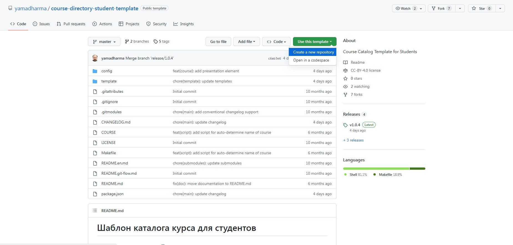
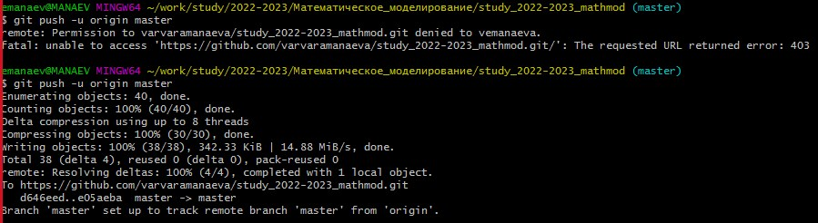

---
## Front matter
lang: ru-RU
title: Создание рабочего пространства для лабораторных работ
author:
  - Манаева В.Е.
institute:
  - Российский университет дружбы народов, Москва, Россия
date: 11.02.2023

## i18n babel
babel-lang: russian
babel-otherlangs: english

## Formatting pdf
toc: false
toc-title: Содержание
slide_level: 2
aspectratio: 169
section-titles: true
theme: metropolis
header-includes:
 - \metroset{progressbar=frametitle,sectionpage=progressbar,numbering=fraction}
 - '\makeatletter'
 - '\beamer@ignorenonframefalse'
 - '\makeatother'
---

# Лабораторная работа 1

### Манаева Варвара Евгеньевна, НФИбд-01-20

#### 2023

---

# Создание рабочего пространства для выполнения лабораторных работ 

---

## Вводная часть:

### Актуальность

Необходимо создать пространство для выполнения лабораторных работ для соответствия установленному соглашению о наименованиях.

### Объект и предмет исследования

- Шаблон рабочего пространства; 
- Рабочее пространство, созданное докладчиком;
- Файлы отчёта и презентации. 

### Цели и задачи

- Скопировать согласованный шаблон рабочего пространства;
- Создать отчёт в Markdown;
- Создать презентацию в Markdown.

### Материалы и методы

- MarkdownPad 2 - редактор файлов *.md*;
- Сервис *GitHub*;
- *git bash* с подключенным функционалом *make*.

---

## Работа (1)

---

### Работа (2)

---

## Результаты

- Было создано рабочее пространство для выполнения лабораторных работ;
- Был написан отчёт о лабораторной работе;
- Была создана презентация о сделанной лабораторной работе.

---

## Заключение

Цели лабораторной работы достигнуты
