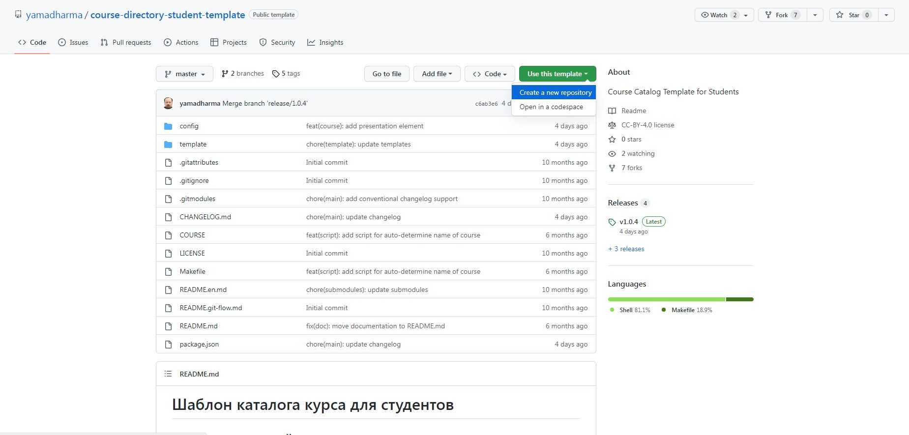
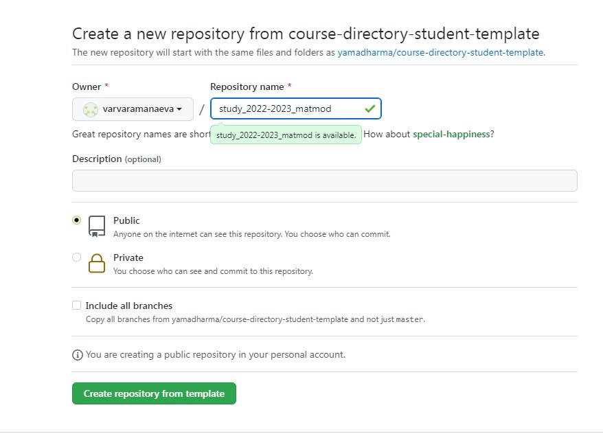
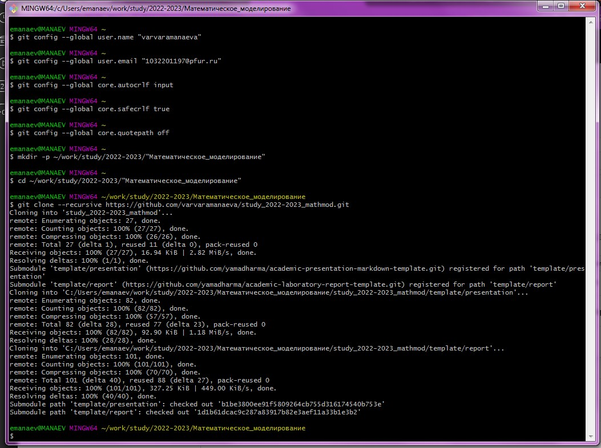
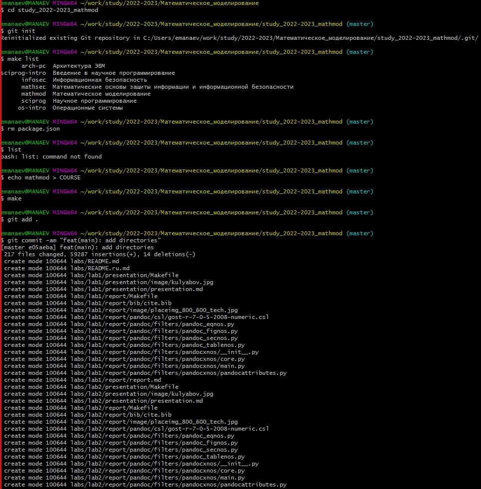
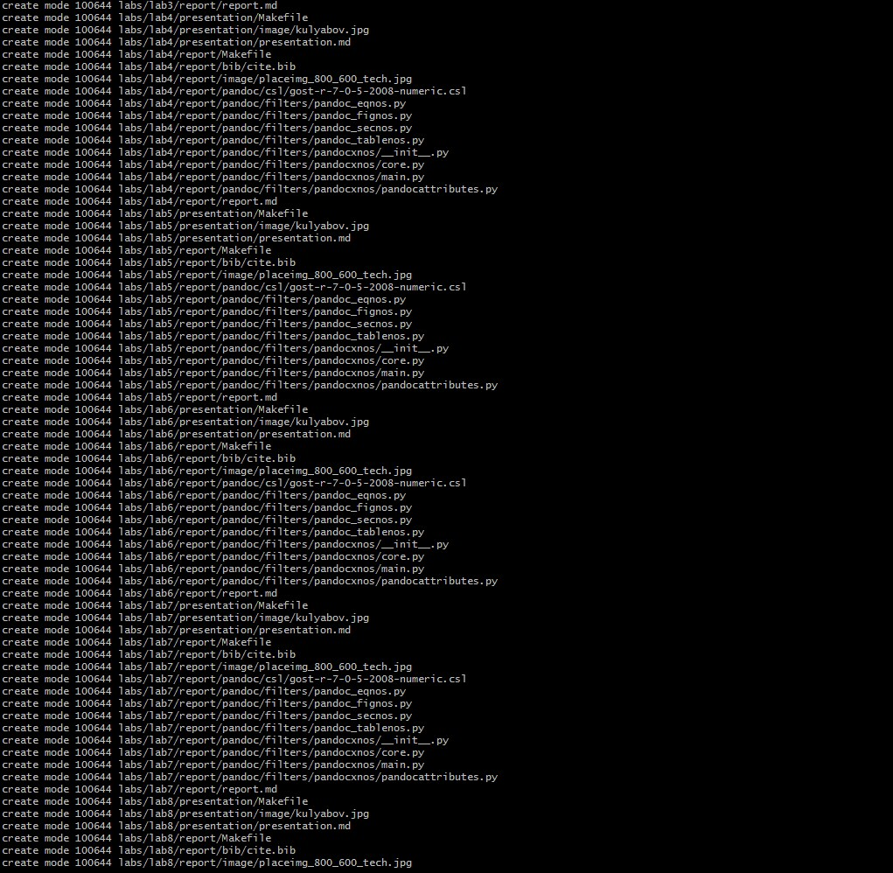
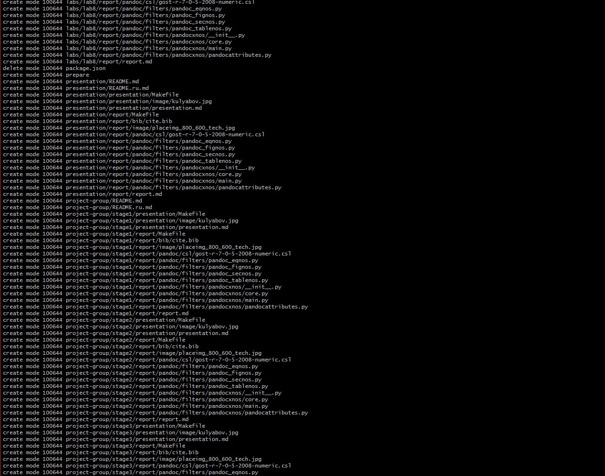
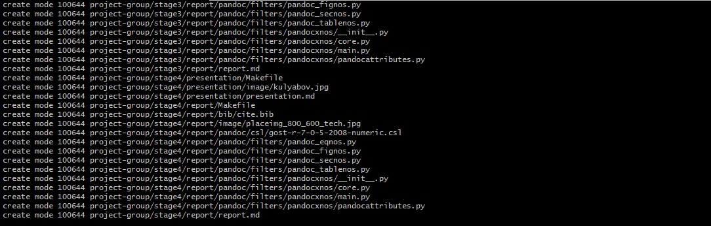
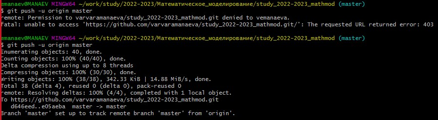
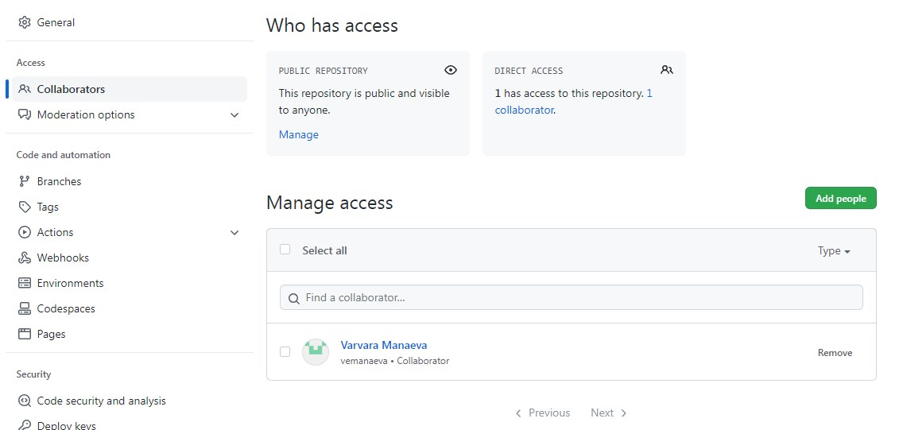

---
## Pdf output format
toc: true # Table of contents
toc-depth: 2
lof: true # List of figures
lot: true # List of tables
fontsize: 12pt
linestretch: 1.5
papersize: a4
documentclass: scrreprt
## I18n polyglossia
polyglossia-lang:
  name: russian
  options:
	- spelling=modern
	- babelshorthands=true
polyglossia-otherlangs:
  name: english
## I18n babel
babel-lang: russian
babel-otherlangs: english
## Fonts
mainfont: PT Serif
romanfont: PT Serif
sansfont: PT Sans
monofont: PT Mono
mainfontoptions: Ligatures=TeX
romanfontoptions: Ligatures=TeX
sansfontoptions: Ligatures=TeX,Scale=MatchLowercase
monofontoptions: Scale=MatchLowercase,Scale=0.9
## Biblatex
biblatex: true
biblio-style: "gost-numeric"
biblatexoptions:
  - parentracker=true
  - backend=biber
  - hyperref=auto
  - language=auto
  - autolang=other*
  - citestyle=gost-numeric
## Pandoc-crossref LaTeX customization
figureTitle: "Рис."
tableTitle: "Таблица"
listingTitle: "Листинг"
lofTitle: "Список иллюстраций"
lotTitle: "Список таблиц"
lolTitle: "Листинги"
## Misc options
indent: true
header-includes:
  - \usepackage{indentfirst}
  - \usepackage{float} # keep figures where there are in the text
  - \floatplacement{figure}{H} # keep figures where there are in the text
---

 **РОССИЙСКИЙ УНИВЕРСИТЕТ ДРУЖБЫ НАРОДОВ** 
 

 **Факультет Физико-Математических Наук** 

 **Кафедра прикладной информатики и теории вероятностей** 

   
 
 
   
 
 

 **ОТЧЁТ** 

 **ПО ЛАБОРАТОРНОЙ РАБОТЕ № 1** 

 *дисциплина: Математическое моделирование* 

 
 
 
 
 
 
 
 
 
 
 
 
 
 
 
 
 
 
 
 
 
 
 
 
 
 
 
 
 

<u> Студент: Манаева Варвара Евгеньевна </u>

Группа: НФИбд-01-20

<u> Преподаватель: Кулябов Дмитрий Сергеевич </u>

 **МОСКВА** 

 20<u>23</u> г. 

  

**Техническое оснащение:**

+ Персональный компьютер с операционной системой Windows 7;
+ Планшет для записи видеосопровождения и голосовых комментариев;
+ Microsoft Teams, использующийся для записи скринкаста лабораторной работы;
+ Приложение MarkPad 2 для редактирования файлов формата *md*;
+ *pandoc* для конвертации файлов отчётов и презентаций.

---

**Цель:** создать рабочее пространство для выполнения лабораторных работ, подключить функционал Git.

**Задание:** создать на основе шаблона рабочее пространство для лабораторных работ. Использовать систему контроля версий git.

---

<h2>**Теоретические вводные данные:**</h2>

При выполнении лабораторной работы следует придерживаться структуры рабочего пространства.

### Основные идеи
- Стандартные соглашения об именах
- Стандартное соглашение для путей к файлам
- Стандартная настройка курса внутри шаблона курса

### Общие правила
Рабочее пространство по предмету располагается в следующей иерархии:

	~/work/study/
	└── <учебный год>/
	    └── <название предмета>/
	        └── <код предмета>/

Например, для 2022-2023 учебного года и предмета «Математическое моделирование» (код предмета mathmod) структура каталогов примет следующий вид:

	~/work/study/
	└── 2022-2023/
	    └── Математическое моделирование/
	        └── mathmod/

Название проекта на хостинге git имеет вид:

	study_<учебный год>_<код предмета>

Например, для 2022–2023 учебного года и предмета «Математическое моделирование» (код предмета mathmod) название проекта примет следующий вид:

	study_2022-2023_mathmod

- Каталог для лабораторных работ имеет вид `labs`.
- Каталоги для лабораторных работ имеют вид `lab<номер>`, например: `lab01`, `lab02` и т.д.
- Каталог для групповых проектов имеет вид `group-project`.
- Каталог для персональных проектов имеет вид `personal-project`.
- Если проектов несколько, то они нумеруются подобно лабораторным работам.
- Этапы проекта обозначаются как `stage<номер>`.

**Этапы работы:**

1) Создаём свою копию шаблона рабочего пространства лабораторной работы. 

Для этого переходим в шаблон рабочего пространства, выбираем в нём функцию "Использовать данный шаблон" и "Создать новый репозиторий".

Создаём там репозиторий, предварительно вставив необходимое название курса.

2) Копируем репозиторий с *github* для дальнейшей работы с ним локально.

3) Выполняем настройку репозитория по образцу из методических материалов.

4) Отправляем изменения, создаём пуш реквест для объединения ветки *master* с существующей. Потребовалось настроить доступ, так как был по ошибке использован другой аккаунт для работы с лабораторной.

5) По окончании работы написан отчёт на *Markdown*, который будет сконвернтирован в *pdf* и *doc*, а после переложен в папку первой лабораторой работы, откуда с помощью аналогичного коммита и *push-request* будет загружен в систему *git*.

Также был записан скринкаст лабораторной работы, который будет выложен на *Youtube*, ссылка на скринкаст лабораторной работы: [https://youtu.be/RcbhgbXaapI](https://youtu.be/RcbhgbXaapI "https://youtu.be/RcbhgbXaapI")

Ссылка на скринкаст презентации лабораторной работы: [https://youtu.be/lsMEmNnJiYw](https://youtu.be/lsMEmNnJiYw "https://youtu.be/lsMEmNnJiYw")

---

**Выводы:** 

В процессе выполнения лабораторной работы было создано рабочее пространство для выполнения последующих лабораторных работ по предмету "Математическое моделирование".

---

**Список литературы:**

- Методические заметки по лабораторным работам, Рабочее пространство для лабораторных работ: [https://esystem.rudn.ru/mod/page/view.php?id=967223](https://esystem.rudn.ru/mod/page/view.php?id=967223 "https://esystem.rudn.ru/mod/page/view.php?id=967223")
- Creating a repository from a template - GitHub Docs: [https://docs.github.com/en/repositories/creating-and-managing-repositories/creating-a-repository-from-a-template](https://docs.github.com/en/repositories/creating-and-managing-repositories/creating-a-repository-from-a-template "https://docs.github.com/en/repositories/creating-and-managing-repositories/creating-a-repository-from-a-template")
- Информационный файл, содержащий команды git: [https://esystem.rudn.ru/pluginfile.php/1971643/mod_folder/content/0/git.pdf](https://esystem.rudn.ru/pluginfile.php/1971643/mod_folder/content/0/git.pdf "https://esystem.rudn.ru/pluginfile.php/1971643/mod_folder/content/0/git.pdf")
- Файлы, подключающие в *git bash* функцию *make*: [https://sourceforge.net/projects/ezwinports/](https://sourceforge.net/projects/ezwinports/ "https://sourceforge.net/projects/ezwinports/")
