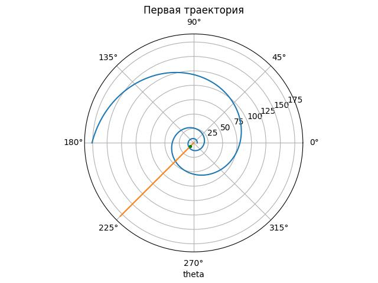
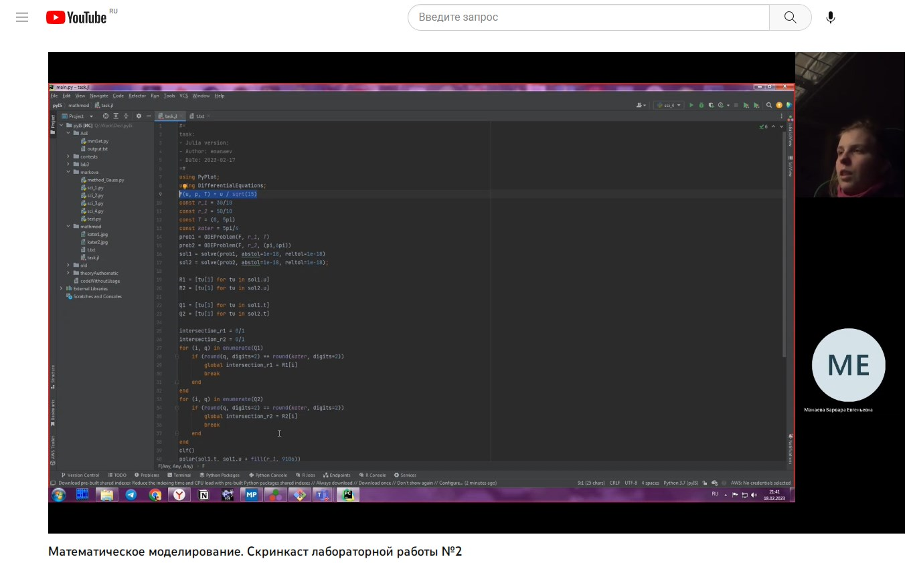

---
## Front matter
lang: ru-RU
title: Лабораторная работа № 2
subtitle: Отчёт по окончании работы
author:
  - Манаева В.Е.
institute:
  - Российский университет дружбы народов, Москва, Россия
date: 18 февраля 2023

## i18n babel
babel-lang: russian
babel-otherlangs: english

## Formatting pdf
toc: false
toc-title: Содержание
slide_level: 2
aspectratio: 169
section-titles: true
theme: metropolis
header-includes:
 - \metroset{progressbar=frametitle,sectionpage=progressbar,numbering=fraction}
 - '\makeatletter'
 - '\beamer@ignorenonframefalse'
 - '\makeatother'
---

## Цели и задачи

- Изучить основы языков программирования Julia и OpenModelica 
- Освоить некоторые библиотеки этих языков, которые используются для решения дифференциальных уравнений и построения графиков
- На основании задачи лабораторной работы продемонстрировать полученные знания

---

# Процесс работы

- Были поставлены Julia и OpenModelica
- Были изучены основы Julia и OpenModelica
- Был написан программный код для решения задачи  

---

## Результаты
### Код и графики

Для данной задачи на Julia был написан код, для кода были получены графики, отображающие движение катера и лодки.

{#fig:005 width=50%}

---

### Скринкасты

Были записаны скринкасты [лабораторной работы](https://youtu.be/362D_CPuTA0 "лабораторной работы") и [презентации лабораторной работы]( "презентации лабораторной работы").

{#fig:005 width=50%}

---

## Библиография

1. [Пример решения лабораторной работы](https://esystem.rudn.ru/pluginfile.php/1971648/mod_resource/content/2/Лабораторная%20работа%20№%201.pdf "Пример решения лабораторной работы")
2. [Варианты заданий лабораторной работы](https://esystem.rudn.ru/pluginfile.php/1971649/mod_resource/content/2/Задание%20к%20лабораторной%20работе%20№%205%20%281%29.pdf "Варианты заданий лабораторной работы")
3. [Plotting polar curves in Python - GeeksForGeeks](https://www.geeksforgeeks.org/plotting-polar-curves-in-python/ "Plotting polar curves in Python - GeeksForGeeks")
4. [Документация Julia 1.8](https://docs.julialang.org/en/v1/ "Документация Julia 1.8")
5. [Документация модуля Julia Differential Equations](https://docs.sciml.ai/DiffEqDocs/stable/ "Документация модуля Julia Differential Equations")
6. [Документация модуля Julia PyPlot](https://docs.juliahub.com/PyPlot/oatAj/2.10.0/ "Документация модуля Julia PyPlot")

