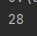
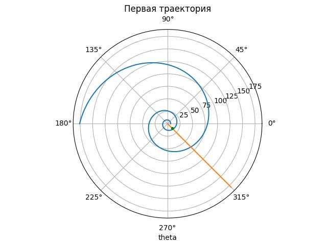
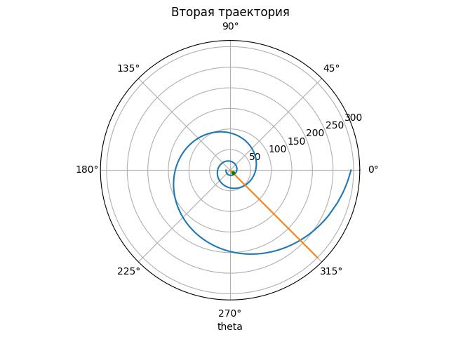
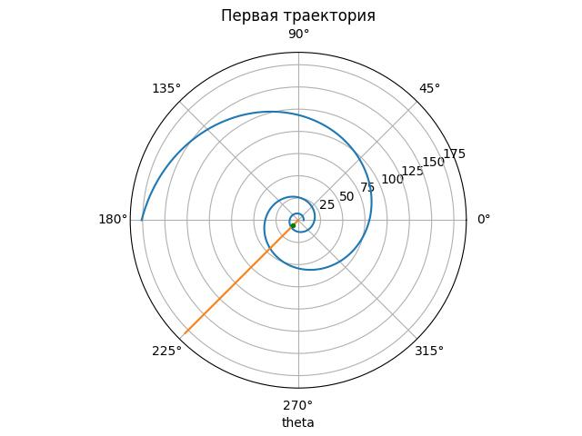
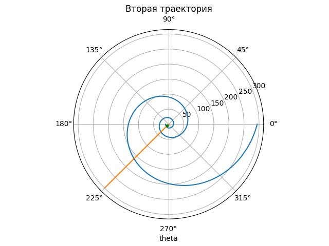

---
## Front matter
title: "Отчёт по лабораторной работе №"
subtitle: "Предмет: Математическое моделирование"
author: "Манаева Варвара Евгеньевна, НФИбд-01-20.
1032201197"

## Generic otions
lang: ru-RU
toc-title: "Содержание"

## Bibliography
bibliography: bib/cite.bib
csl: pandoc/csl/gost-r-7-0-5-2008-numeric.csl

## Pdf output format
toc: true # Содержание
toc-depth: 2
lof: true # Список рисунков
lot: true # Список таблиц
fontsize: 12pt
linestretch: 1.5
papersize: a4
documentclass: scrreprt
## I18n polyglossia
polyglossia-lang:
  name: russian
  options:
	- spelling=modern
	- babelshorthands=true
polyglossia-otherlangs:
  name: english
## I18n babel
babel-lang: russian
babel-otherlangs: english
## Fonts
mainfont: PT Serif
romanfont: PT Serif
sansfont: PT Sans
monofont: PT Mono
mainfontoptions: Ligatures=TeX
romanfontoptions: Ligatures=TeX
sansfontoptions: Ligatures=TeX,Scale=MatchLowercase
monofontoptions: Scale=MatchLowercase,Scale=0.9
## Biblatex
biblatex: true
biblio-style: "gost-numeric"
biblatexoptions:
  - parentracker=true
  - backend=biber
  - hyperref=auto
  - language=auto
  - autolang=other*
  - citestyle=gost-numeric
## Pandoc-crossref LaTeX customization
figureTitle: "Рис."
tableTitle: "Таблица"
listingTitle: "Листинг"
lofTitle: "Список иллюстраций"
lotTitle: "Список таблиц"
lolTitle: "Листинги"
## Misc options
indent: true
header-includes:
  - \usepackage{indentfirst}
  - \usepackage{float} # keep figures where there are in the text
  - \floatplacement{figure}{H} # keep figures where there are in the text
---

# Цель работы

Изучить основы языков программирования Julia и OpenModelica. Освоить некоторые библиотеки этих языков, которые используются для решения дифференциальных уравнений и построения графиков. На основании задачи лабораторной работы продемонстрировать полученные знания.

# Задание лабораторной работы

Задания лабораторной работы разделены по вариантам. Мой вариант 28 (исходя из формулы $N_{student} mod K_{of variants} + 1$) (рис. @fig:001, @fig:002). Этот же вариант будет использоваться для всех последующих лабораторных работ.

{#fig:001}

{#fig:002}

На море в тумане катер береговой охраны преследует лодку браконьеров. Через определенный промежуток времени туман рассеивается, и лодка обнаруживается на расстоянии 15 км от катера. Затем лодка снова скрывается в тумане и уходит прямолинейно в неизвестном направлении. Известно, что скорость катера в 4 раза больше скорости браконьерской лодки.

1. Записать уравнение, описывающее движение катера, с начальными условиями
для двух случаев (в зависимости от расположения катера относительно лодки в
начальный момент времени).
2. Построить траекторию движения катера и лодки для двух случаев.
3. Найти точку пересечения траектории катера и лодки

# Теоретическое введение

Julia — высокоуровневый высокопроизводительный свободный язык программирования с динамической типизацией, созданный для математических вычислений. Эффективен также и для написания программ общего назначения. Синтаксис языка схож с синтаксисом других математических языков (например, MATLAB и Octave), однако имеет некоторые существенные отличия. Julia написан на Си, C++ и Scheme. Имеет встроенную поддержку многопоточности и распределённых вычислений, реализованные в том числе в стандартных конструкциях.

OpenModelica — свободное открытое программное обеспечение для моделирования, симуляции, оптимизации и анализа сложных динамических систем. Основано на языке Modelica. Активно развивается Open Source Modelica Consortium, некоммерческой неправительственной организацией. Open Source
Modelica Consortium является совместным проектом RISE SICS East AB и Линчёпингского университета. По своим возможностям приближается к таким
вычислительным средам как Matlab Simulink, Scilab xCos, имея при этом значительно более удобное представление системы уравнений исследуемого
блока.

# Выполнение лабораторной работы

## Математическая модель

1. Примем за момент отсчета времени момент первого рассеивания тумана. Введем полярные координаты с центром в точке нахождения браконьеров
и осью, проходящей через катер береговой охраны. Тогда начальные координаты катера (15; 0). Обозначим скорость лодки $v$.
2. Траектория катера должна быть такой, чтобы и катер, и лодка все время были на одном расстоянии от полюса. Только в этом случае траектория катера пересечется с траекторией лодки. Поэтому для начала катер береговой охраны должен двигаться некоторое время прямолинейно, пока не окажется на том же расстоянии от полюса, что и лодка браконьеров. После этого катер береговой охраны должен двигаться вокруг полюса удаляясь от него с той же скоростью, что и лодка браконьеров.
3. Чтобы найти расстояние x (расстояние после которого катер начнет двигаться вокруг полюса), необходимо составить следующие уравнение. Пусть через время t катер и лодка окажутся на одном расстоянии x от полюса. За это время лодка пройдет $x$, а катер $15 + x$ (или $15 - x$, в зависимости от начального положения катера относительно полюса). Время, за которое они пройдут это расстояние, вычисляется как $x\over v$ или ${15 - x}\over{4v}$ (${15 + x}\over{4v}$). Так как время должно быть одинаковым, эти величины тоже будут друг другу равны. Из этого получаем объединение из двух уравнений (двух из-за двух разных изначальных позиций катера относительно полюса):

$$ \left[ \begin{array}{cl}
{{x}\over{v}} = {{15 - x}\over{4v}}\\
{{x}\over{v}} = {{15 + x}\over{4v}}
\end{array} \right. $$

Из данных уравнений можно найти расстояние, после которого катер начнёт раскручиваться по спирали. Для данных уравнений решения будут следующими: $x_1 = 3$, $x_2 = 5$. Задачу будем решать для двух случаев. После того, как катер береговой охраны окажется на одном расстоянии от полюса, что и лодка, он должен сменить прямолинейную траекторию и начать двигаться вокруг полюса удаляясь от него со скоростью лодки v. Для этого скорость катера раскладываем на две составляющие: $v_r = {dr\over dt} = v$ - радиальная скорость и $v_\tau = r{d\theta\over dt}$ - тангенциальная скорость.

$$ v_\tau = \sqrt{15}v $$

4. Решение исходной задачи сводится к решению системы из двух дифференциальных уравнений:

$$ \left\{ \begin{array}{cl}
{dr\over dt} = v \\
r{d\theta\over dt} = \sqrt{15}v
\end{array} \right. $$

с начальными условиями 

$$ \left\{ \begin{array}{cl}
\theta_0 = 0 \\
r_0 = x_1
\end{array} \right. $$

или

$$ \left\{ \begin{array}{cl}
\theta_0 = \pi \\
r_0 = x_2
\end{array} \right. $$

Исключая из полученной системы производную по t, можно перейти к следующему уравнению (с неизменными начальными условиями):

$$ {dr\over d\theta} = {r\over\sqrt{15}} $$

Решением этого уравнения с заданными начальными условиями и будет являться траектория движения катера в полярных координатах.

## Решение с помощью программ
### OpenModelica

К сожалению, OpenModelica не адаптирована к использованию полярных координат, поэтому адекватное отображение результатов данный задачи там невозможно.

### Julia
#### Программный код решения на Julia

Решить дифференциальное уравнение, расписанное в постановке задачи лабораторной работы, поможет библиотека DifferentialEquations. Итоговые изображения в полярных координатах будут строиться через библиотеку PyPlot.

Код первой программы ($\theta_l = {7\pi\over 4}$):

	using PyPlot;
	using DifferentialEquations;
	F(u, p, T) = u / sqrt(15)
	const r_1 = 30/10
	const r_2 = 50/10
	const T = (0, 5pi)
	const kater = 7pi/4
	prob1 = ODEProblem(F, r_1, T)
	prob2 = ODEProblem(F, r_2, (pi,6pi))
	sol1 = solve(prob1, abstol=1e-18, reltol=1e-18)
	sol2 = solve(prob2, abstol=1e-18, reltol=1e-18);
	
	R1 = [tu[1] for tu in sol1.u]
	R2 = [tu[1] for tu in sol2.u]
	
	Q1 = [tu[1] for tu in sol1.t]
	Q2 = [tu[1] for tu in sol2.t]
	
	intersection_r1 = 0/1
	intersection_r2 = 0/1
	for (i, q) in enumerate(Q1)
	    if (round(q, digits=2) == round(kater, digits=2))
	        global intersection_r1 = R1[i]
	        break
	    end
	end
	for (i, q) in enumerate(Q2)
	    if (round(q, digits=2) == round(kater, digits=2))
	        global intersection_r2 = R2[i]
	        break
	    end
	end
	clf()
	polar(sol1.t, sol1.u + fill(r_1, 9106))
	polar(fill(kater, 19), collect(0: 10: 180))
	polar(kater, intersection_r1, "g.")
	xlabel("theta")
	title("Первая траектория")
	savefig("kater1.jpg")
	clf()
	polar(sol2.t, sol2.u + fill(r_2, 10426))
	polar(fill(kater, 31), collect(0: 10: 300))
	polar(kater, intersection_r2, "g.")
	xlabel("theta")
	title("Вторая траектория")
	savefig("kater2.jpg")
	clf()

Код второй программы программы ($\theta_l = {5\pi\over 4}$):

	using PyPlot;
	using DifferentialEquations;
	F(u, p, T) = u / sqrt(15)
	const r_1 = 30/10
	const r_2 = 50/10
	const T = (0, 5pi)
	const kater = 5pi/4
	prob1 = ODEProblem(F, r_1, T)
	prob2 = ODEProblem(F, r_2, (pi,6pi))
	sol1 = solve(prob1, abstol=1e-18, reltol=1e-18)
	sol2 = solve(prob2, abstol=1e-18, reltol=1e-18);
	
	R1 = [tu[1] for tu in sol1.u]
	R2 = [tu[1] for tu in sol2.u]
	
	Q1 = [tu[1] for tu in sol1.t]
	Q2 = [tu[1] for tu in sol2.t]
	
	intersection_r1 = 0/1
	intersection_r2 = 0/1
	for (i, q) in enumerate(Q1)
	    if (round(q, digits=2) == round(kater, digits=2))
	        global intersection_r1 = R1[i]
	        break
	    end
	end
	for (i, q) in enumerate(Q2)
	    if (round(q, digits=2) == round(kater, digits=2))
	        global intersection_r2 = R2[i]
	        break
	    end
	end
	clf()
	polar(sol1.t, sol1.u + fill(r_1, 9106))
	polar(fill(kater, 19), collect(0: 10: 180))
	polar(kater, intersection_r1, "g.")
	xlabel("theta")
	title("Первая траектория")
	savefig("kater3.jpg")
	clf()
	polar(sol2.t, sol2.u + fill(r_2, 10426))
	polar(fill(kater, 31), collect(0: 10: 300))
	polar(kater, intersection_r2, "g.")
	xlabel("theta")
	title("Вторая траектория")
	savefig("kater4.jpg")
	clf()

#### Результаты работы кода на Julia

На рис. @fig:003 и @fig:004 изображены итоговые графики траектории движения катера и лодки для случая 1 ($\theta_l = {7\pi \over 4}$)

{#fig:003}

{#fig:004}

На рис. @fig:005 и @fig:006 изображены итоговые графики траектории движения катера и лодки для случая 2 ($\theta_l = {5\pi \over 4}$)

{#fig:005}

{#fig:006}

# Выводы

Были изучены основы Julia и OpenModelica. Поскольку OpenModelica не работает с полярными координатами, она не была использована в данной лабораторной работе. 

Для данной задачи на Julia был написан код, для кода были получены графики, отображающие движение катера и лодки.

Были записаны скринкасты [лабораторной работы](https://youtu.be/362D_CPuTA0 "лабораторной работы") и [презентации лабораторной работы](https://youtu.be/UnU-6JBA9-g "презентации лабораторной работы").

# Список литературы

1. [Пример решения лабораторной работы](https://esystem.rudn.ru/pluginfile.php/1971648/mod_resource/content/2/Лабораторная%20работа%20№%201.pdf "Пример решения лабораторной работы")
2. [Варианты заданий лабораторной работы](https://esystem.rudn.ru/pluginfile.php/1971649/mod_resource/content/2/Задание%20к%20лабораторной%20работе%20№%205%20%281%29.pdf "Варианты заданий лабораторной работы")
3. [Plotting polar curves in Python - GeeksForGeeks](https://www.geeksforgeeks.org/plotting-polar-curves-in-python/ "Plotting polar curves in Python - GeeksForGeeks")
4. [Документация Julia 1.8](https://docs.julialang.org/en/v1/ "Документация Julia 1.8")
5. [Документация модуля Julia Differential Equations](https://docs.sciml.ai/DiffEqDocs/stable/ "Документация модуля Julia Differential Equations")
6. [Документация модуля Julia PyPlot](https://docs.juliahub.com/PyPlot/oatAj/2.10.0/ "Документация модуля Julia PyPlot")
