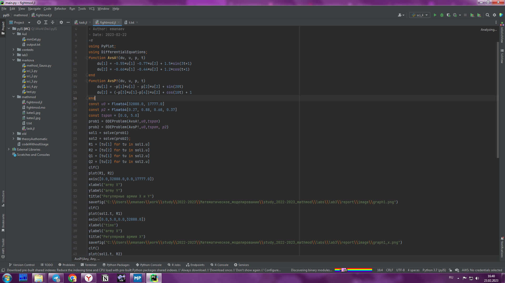
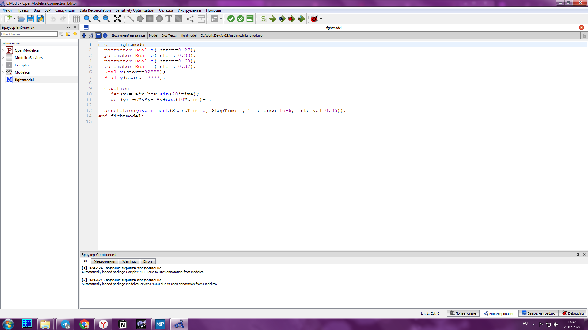
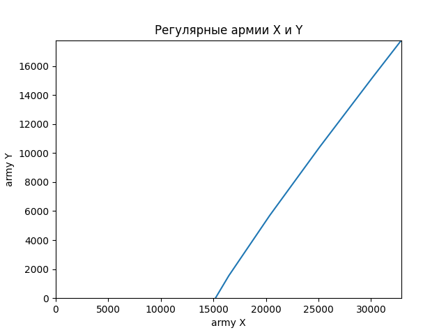
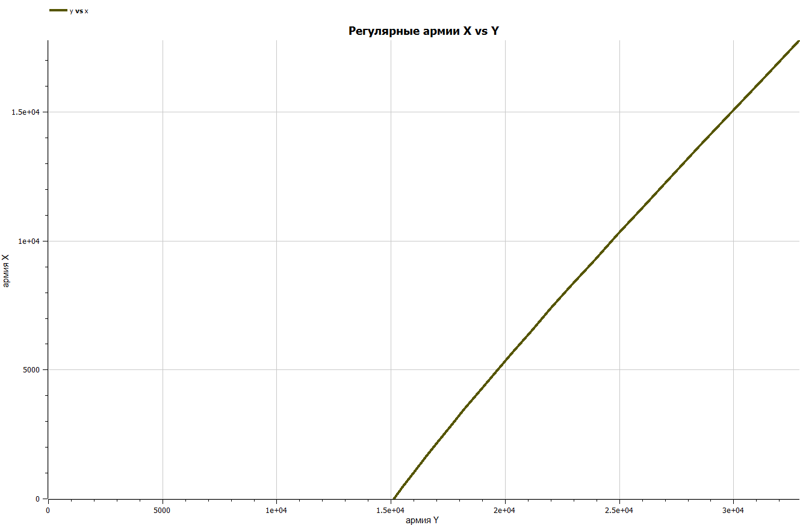
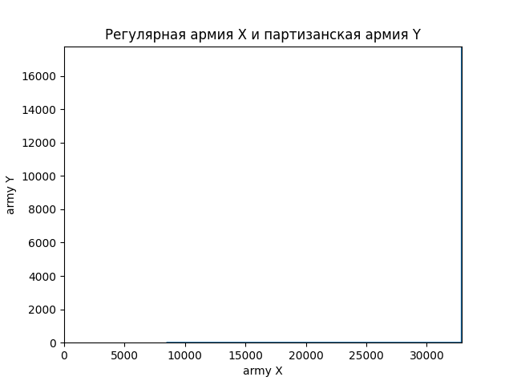
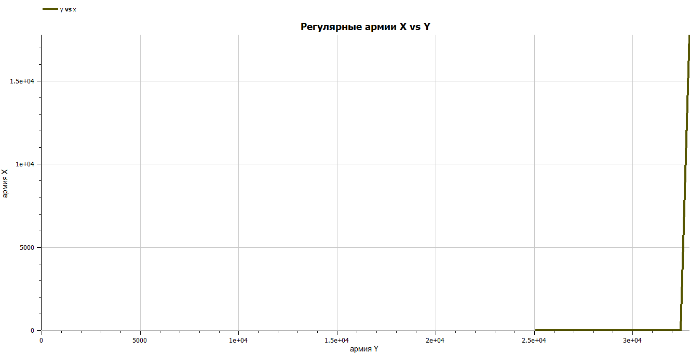
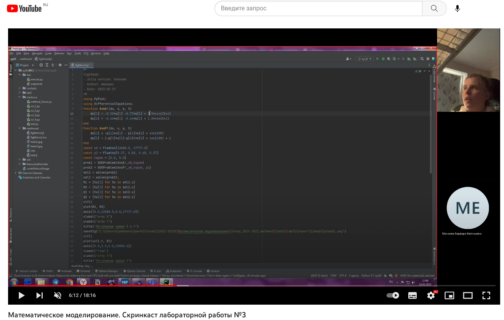

---
## Front matter
lang: ru-RU
title: Моделирование боевых действий
subtitle: Лабораторная работа №3
author:
  - Манаева В.Е.
institute:
  - Российский университет дружбы народов, Москва, Россия
date: 18 февраля 2023

## i18n babel
babel-lang: russian
babel-otherlangs: english

## Formatting pdf
toc: false
toc-title: Содержание
slide_level: 2
aspectratio: 169
section-titles: true
theme: metropolis
header-includes:
 - \metroset{progressbar=frametitle,sectionpage=progressbar,numbering=fraction}
 - '\makeatletter'
 - '\beamer@ignorenonframefalse'
 - '\makeatother'
---

## Цели и задачи

- Изучить модели Ланчестера для имитации боевых действий
- Записать на языках OpenModelica и Julia программы, которые бы решали данные задачи с возможностью вносить разные входящие данные
- Сравнить результат работы данных программ между собой

---

## Условия

1. Модель боевых действий между регулярными войсками:

$$ {dx\over {dt}} = -0.55x(t)-0.77y(t)+1,5*sin(3t+1) $$
$$ {dy\over {dt}} = -0.66x(t)-0.44y(t)+1,2*cos(t+1) $$

2. Модель ведение боевых действий с участием регулярных войск и партизанских отрядов:

$$ {dx\over {dt}} = -0.27x(t)-0.88y(t)+sin(20t) $$
$$ {dy\over {dt}} = -0.68x(t)y(t)-0.37y(t)+cos(10t) + 1 $$

---

# Процесс работы

---

## Julia 

Был написан код на Julia с использованием библиотек PyPlot.jl и DifferentialEquations.jl

{#fig:001 width=50%}

---

## OpenModelica 

Был написан код на OpenModelica

{#fig:002 width=50%}

---

# Результаты

---

## Графики, построенные для первой модели

Графики, построенные программами для первой задачи, одинаковы.

 | 
:-------------------------:|:-------------------------:
{#fig:003 width=40%} | {#fig:003 width=40%}

---

## Графики, построенные для второй модели

Аналогичная ситуация и для графиков, построенных для второго условия.

 | 
:-------------------------:|:-------------------------:
{#fig:003 width=50%}|{#fig:004 width=50%}

---

## Скринкасты

Были записаны скринкасты [лабораторной работы](https://youtu.be/S6TlYdG0pnE "лабораторной работы") и [презентации лабораторной работы](https://youtu.be/sP3CdiE58fk "презентации лабораторной работы").

{#fig:005 width=50%}