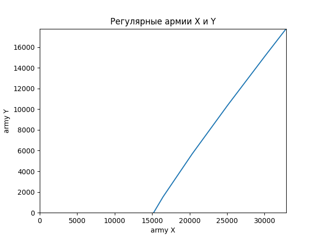
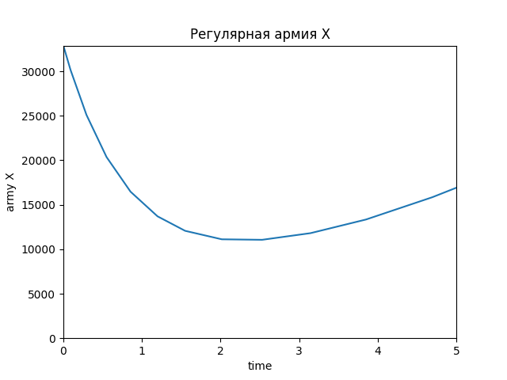
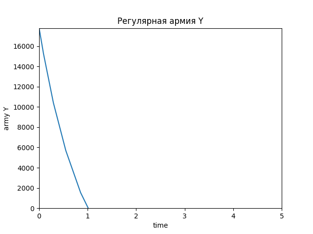
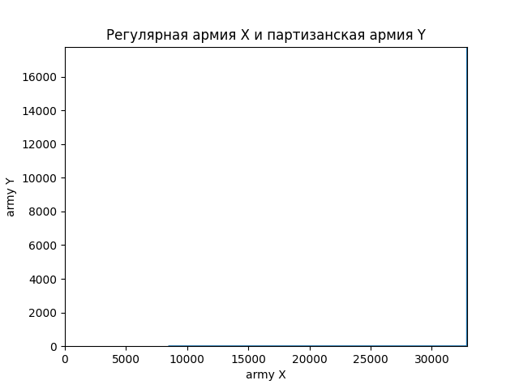
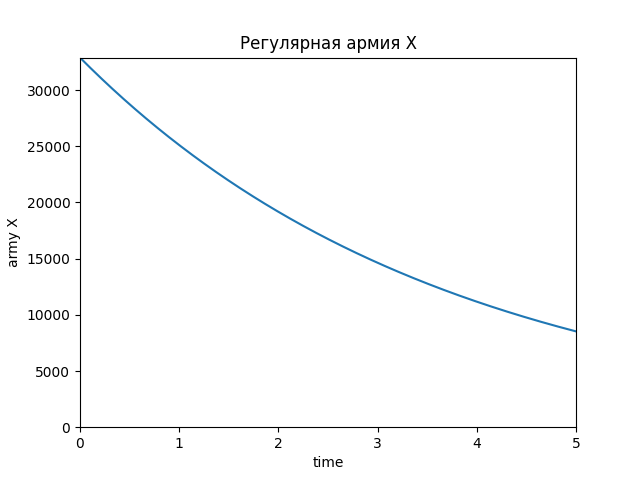
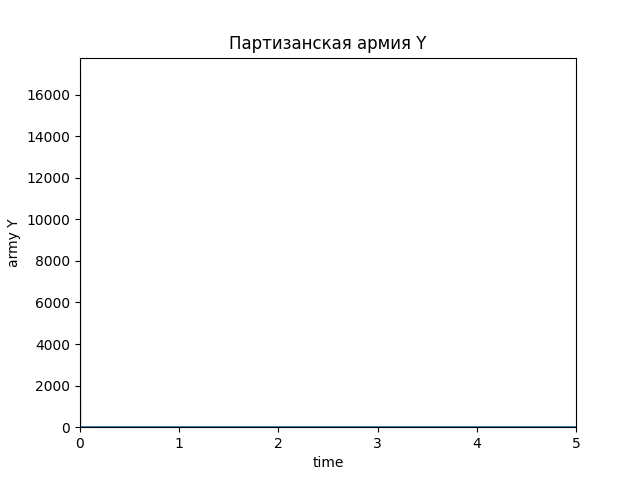
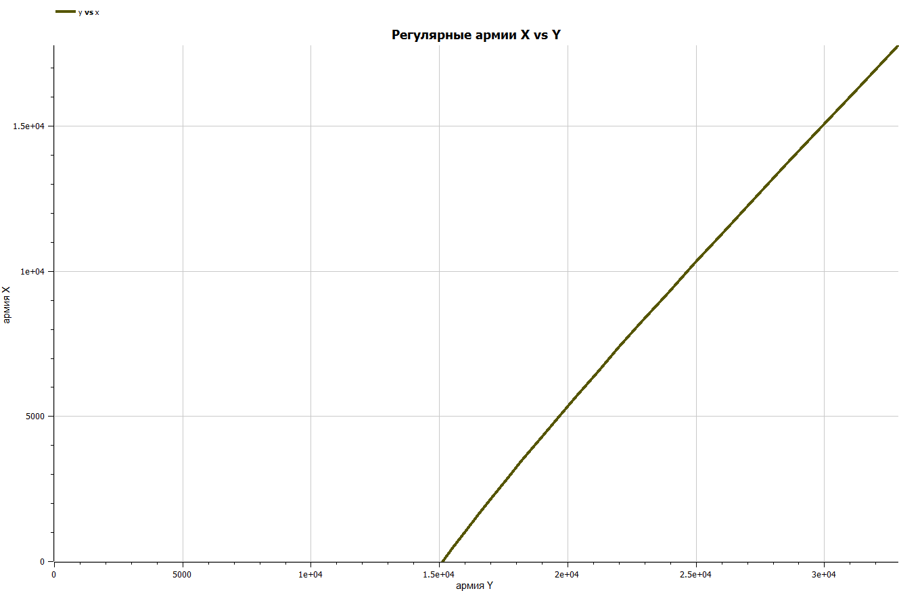
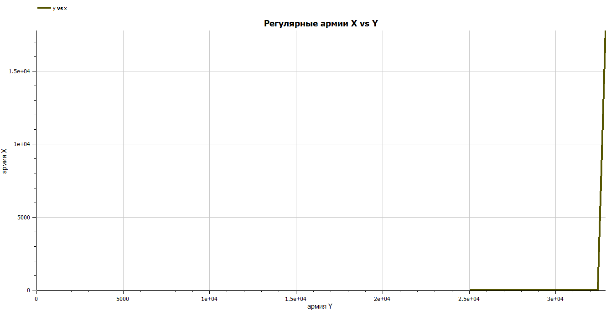

---
## Front matter
title: "Отчёт по лабораторной работе №3"
subtitle: "Предмет: Математическое моделирование"
author: "Манаева В.Е., НФИбд-01-20"

## Generic otions
lang: ru-RU
toc-title: "Содержание"

## Bibliography
bibliography: bib/cite.bib
csl: pandoc/csl/gost-r-7-0-5-2008-numeric.csl

## Pdf output format
toc: true # Содержание
toc-depth: 2
lof: true # Список рисунков
lot: true # Список таблиц
fontsize: 12pt
linestretch: 1.5
papersize: a4
documentclass: scrreprt
## I18n polyglossia
polyglossia-lang:
  name: russian
  options:
	- spelling=modern
	- babelshorthands=true
polyglossia-otherlangs:
  name: english
## I18n babel
babel-lang: russian
babel-otherlangs: english
## Fonts
mainfont: PT Serif
romanfont: PT Serif
sansfont: PT Sans
monofont: PT Mono
mainfontoptions: Ligatures=TeX
romanfontoptions: Ligatures=TeX
sansfontoptions: Ligatures=TeX,Scale=MatchLowercase
monofontoptions: Scale=MatchLowercase,Scale=0.9
## Biblatex
biblatex: true
biblio-style: "gost-numeric"
biblatexoptions:
  - parentracker=true
  - backend=biber
  - hyperref=auto
  - language=auto
  - autolang=other*
  - citestyle=gost-numeric
## Pandoc-crossref LaTeX customization
figureTitle: "Рис."
tableTitle: "Таблица"
listingTitle: "Листинг"
lofTitle: "Список иллюстраций"
lotTitle: "Список таблиц"
lolTitle: "Листинги"
## Misc options
indent: true
header-includes:
  - \usepackage{indentfirst}
  - \usepackage{float} # keep figures where there are in the text
  - \floatplacement{figure}{H} # keep figures where there are in the text
---

# Цель работы

Изучить модели боевых действий Ланчестера и применить их на практике для решения задания лабораторной работы. 

# Задание лабораторной работы
## Вариант №28 [@lab-task:mathmod]

Между страной Х и страной У идет война. Численность состава войск исчисляется от начала войны, и являются временными функциями $x(t)$ и $y(t)$. В
начальный момент времени страна Х имеет армию численностью $32 888$ человек, а в распоряжении страны У армия численностью в $17 777$ человек. Для упрощения модели считаем, что коэффициенты $a$, $b$, $c$, $h$ постоянны. Также считаем $P(t)$ и $Q(t)$ непрерывными функциями. 

Постройте графики изменения численности войск армии Х и армии У для следующих случаев:

1. Модель боевых действий между регулярными войсками:

$$ {dx\over {dt}} = -0.55x(t)-0.77y(t)+1,5*sin(3t+1) $$
$$ {dy\over {dt}} = -0.66x(t)-0.44y(t)+1,2*cos(t+1) $$

2. Модель ведение боевых действий с участием регулярных войск и партизанских отрядов:

$$ {dx\over {dt}} = -0.27x(t)-0.88y(t)+sin(20t) $$
$$ {dy\over {dt}} = -0.68x(t)y(t)-0.37y(t)+cos(10t) + 1 $$

# Теоретическое введение

## Общая информация о модели

В данной лабораторной работе мы будем использовать простейшие модели боевых действий – модели Ланчестера. В противоборстве могут принимать участие как регулярные войска, так и партизанские отряды. В общем случае главной характеристикой соперников являются численности сторон. Если в какой-то момент времени одна из численностей обращается в нуль, то данная сторона считается проигравшей (при условии, что численность другой стороны в данный момент положительна).

Нам интересны два случая ведения боевых действий:

1. Боевые действия между регулярными войсками;
2. Боевые действия с участием регулярных войск и партизанских отрядов (где одна сторона представлена регулярной армией, а вторая представлена партизанскими отрядами).

## Регулярная армия X vs регулярная армия Y

Рассмотрим первый случай. Численность регулярных войск определяется тремя факторами:

- скорость уменьшения численности войск из-за причин, не связанных с боевыми действиями (болезни, травмы, дезертирство);
- скорость потерь, обусловленных боевыми действиями противоборствующих сторон (что связанно с качеством стратегии, уровнем вооружения, профессионализмом солдат и т.п.);
- скорость поступления подкрепления (задаётся некоторой функцией от времени).

В этом случае модель боевых действий между регулярными войсками описывается следующим образом[@lab-example:mathmod]:

$$ {dx\over {dt}} = -a(t)x(t)-b(t)y(t)+P(t) $$
$$ {dy\over {dt}} = -c(t)x(t)-h(t)y(t)+Q(t) $$

Пояснения:

- члены $a(t)x(t)$ и $h(t)y(t)$ описывают НЕ связанные с боевыми действиями потери армий X и Y соответственно;
- члены $b(t)y(t)$ и $c(t)x(t)$ описывают потери в боевых действиях армий X и Y соответственно;
- коэффициенты $b(t)$ и $c(t)$ указывают на эффективность действий каждого отдельно взятого солдата в армиях Y и X соответственно;
- коэффициенты $a(t)$ и $h(t)$ есть величины, которые указывают на степень влияния различных факторов на потери;
- члены $P(t)$ и $Q(t)$ учитывают подкрепления в течение некоторого фиксированного промежутка времени.   

В первом пункте нами рассматривается как раз такая модель. Она является доработанной моделью Ланчестера, так его изначальная модель учитывала лишь члены $b(t)y(t)$ и $c(t)x(t)$, то есть, на потери за промежуток времени влияли лишь численность армий и "эффективность оружия" (коэффициенты $b(t)$ и $c(t)$) [@taylor:1983:lanchester, страница 55-56, глава 2: Lanchester's classic combat formulations].

В нашей работе коэффициенты $a$, $b$, $c$ и $h$ будут положительными десятичными числами, что приводит формулы модели к виду:

$$ {dx\over {dt}} = -ax(t)-by(t)+P(t) $$
$$ {dy\over {dt}} = -cx(t)-hy(t)+Q(t) $$

То есть, к виду системы линейных неоднородных дифференциальных уравнений с постоянными коэффициентами.

Именно эти уравнения и будут решать наши программы для выполнения первой части задания. В конце мы получим график кривой в декартовых координатах, где по оси $ox$ будет отображаться численность армии государства X, по оси $ox$ будет отображаться соответствующая численность армии Y. По тому, с какой осью пересечётся график, можно определить исход войны. Если ось $ox$ будет пересечена в положительных значениях, победа будет на стороне армии государства X (так как при таком раскладе численность армии Y достигла нуля при положительном значении численности армии X). Аналогичная ситуация для оси $oy$ и победы армии государства Y. 

Также (дополнительно) будут отдельно приведены графики изменения численности армий в зависимости от времени.

## Регулярная армия X vs партизанская армия Y

Для второй части задания, то есть, для моделирования боевых действий между регулярной армией и партизанской армией, необходимо внести поправки в предыдущую модель. Нерегулярные войска в отличии от постоянной армии менее уязвимы, так как действуют скрытно, в этом случае сопернику приходится действовать неизбирательно, по площадям, занимаемым партизанами. Поэтому считается, что темп потерь партизан, проводящих свои операции в разных местах на некоторой известной территории, пропорционален не только численности армейских соединений, но и численности самих партизан. В результате модель принимает вид:

$$ {dx\over {dt}} = -a(t)x(t)-b(t)y(t)+P(t) $$
$$ {dy\over {dt}} = -c(t)x(t)y(t)-h(t)y(t)+Q(t) $$

Смысл коэффициентов не меняется. Точно так же, с поправкой на то, что наши коэффициенты $a$, $b$, $c$ и $h$ будут положительными десятичными числами, что приводит формулы модели к виду:

$$ {dx\over {dt}} = -ax(t)-by(t)+P(t) $$
$$ {dy\over {dt}} = -cx(t)y(t)-hy(t)+Q(t) $$

Решения для этой модели будет представлено в виде, аналогичном первой модели.

# Выполнение лабораторной работы

## Решение с помощью программ
### Julia
#### Программный код решения на Julia

Решить дифференциальное уравнение, расписанное в постановке задачи лабораторной работы, поможет библиотека DifferentialEquations. Итоговые изображения в полярных координатах будут строиться через библиотеку PyPlot.

Код программы:

	using PyPlot;
	using DifferentialEquations;
	function AvsA!(du, u, p, t)
	    du[1] = -0.55*u[1] -0.77*u[2] + 1.5*sin(3t+1)
	    du[2] = -0.66*u[1] -0.44*u[2] + 1.2*cos(t+1)
	end
	function AvsP!(du, u, p, t)
	    du[1] = -p[1]*u[1] - p[2]*u[2] + sin(20t)
	    du[2] = (-p[3]*u[1]-p[4])*u[2] + cos(10t) + 1
	end
	const u0 = Float64[32888.0, 17777.0]
	const p2 = Float64[0.27, 0.88, 0.68, 0.37]
	const tspan = [0.0, 5.0]
	prob1 = ODEProblem(AvsA!,u0,tspan)
	prob2 = ODEProblem(AvsP!,u0,tspan, p2)
	sol1 = solve(prob1)
	sol2 = solve(prob2);
	R1 = [tu[1] for tu in sol1.u]
	R2 = [tu[2] for tu in sol1.u]
	Q1 = [tu[1] for tu in sol2.u]
	Q2 = [tu[2] for tu in sol2.u]
	clf()
	plot(R1, R2)
	axis([0.0,32888.0,0.0,17777.0])
	xlabel("army X")
	ylabel("army Y")
	title("Регулярные армии X и Y")
	savefig("C:\\Users\\emanaev\\work\\study\\2022-2023\\Математическое_моделирование\\study_2022-2023_mathmod\\labs\\lab3\\report\\image\\graph1.png")
	clf()
	plot(sol1.t, R1)
	axis([0.0,5.0,0.0,32888.0])
	xlabel("time")
	ylabel("army X")
	title("Регулярная армия X")
	savefig("C:\\Users\\emanaev\\work\\study\\2022-2023\\Математическое_моделирование\\study_2022-2023_mathmod\\labs\\lab3\\report\\image\\graph1_x.png")
	clf()
	plot(sol1.t, R2)
	axis([0.0, 5.0, 0.0, 17777.0])
	xlabel("time")
	ylabel("army Y")
	title("Регулярная армия Y")
	savefig("C:\\Users\\emanaev\\work\\study\\2022-2023\\Математическое_моделирование\\study_2022-2023_mathmod\\labs\\lab3\\report\\image\\graph1_y.png")
	clf()
	plot(Q1, Q2)
	axis([0.0,32888.0,0.0,17777.0])
	xlabel("army X")
	ylabel("army Y")
	title("Регулярная армия X и партизанская армия Y")
	savefig("C:\\Users\\emanaev\\work\\study\\2022-2023\\Математическое_моделирование\\study_2022-2023_mathmod\\labs\\lab3\\report\\image\\graph2.png")
	clf()
	plot(sol2.t, Q1)
	axis([0.0,5.0,0.0,32888.0])
	xlabel("time")
	ylabel("army X")
	title("Регулярная армия X")
	savefig("C:\\Users\\emanaev\\work\\study\\2022-2023\\Математическое_моделирование\\study_2022-2023_mathmod\\labs\\lab3\\report\\image\\graph2_x.png")
	clf()
	plot(sol2.t, Q2)
	axis([0.0,5.0,0.0,17777.0])
	xlabel("time")
	ylabel("army Y")
	title("Партизанская армия Y")
	savefig("C:\\Users\\emanaev\\work\\study\\2022-2023\\Математическое_моделирование\\study_2022-2023_mathmod\\labs\\lab3\\report\\image\\graph2_y.png")
	clf()

#### Результаты работы кода на Julia

Война между регулярными армиями X и Y оканчивается в пользу армии X (рис. @fig:001).

{#fig:001}

На графиках на рис. @fig:002 и @fig:003 представлены численности армий X и Y соответственно. Из них ясно видно, что численность армии государтсва Y быстро достигает нуля, в то время как численность армии государства X успевает лишь спуститься где-то до тринадцати-четырнадцати тысяч. Дальнейший рост численности у армии X связан с тем, что численность армии Y стремительно уходит в минусовые значения, а в формуле изменений численности армии X вычитается произведение численности армии Y и отрицательного коэффициента. 

{#fig:002}

{#fig:003}

Война между регулярной армией государства X и партизанской армией Y оканчивается в пользу армии X (рис. @fig:004).

{#fig:004}

На графиках на рис. @fig:002 и @fig:003 представлены численности армий X и Y соответственно. Из них видно, что на протяжении всего промежутка дифференцирования численность армии Y была равна нулю, из-за чего армия X просто потихоньку вымирает из-за естественных условий. 

{#fig:005}

{#fig:006}

Ради практического интереса я так же решила опробовать 

### OPenModelica
#### Программный код решения на OPenModelica

	model fightmodel
	  Real x(start=32888);
	  Real y(start=17777);
	  parameter Real a( start=0.55);
	  parameter Real b( start=0.77);
	  parameter Real c( start=0.66);
	  parameter Real h( start=0.44);
	  
	  equation
	    der(x)=-a*x-b*y+1.5*sin(3*time+1);
	    der(y)=-c*x-h*y+1.2*cos(time+1);
	  
	  annotation(experiment(StartTime=0, StopTime=1, Tolerance=1e-6, Interval=0.05)); 
	end fightmodel;
	model fightmodel2
	  Real x(start=32888);
	  Real y(start=17777);
	  parameter Real a( start=0.27);
	  parameter Real b( start=0.88);
	  parameter Real c( start=0.68);
	  parameter Real h( start=0.37);
	  
	  equation
	    der(x)=-a*x-b*y+sin(20*time);
	    der(y)=-c*x-h*y+cos(10*time)+1;
	  
	  annotation(experiment(StartTime=0, StopTime=1, Tolerance=1e-6, Interval=0.05)); 
	end fightmodel2;

#### Результаты работы кода на OpenModelica

На графиках на рис. @fig:007 и @fig:008, построенных с помощью OpenModelica изображены графики, аналогичные графикам @fig:001 и @fig:004 соответственно, то есть, параметрические графики численности армий X и Y (X отсчитывается по оси *ox*, Y, соответственно, по оси *oy*).

{#fig:007}

{#fig:008}

## Сравнение результатов

Как видно из графиков на рис. @fig:001 и @fig:007, для первой модели, то есть двух регулярных армий, противостоящих друг другу, графики на Julia и OpenModelica идентичны (с поправкой на использование разных графических ресурсов).

Аналогичная ситуация верна и для графиков @fig:004 и @fig:008, которые рассматривали вторую модель, то есть, регулярная армия противостоит армии партизанов.

# Выводы

Были изучены модели Ланчестера для моделирования ведения боевых действий. Мною были прочитаны несколько глав из книги [@taylor:1983:lanchester], в которых описывались изначальные модели Ланчестера и их модификации.

По условиям задания лабораторной работы были построены графики численности армий относительно друг друга и зависимость численностей армии от времени (только на Джулии, хотя на OpenModelica интерфейс весьма быстро позволяет построить аналогичные графики).

Графики на Julia и OpenModelica совпали между собой.

Были записаны скринкасты [лабораторной работы](https://youtu.be/S6TlYdG0pnE "лабораторной работы") и [презентации лабораторной работы](https://youtu.be/sP3CdiE58fk "презентации лабораторной работы").

# Список литературы

