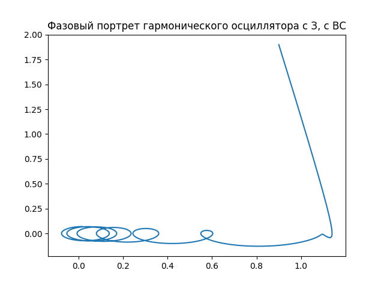

---
## Front matter
lang: ru-RU
title: Модель гармонических колебаний
subtitle: Лабораторная работа №4
author:
  - Манаева В.Е.
institute:
  - Российский университет дружбы народов, Москва, Россия
date: 18 февраля 2023

## i18n babel
babel-lang: russian
babel-otherlangs: english

## Formatting pdf
toc: false
toc-title: Содержание
slide_level: 2
aspectratio: 169
section-titles: true
theme: metropolis
header-includes:
 - \metroset{progressbar=frametitle,sectionpage=progressbar,numbering=fraction}
 - '\makeatletter'
 - '\beamer@ignorenonframefalse'
 - '\makeatother'
---

## Цели и задачи

- Изучить модели гармонического осциллятора;
- Записать на языках OpenModelica и Julia программы, которые бы решали данные задачи с возможностью вносить разные входящие данные;
- Сравнить результат работы данных программ между собой.

---

## Условия

Постройте фазовый портрет гармонического осциллятора и решение уравнения гармонического осциллятора для следующих случаев:

1. Колебания гармонического осциллятора без затуханий и без действий внешней силы $\ddot{x}+4.7x=0$;
2. Колебания гармонического осциллятора c затуханием и без действий внешней силы $\ddot{x}+0.5\dot{x}+7x=0$
3. Колебания гармонического осциллятора c затуханием и под действием внешней силы $\ddot{x}+7\dot{x}+0.5x=0.5sin(0.7t)$

На интервале $t\in [0;56]$ (шаг $0.05$) с начальными условиями $x_0=0.9, y_0=1.9$.

# Процесс работы

## Julia 

Был написан код на Julia с использованием библиотек PyPlot.jl и DifferentialEquations.jl

{#fig:001 width=50%}

## OpenModelica 

Был написан код на OpenModelica

{#fig:002 width=50%}

# Результаты

## Графики, построенные для первой модели

Графики, построенные программами для первой задачи, одинаковы.

 | 
:-------------------------:|:-------------------------:
{#fig:003 width=40%} | {#fig:003 width=40%}

## Графики, построенные для второй модели

Аналогичная ситуация и для графиков, построенных для второго условия.

 | 
:-------------------------:|:-------------------------:
{#fig:003 width=50%}|{#fig:004 width=50%}

## Графики, построенные для третьей модели

Аналогичная ситуация и для графиков, построенных для третьего условия.

 | 
:-------------------------:|:-------------------------:
{#fig:003 width=50%}|{#fig:004 width=50%}

## Скринкасты

Были записаны скринкасты [лабораторной работы](https://youtu.be/NL1h4QvIfmM "лабораторной работы") и [презентации лабораторной работы](https://youtu.be/hyq9K2w2Pwk "презентации лабораторной работы").

{#fig:005 width=50%}