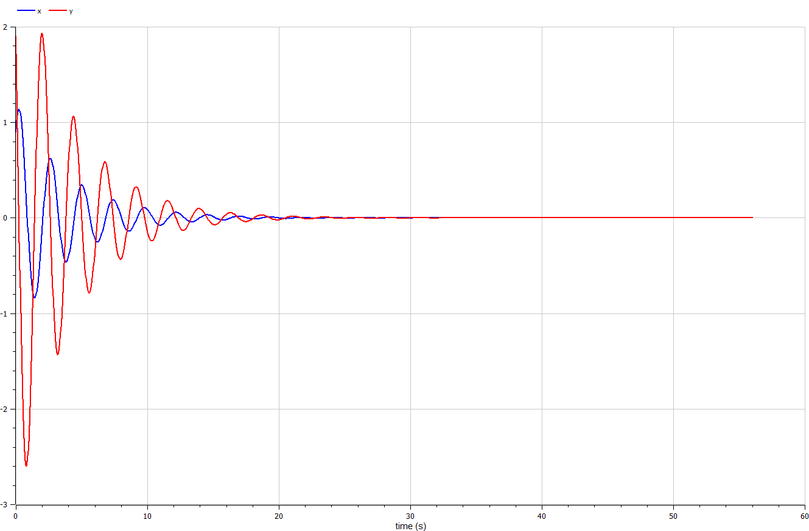

---
## Front matter
title: "Отчёт по лабораторной работе №4"
subtitle: "Предмет: Математическое моделирование"
author: "Манаева Варвара Евгеньевна, НФИбд-01-20.
1032201197"

## Generic otions
lang: ru-RU
toc-title: "Содержание"

## Bibliography
bibliography: bib/cite.bib
csl: pandoc/csl/gost-r-7-0-5-2008-numeric.csl

## Pdf output format
toc: true # Содержание
toc-depth: 2
lof: true # Список рисунков
lot: true # Список таблиц
fontsize: 12pt
linestretch: 1.5
papersize: a4
documentclass: scrreprt
## I18n polyglossia
polyglossia-lang:
  name: russian
  options:
	- spelling=modern
	- babelshorthands=true
polyglossia-otherlangs:
  name: english
## I18n babel
babel-lang: russian
babel-otherlangs: english
## Fonts
mainfont: PT Serif
romanfont: PT Serif
sansfont: PT Sans
monofont: PT Mono
mainfontoptions: Ligatures=TeX
romanfontoptions: Ligatures=TeX
sansfontoptions: Ligatures=TeX,Scale=MatchLowercase
monofontoptions: Scale=MatchLowercase,Scale=0.9
## Biblatex
biblatex: true
biblio-style: "gost-numeric"
biblatexoptions:
  - parentracker=true
  - backend=biber
  - hyperref=auto
  - language=auto
  - autolang=other*
  - citestyle=gost-numeric
## Pandoc-crossref LaTeX customization
figureTitle: "Рис."
tableTitle: "Таблица"
listingTitle: "Листинг"
lofTitle: "Список иллюстраций"
lotTitle: "Список таблиц"
lolTitle: "Листинги"
## Misc options
indent: true
header-includes:
  - \usepackage{indentfirst}
  - \usepackage{float} # keep figures where there are in the text
  - \floatplacement{figure}{H} # keep figures where there are in the text
---

# Цель работы

Изучить работу гармонического осциллятора и решить задания лабораторной работы.

Задачи:

- Изучить теоретическую справку;
- Запрограммировать решение на Julia;
- Запрограммировать решение на OpenModelica;
- Сравнить результаты работы программ;

# Задание лабораторной работы
## Вариант №28 [@lab-task:mathmod]

Постройте фазовый портрет гармонического осциллятора и решение уравнения гармонического осциллятора для следующих случаев:

1. Колебания гармонического осциллятора без затуханий и без действий внешней силы $\ddot{x}+4.7x=0$;
2. Колебания гармонического осциллятора c затуханием и без действий внешней силы $\ddot{x}+0.5\dot{x}+7x=0$
3. Колебания гармонического осциллятора c затуханием и под действием внешней силы $\ddot{x}+7\dot{x}+0.5x=0.5sin(0.7t)$

На интервале $t\in [0;56]$ (шаг $0.05$) с начальными условиями $x_0=0.9, y_0=1.9$.

# Теоретическое введение

## Общая информация о модели [@lab-example:mathmod]

Движение грузика на пружинке, маятника, заряда в электрическом контуре, а также эволюция во времени многих систем в физике, химии, биологии и других науках при определенных предположениях можно описать одним и тем же дифференциальным уравнением, которое в теории колебаний выступает в качестве основной модели. Эта модель называется линейным гармоническим осциллятором. 

Уравнение свободных колебаний гармонического осциллятора имеет следующий вид:

\begin{equation}
	\label{eq1}
	\ddot{x}+2\gamma\dot{x}+{{\omega}_0}^2x=0
\end{equation}

где x – переменная, описывающая состояние системы (смещение грузика, заряд конденсатора и т.д.), $\gamma$ – параметр, характеризующий потери энергии (трение в механической системе, сопротивление в контуре), ${{\omega}_0}^2$ – собственная частота колебаний, t – время. (Обозначения $\ddot{x} = \frac{\partial^2 x}{\partial t^2}$, $\dot{x} = \frac{\partial x}{\partial t}$)

Уравнение (\eqref{eq1}) есть линейное однородное дифференциальное уравнение второго порядка и оно является примером линейной динамической системы.

При отсутствии потерь в системе ($\gamma=0$) вместо уравнения \eqref{eq1} получаем уравнение консервативного осциллятора, энергия колебания которого сохраняется во времени.

\begin{equation}
	\label{eq2}
	\ddot{x}+{{\omega}_0}^2x=0
\end{equation}

Для однозначной разрешимости уравнения второго порядка \eqref{eq2} необходимо задать двав начальных условия вида

\begin{equation}
	\label{eq3}
	\begin{cases}
		x(t) = x_0 \\
		\dot{x}(t) = y_0
	\end{cases}
\end{equation}

Уравнение второго порядка \eqref{eq2} можно представить в виде системы двух уравнений первого порядка:

\begin{equation}
	\label{eq4}
	\begin{cases}
		\dot{x} = y \\
		\dot{y} = -{{\omega}_0}^2
	\end{cases}
\end{equation}

Начальные условия \eqref{eq3} для системы (4) примут вид: 

\begin{equation}
	\label{eq5}
	\begin{cases}
		x(t_0) = x_0 \\
		y(t_0) = y_0
	\end{cases}
\end{equation}

# Выполнение лабораторной работы

## Решение с помощью программ
### Julia
#### Программный код решения на Julia

Решить дифференциальное уравнение, расписанное в постановке задачи лабораторной работы, поможет библиотека DifferentialEquations [@diff-eq-doc:julka]. Итоговые изображения в полярных координатах будут строиться через библиотеку PyPlot.

	using PyPlot;
	using DifferentialEquations;
	function ZF!(du, u, p, t)
	    du[1] = u[2]
	    du[2] = -p[1]*u[2]-p[2]*u[1] + p[3]*sin(0.7*t)
	end
	const u0 = Float64[0.9, 1.9]
	const p1 = Float64[0, 4.7, 0]
	const p2 = Float64[0.5, 7, 0]
	const p3 = Float64[7, 0.5, 0.5]
	const tspan = Float64[0.0, 56.0]
	const shag = Float64(0.05)
	
	prob = ODEProblem(ZF!,u0,tspan, p1)
	sol = solve(prob, dtmax=0.05);
	
	x = [tu[1] for tu in sol.u]
	y = [tu[2] for tu in sol.u]
	
	clf()
	plot(x, y)
	title("Фазовый портрет гармонического осциллятора без З, без ВС")
	savefig("C:\\Users\\emanaev\\work\\study\\2022-2023\\Математическое_моделирование\\study_2022-2023_mathmod\\labs\\lab4\\report\\image\\graph1.png")
	savefig("C:\\Users\\emanaev\\work\\study\\2022-2023\\Математическое_моделирование\\study_2022-2023_mathmod\\labs\\lab4\\presentation\\image\\graph1.png")
	clf()
	plot(sol.t, x, color="darkblue")
	plot(sol.t, y, color="crimson")
	title("Фазовый портрет гармонического осциллятора без З, без ВС")
	savefig("C:\\Users\\emanaev\\work\\study\\2022-2023\\Математическое_моделирование\\study_2022-2023_mathmod\\labs\\lab4\\report\\image\\graph1_t.png")
	savefig("C:\\Users\\emanaev\\work\\study\\2022-2023\\Математическое_моделирование\\study_2022-2023_mathmod\\labs\\lab4\\presentation\\image\\graph1_t.png")
	clf()
	
	prob = ODEProblem(ZF!,u0,tspan, p2)
	sol = solve(prob, dtmax=0.05);
	
	x = [tu[1] for tu in sol.u]
	y = [tu[2] for tu in sol.u]
	
	clf()
	plot(x, y)
	title("Фазовый портрет гармонического осциллятора c З, без ВС")
	savefig("C:\\Users\\emanaev\\work\\study\\2022-2023\\Математическое_моделирование\\study_2022-2023_mathmod\\labs\\lab4\\report\\image\\graph2.png")
	savefig("C:\\Users\\emanaev\\work\\study\\2022-2023\\Математическое_моделирование\\study_2022-2023_mathmod\\labs\\lab4\\presentation\\image\\graph2.png")
	clf()
	plot(sol.t, x, color="darkblue")
	plot(sol.t, y, color="crimson")
	title("Фазовый портрет гармонического осциллятора c З, без ВС")
	savefig("C:\\Users\\emanaev\\work\\study\\2022-2023\\Математическое_моделирование\\study_2022-2023_mathmod\\labs\\lab4\\report\\image\\graph2_t.png")
	savefig("C:\\Users\\emanaev\\work\\study\\2022-2023\\Математическое_моделирование\\study_2022-2023_mathmod\\labs\\lab4\\presentation\\image\\graph2_t.png")
	clf()
	
	prob = ODEProblem(ZF!,u0,tspan, p3)
	sol = solve(prob, dtmax=0.05);
	
	x = [tu[1] for tu in sol.u]
	y = [tu[2] for tu in sol.u]
	
	clf()
	plot(x, y)
	title("Фазовый портрет гармонического осциллятора c З, c ВС")
	savefig("C:\\Users\\emanaev\\work\\study\\2022-2023\\Математическое_моделирование\\study_2022-2023_mathmod\\labs\\lab4\\report\\image\\graph3.png")
	savefig("C:\\Users\\emanaev\\work\\study\\2022-2023\\Математическое_моделирование\\study_2022-2023_mathmod\\labs\\lab4\\presentation\\image\\graph3.png")
	clf()
	plot(sol.t, x, color="darkblue")
	plot(sol.t, y, color="crimson")
	title("Фазовый портрет гармонического осциллятора c З, c ВС")
	savefig("C:\\Users\\emanaev\\work\\study\\2022-2023\\Математическое_моделирование\\study_2022-2023_mathmod\\labs\\lab4\\report\\image\\graph3_t.png")
	savefig("C:\\Users\\emanaev\\work\\study\\2022-2023\\Математическое_моделирование\\study_2022-2023_mathmod\\labs\\lab4\\presentation\\image\\graph3_t.png")
	clf()

#### Результаты работы кода на Julia

Решение первой задачи (рис. @fig:001, @fig:011):

{#fig:001}

{#fig:011}

Решение второй задачи (рис. @fig:002, @fig:022):

{#fig:002}

{#fig:022}

Решение третье задачи (рис. @fig:003, @fig:033):

{#fig:003}

{#fig:033}

### OPenModelica
#### Программный код решения на OPenModelica

	model oscilyator
	  parameter Real w(start=4.7);
	  Real x(start = 0.9);
	  Real y(start = 1.9);
	  
	  equation
	    der(x)=y;
	    der(y)=-w*x;
	  
	  annotation(experiment(StartTime = 0, StopTime = 56, Tolerance = 1e-6, Interval = 0.05));
	end oscilyator;

	model oscilyator2
	  parameter Real g(start=7);
	  parameter Real w(start=0.5);
	  Real x(start = 0.9);
	  Real y(start = 1.9);
	  
	  equation
	    der(x)=y;
	    der(y)=-g*y-w*x;
	  
	  annotation(experiment(StartTime = 0, StopTime = 56, Tolerance = 1e-6, Interval = 0.05));
	end oscilyator2;

	model oscilyator3
	  parameter Real g(start=7);
	  parameter Real w(start=0.5);
	  Real x(start = 0.9);
	  Real y(start = 1.9);
	  
	  equation
	    der(x)=y;
	    der(y)=-g*y-w*x+0.5*sin(0.7*time);
	  
	  annotation(experiment(StartTime = 0, StopTime = 56, Tolerance = 1e-6, Interval = 0.05));
	end oscilyator3;

#### Результаты работы кода на OpenModelica

Решение первой задачи (рис. @fig:004, @fig:044):

{#fig:004}

{#fig:044}

Решение первой задачи (рис. @fig:005, @fig:055):

{#fig:005}

{#fig:055}

Решение первой задачи (рис. @fig:006, @fig:066):

{#fig:006}

{#fig:066}

## Сравнение результатов

Результаты работы программы на Julia и на OpenModelica идентичны до различий между графическими модулями. 

# Выводы

Были написаны программы на Julia и OpenModelica для решения трёх задач про движение гармонического осциллятора. Соответствующие решения на обоих языках оказались идентичны с поправкой на использование разных графических модулей.

Были записаны скринкасты [лабораторной работы](https://youtu.be/NL1h4QvIfmM "лабораторной работы") и [презентации лабораторной работы](https://youtu.be/hyq9K2w2Pwk "презентации лабораторной работы").

# Контрольные вопросы:

<u> *1) Запишите простейшую модель гармонических колебаний* </u>

Ответ: Запишем модель гармонических колебаний без затухания и без влияния внешней силы:

\begin{equation}
	\label{ans1}
	\ddot{x}+{{\omega}_0}^2x=0
\end{equation}

<u> *2) Дайте определение осциллятора*</u> 

Ответ: Осциллятор - это система, совершающая колебания, то есть показатели которой периодически повторяются во времени.

<u> *3) Запишите модель математического маятника* </u>

Ответ:  осциллятор, представляющий собой механическую систему, состоящую из материальной точки на конце невесомой нерастяжимой нити или лёгкого стержня и находящуюся в однородном поле сил тяготения. Другой конец нити (стержня) обычно неподвижен. Период малых собственных колебаний маятника длины L, подвешенного в поле тяжести, равен

\begin{equation}
	\label{ans3}
	T_0 = 2\Pi\sqrt{\frac{L}{g}}
\end{equation}

и не зависит, в первом приближении, от амплитуды колебаний и массы маятника. Здесь g — ускорение свободного падения.

<u> *4) Запишите алгоритм перехода от дифференциального уравнения второго порядка к двум дифференциальным уравнениям первого порядка* </u>

Ответ:

1. Первым уравнением обозначаем, что $\dot{x} = y$. Первое уравнение готово.
2. Из первого уравнения следует, что $\ddot{x} = \dot{y}$.
3. В изначальном уравнении второго порядка заменяем $\ddot{x}$ на $\dot{y}$, а также $\dot{x}$ на $y$.
4. Записываем изначальное уравнение с заменами из пункта 3 в систему. Второе уравнение в системе.
5. Финальные преобразования: второе уравнение в получившейся системе необходимо перегруппировать таким образом, чтобы $\dot{y}$ стояло слева от равно, а всё остальное - справа.

Система уравнений дифференциальных уравнений первого порядка из уравнения второго порядка готова.

<u> *5) Что такое фазовый портрет и фазовая траектория?* </u>

Ответ: Фазовая траектория - гладкая кривая в фазовой плоскости, которая отвечает решению уравнения движения как функции времени.

Фазовый портрет - множество различных решений (соответствующих разным начальным условиям), изображённые на одной фазовой плоскости.

# Список литературы

