---
## Front matter
lang: ru-RU
title: Модель Хищник-жертва
subtitle: Лабораторная работа №5
author:
  - Манаева В.Е.
institute:
  - Российский университет дружбы народов, Москва, Россия
date: 2 марта 2023

## i18n babel
babel-lang: russian
babel-otherlangs: english

## Formatting pdf
toc: false
toc-title: Содержание
slide_level: 2
aspectratio: 169
section-titles: true
theme: metropolis
header-includes:
 - \metroset{progressbar=frametitle,sectionpage=progressbar,numbering=fraction}
 - '\makeatletter'
 - '\beamer@ignorenonframefalse'
 - '\makeatother'
---

## Цели и задачи

- Изучить модели хищник-жертва Лотки-Вольтерры;
- Записать на языках OpenModelica и Julia программы, которые бы решали данные задачи с возможностью вносить разные входящие данные;
- Сравнить результат работы данных программ между собой.

## Условия

Для модели "хищник-жертва"

$$
\begin{cases}
\frac{dx}{dt} = -0.69x(t)+0.059x(t)y(t) \\
\frac{dy}{dt} = 0.49y(t)-0.096x(t)y(t)
\end{cases}
$$

Постройте график зависимости численности хищников от численности жертв, а также графики изменения численности хищников
и численности жертв при следующих начальных условиях: $x_0 = 8, y_0 = 19$. Найдите стационарное состояние системы.

# Процесс работы

## Julia 

Был написан код на Julia с использованием библиотек PyPlot.jl и DifferentialEquations.jl

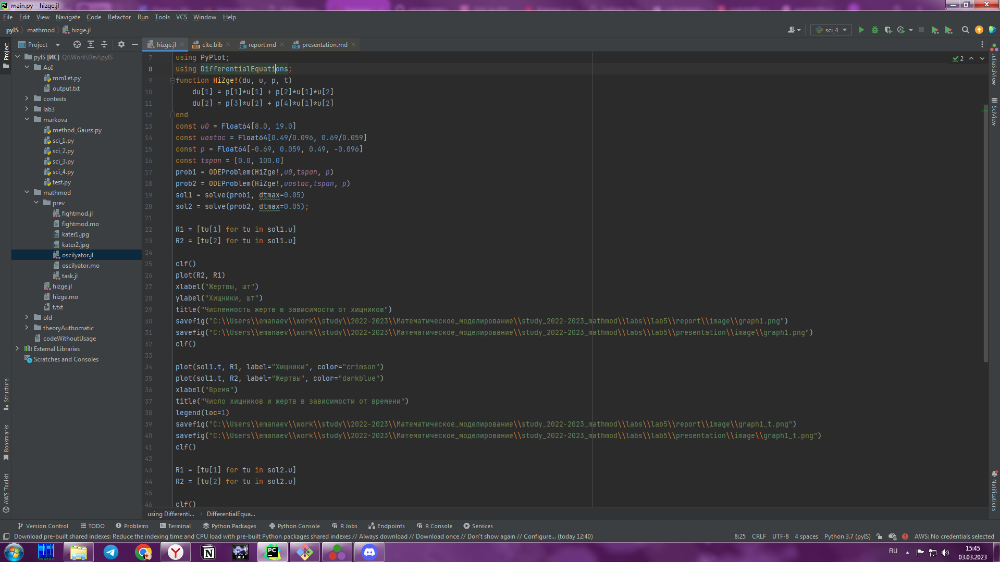{#fig:001 width=50%}

## OpenModelica 

Был написан код на OpenModelica

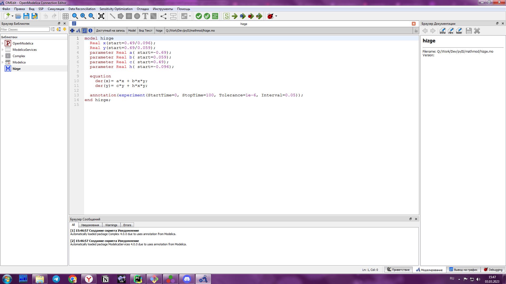{#fig:002 width=50%}

# Результаты

## Графики, построенные для первой модели

Графики, построенные программами для первой задачи, одинаковы.

 | 
:-------------------------:|:-------------------------:
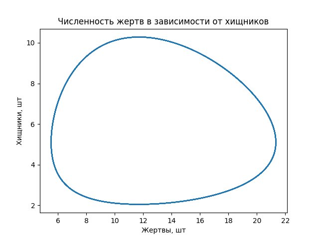{#fig:003 width=40%} | 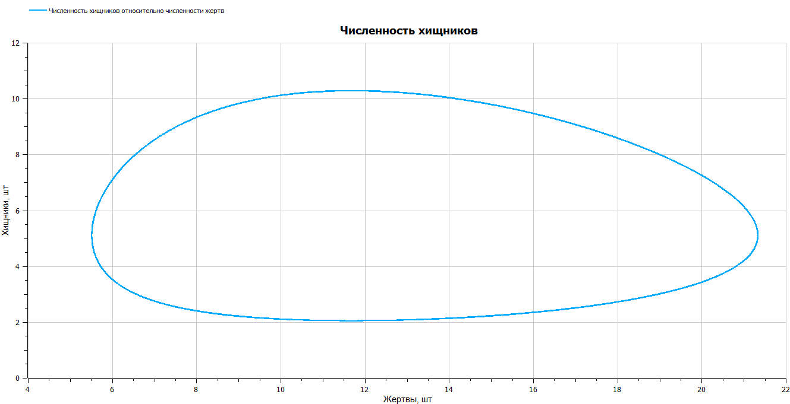{#fig:003 width=40%}

## Графики, построенные для первой модели

Графики, построенные программами для первой задачи, одинаковы.

 | 
:-------------------------:|:-------------------------:
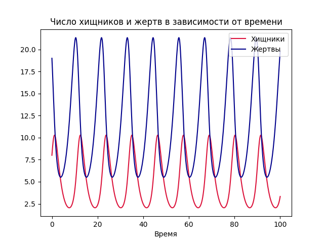{#fig:003 width=40%} | 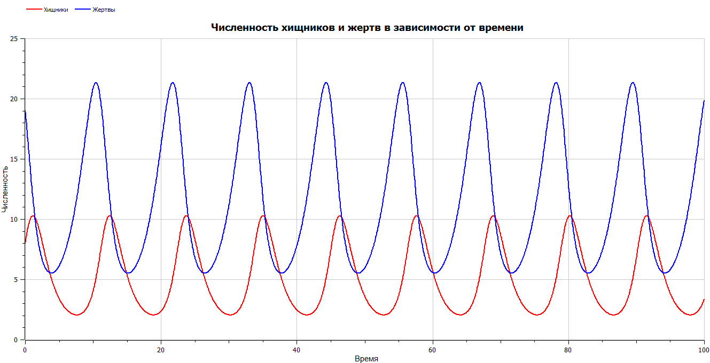{#fig:003 width=40%}

## Графики, построенные для второй модели

Аналогичная ситуация и для графиков, построенных для второго условия.

 | 
:-------------------------:|:-------------------------:
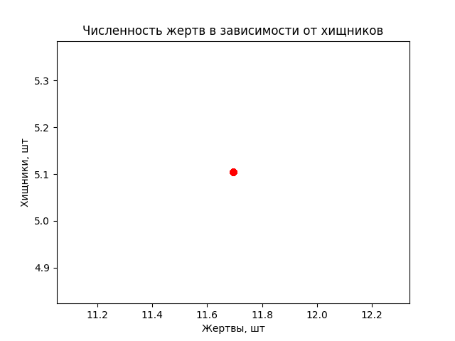{#fig:003 width=50%}|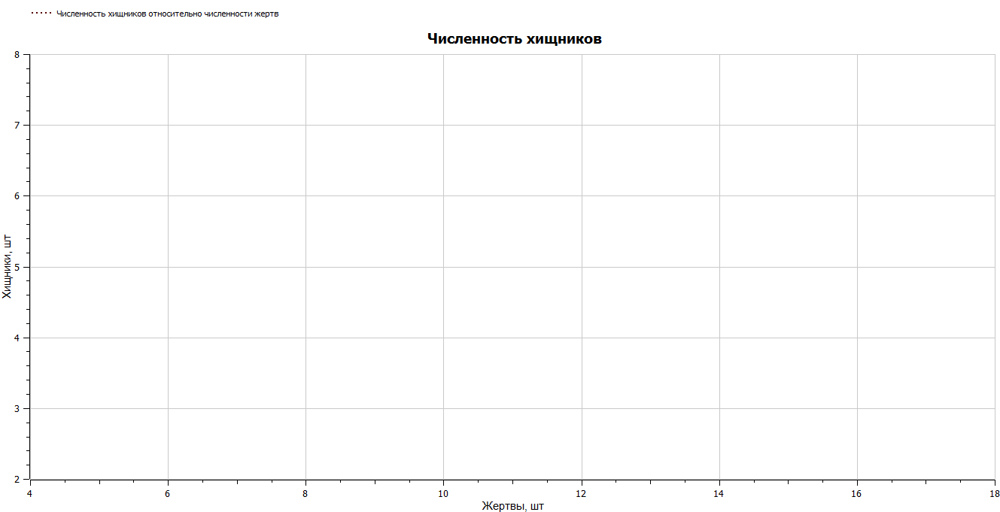{#fig:004 width=50%}

## Графики, построенные для второй модели

Аналогичная ситуация и для графиков, построенных для второго условия.

 | 
:-------------------------:|:-------------------------:
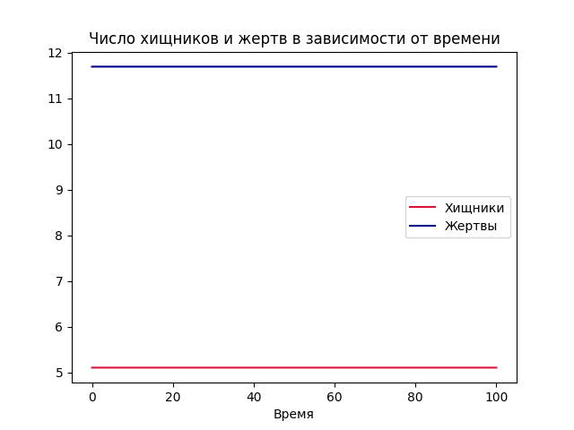{#fig:003 width=50%}|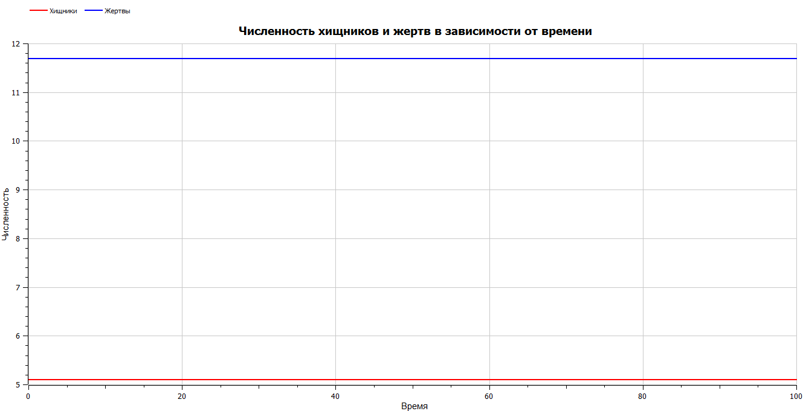{#fig:004 width=50%}

## Скринкасты

Были записаны скринкасты [лабораторной работы](https://youtu.be/Oj6xaBcyzBg "лабораторной работы") и [презентации лабораторной работы](https://youtu.be/_V_hC144Qms "презентации лабораторной работы").

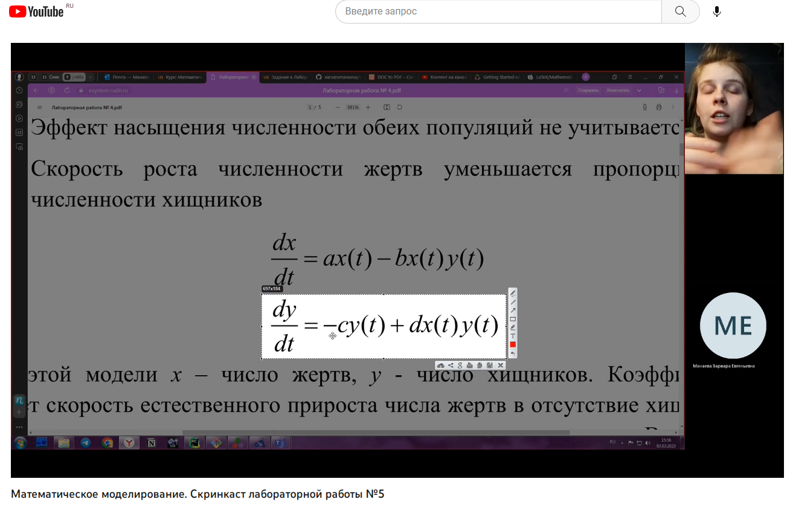{#fig:005 width=60% }