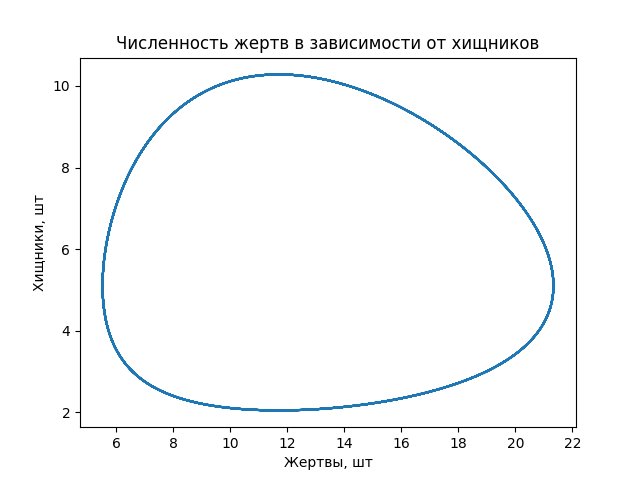
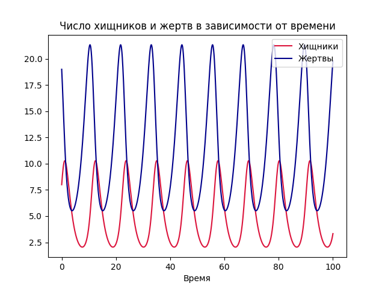
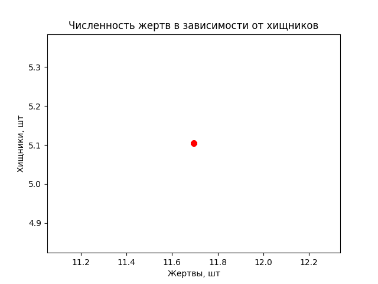
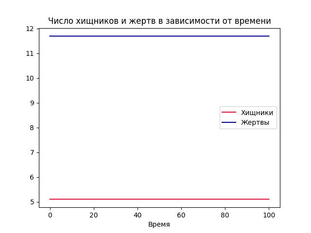
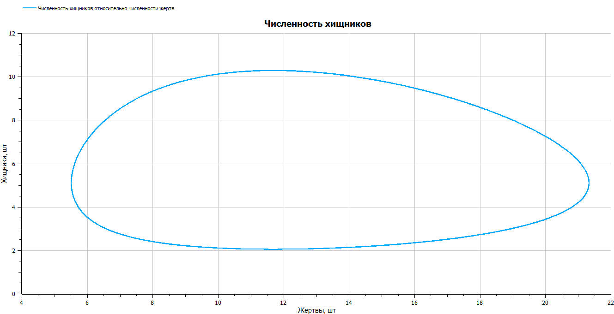
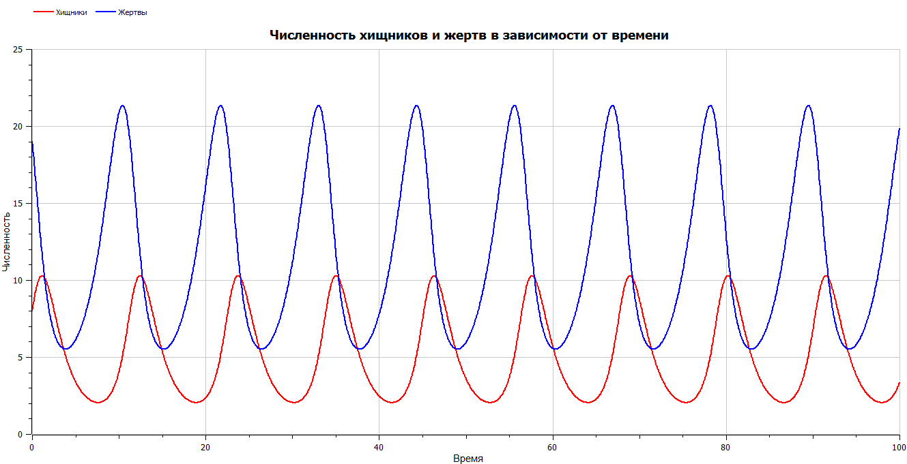
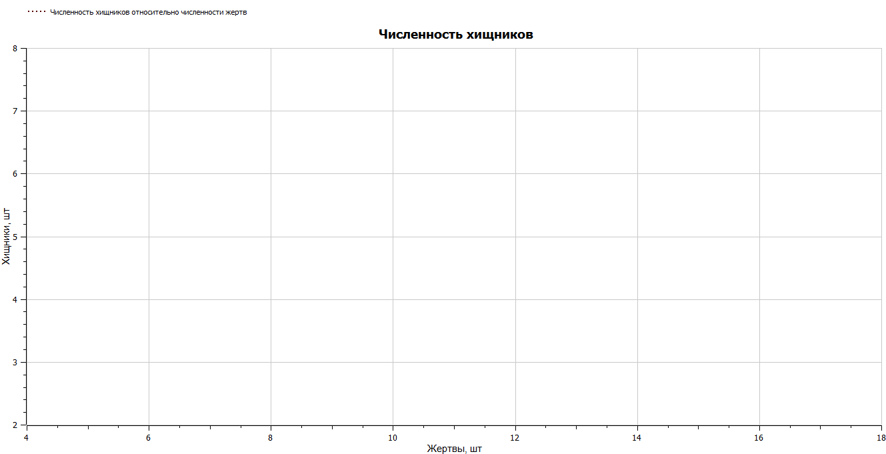
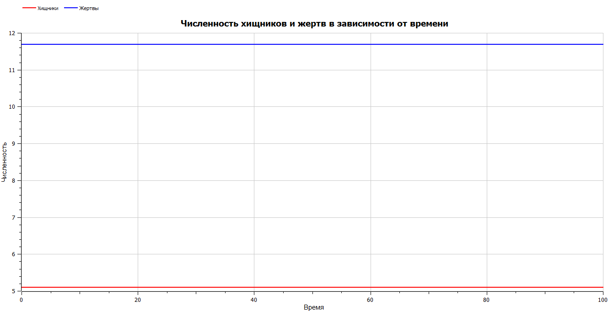

---
## Front matter
title: "Отчёт по лабораторной работе №5"
subtitle: "Предмет: Математическое моделирование"
author: "Манаева Варвара Евгеньевна, НФИбд-01-20.
1032201197"

## Generic otions
lang: ru-RU
toc-title: "Содержание"

## Bibliography
bibliography: bib/cite.bib
csl: pandoc/csl/gost-r-7-0-5-2008-numeric.csl

## Pdf output format
toc: true # Содержание
toc-depth: 3
lof: true # Список рисунков
lot: true # Список таблиц
fontsize: 12pt
linestretch: 1.5
papersize: a4
documentclass: scrreprt
## I18n polyglossia
polyglossia-lang:
  name: russian
  options:
	- spelling=modern
	- babelshorthands=true
polyglossia-otherlangs:
  name: english
## I18n babel
babel-lang: russian
babel-otherlangs: english
## Fonts
mainfont: PT Serif
romanfont: PT Serif
sansfont: PT Sans
monofont: PT Mono
mainfontoptions: Ligatures=TeX
romanfontoptions: Ligatures=TeX
sansfontoptions: Ligatures=TeX,Scale=MatchLowercase
monofontoptions: Scale=MatchLowercase,Scale=0.9
## Biblatex
biblatex: true
biblio-style: "gost-numeric"
biblatexoptions:
  - parentracker=true
  - backend=biber
  - hyperref=auto
  - language=auto
  - autolang=other*
  - citestyle=gost-numeric
## Pandoc-crossref LaTeX customization
figureTitle: "Рис."
tableTitle: "Таблица"
listingTitle: "Листинг"
lofTitle: "Список иллюстраций"
lotTitle: "Список таблиц"
lolTitle: "Листинги"
## Misc options
indent: true
header-includes:
  - \usepackage{indentfirst}
  - \usepackage{float} # keep figures where there are in the text
  - \floatplacement{figure}{H} # keep figures where there are in the text
---

# Цель работы

Изучить жёсткую модель Хищник-жертва и решить задания лабораторной работы.

Задачи:

- Изучить теоретическую справку;
- На основании теоретической справки найти стационарное решение для задачи;
- Запрограммировать решение на Julia;
- Запрограммировать решение на OpenModelica;
- Сравнить результаты работы программ;

# Задание лабораторной работы
## Вариант №28 [@lab-task:mathmod]

Для модели "хищник-жертва"

\begin{equation}
\label{eq1}
\begin{cases}
\frac{dx}{dt} = -0.69x(t)+0.059x(t)y(t) \\
\frac{dy}{dt} = 0.49y(t)-0.096x(t)y(t)
\end{cases}
\end{equation}

Постройте график зависимости численности хищников от численности жертв, а также графики изменения численности хищников
и численности жертв при следующих начальных условиях: $x_0 = 8, y_0 = 19$. Найдите стационарное состояние системы.

# Теоретическое введение

## Общая информация о модели [@lab-example:mathmod]

Простейшая модель взаимодействия двух видов типа «хищник — жертва» - модель Лотки-Вольтерры. Данная двувидовая модель основывается на следующих предположениях:

1. Численность популяции жертв x и хищников y зависят только от времени (модель не учитывает пространственное распределение популяции на занимаемой территории)
2. В отсутствии взаимодействия численность видов изменяется по модели Мальтуса, при этом число жертв увеличивается, а число хищников падает
3. Естественная смертность жертвы и естественная рождаемость хищника считаются несущественными
4. Эффект насыщения численности обеих популяций не учитывается
5. Скорость роста численности жертв уменьшается пропорционально численности хищников

\begin{equation}
\label{eq2}
\begin{array}{l}
\frac{dx}{dt} = ax(t)-bx(t)y(t) \\
\frac{dy}{dt} = -cy(t)+dx(t)y(t)
\end{array}
\end{equation}

В этой модели $x$ – число жертв, $y$ - число хищников.
Коэффициент $a$ описывает скорость естественного прироста числа жертв в отсутствие хищников, $с$ - естественное вымирание хищников, лишенных пищи в виде жертв.
Вероятность взаимодействия жертвы и хищника считается пропорциональной как количеству жертв, так и числу самих хищников ($xy$).
Каждый акт взаимодействия уменьшает популяцию жертв, но способствует увеличению популяции хищников (члены $-bxy$ и $dxy$ в правой части уравнения).

Математический анализ этой (жёсткой) модели показывает, что имеется стационарное состояние, всякое же другое начальное состояние приводит
к периодическому колебанию численности как жертв, так и хищников, так что по прошествии некоторого времени такая система вернётся в изначальное состояние.

Стационарное состояние системы \eqref{eq2} (положение равновесия, не зависящее от времени решения) будет находиться
в точке $x_0=\frac{c}{d}, y_0=\frac{a}{b}$. Если начальные значения задать в стационарном состоянии $x(0) = x_0, y(0) = y_0$, то в любой момент времени
численность популяций изменяться не будет. При малом отклонении от положения равновесия численности как хищника, так и жертвы с течением времени не
возвращаются к равновесным значениям, а совершают периодические колебания вокруг стационарной точки. Амплитуда колебаний и их период определяется
начальными значениями численностей $x(0), y(0)$. Колебания совершаются в противофазе.

При малом изменении модели

\begin{equation}
\label{eq3}
\begin{array}{l}
\frac{dx}{dt} = ax(t)-bx(t)y(t) + \epsilon f(x,y) \\
\frac{dy}{dt} = -cy(t)+dx(t)y(t) + \epsilon g(x,y), \epsilon << 1
\end{array}
\end{equation}

(прибавление к правым частям малые члены, учитывающие, например, конкуренцию жертв за пищу и хищников за жертв), вывод о периодичности
(возвращении системы в исходное состояние B), справедливый для жесткой системы Лотки-Вольтерры, теряет силу. Таким образом, мы получаем так
называемую мягкую модель «хищник-жертва».

# Выполнение лабораторной работы

## Решение с помощью программ
### Julia
#### Программный код решения на Julia

Решить дифференциальное уравнение, расписанное в постановке задачи лабораторной работы, поможет библиотека DifferentialEquations[@diff-eq-doc:julka].
Итоговые изображения в полярных координатах будут строиться через библиотеку PyPlot.

    using PyPlot;
    using DifferentialEquations;
    function HiZge!(du, u, p, t)
        du[1] = p[1]*u[1] + p[2]*u[1]*u[2]
        du[2] = p[3]*u[2] + p[4]*u[1]*u[2]
    end
    const u0 = Float64[8.0, 19.0]
    const uostac = Float64[0.49/0.096, 0.69/0.059]
    const p = Float64[-0.69, 0.059, 0.49, -0.096]
    const tspan = [0.0, 100.0]
    prob1 = ODEProblem(HiZge!,u0,tspan, p)
    prob2 = ODEProblem(HiZge!,uostac,tspan, p)
    sol1 = solve(prob1, dtmax=0.05)
    sol2 = solve(prob2, dtmax=0.05);
    
    R1 = [tu[1] for tu in sol1.u]
    R2 = [tu[2] for tu in sol1.u]
    
    clf()
    plot(R2, R1)
    xlabel("Жертвы, шт")
    ylabel("Хищники, шт")
    title("Численность жертв в зависимости от хищников")
    savefig("C:\\Users\\emanaev\\work\\study\\2022-2023\\Математическое_моделирование\\study_2022-2023_mathmod\\labs\\lab5\\report\\image\\graph1.png")
    savefig("C:\\Users\\emanaev\\work\\study\\2022-2023\\Математическое_моделирование\\study_2022-2023_mathmod\\labs\\lab5\\presentation\\image\\graph1.png")
    clf()
    
    plot(sol1.t, R1, label="Хищники", color="crimson")
    plot(sol1.t, R2, label="Жертвы", color="darkblue")
    xlabel("Время")
    title("Число хищников и жертв в зависимости от времени")
    legend(loc=1)
    savefig("C:\\Users\\emanaev\\work\\study\\2022-2023\\Математическое_моделирование\\study_2022-2023_mathmod\\labs\\lab5\\report\\image\\graph1_t.png")
    savefig("C:\\Users\\emanaev\\work\\study\\2022-2023\\Математическое_моделирование\\study_2022-2023_mathmod\\labs\\lab5\\presentation\\image\\graph1_t.png")
    clf()
    
    R1 = [tu[1] for tu in sol2.u]
    R2 = [tu[2] for tu in sol2.u]
    
    clf()
    plot(R2, R1, "ro")
    xlabel("Жертвы, шт")
    ylabel("Хищники, шт")
    title("Численность жертв в зависимости от хищников")
    savefig("C:\\Users\\emanaev\\work\\study\\2022-2023\\Математическое_моделирование\\study_2022-2023_mathmod\\labs\\lab5\\report\\image\\graph2.png")
    savefig("C:\\Users\\emanaev\\work\\study\\2022-2023\\Математическое_моделирование\\study_2022-2023_mathmod\\labs\\lab5\\presentation\\image\\graph2.png")
    clf()
    
    plot(sol2.t, R1, label="Хищники", color="crimson")
    plot(sol2.t, R2, label="Жертвы", color="darkblue")
    xlabel("Время")
    title("Число хищников и жертв в зависимости от времени")
    legend()
    savefig("C:\\Users\\emanaev\\work\\study\\2022-2023\\Математическое_моделирование\\study_2022-2023_mathmod\\labs\\lab5\\report\\image\\graph2_t.png")
    savefig("C:\\Users\\emanaev\\work\\study\\2022-2023\\Математическое_моделирование\\study_2022-2023_mathmod\\labs\\lab5\\presentation\\image\\graph2_t.png")
    clf()

#### Результаты работы кода на Julia

Решение для нестационарного состояния, заданного заданием лабораторной работы (рис. @fig:001, @fig:011).

{#fig:001}

{#fig:011}

Решение для стационарного состояния, заданного заданием лабораторной работы (рис. @fig:002, @fig:022).

{#fig:002}

{#fig:022}

В стационарном состоянии решение вида $y(x)=some function$ будет представлять собой точку.

### OPenModelica
#### Программный код решения на OPenModelica

	model hizge
	  Real x(start=8);
	  Real y(start=19);
	  parameter Real a( start=-0.69);
	  parameter Real b( start=0.059);
	  parameter Real c( start=0.49);
	  parameter Real h( start=-0.096);
	
	  equation
	    der(x)= a*x + b*x*y;
	    der(y)= c*y + h*x*y;
	
	  annotation(experiment(StartTime=0, StopTime=100, Tolerance=1e-6, Interval=0.05));
	end hizge;
	model hizge
	  Real x(start=0.49/0.096);
	  Real y(start=0.69/0.059);
	  parameter Real a( start=-0.69);
	  parameter Real b( start=0.059);
	  parameter Real c( start=0.49);
	  parameter Real h( start=-0.096);
	
	  equation
	    der(x)= a*x + b*x*y;
	    der(y)= c*y + h*x*y;
	
	  annotation(experiment(StartTime=0, StopTime=100, Tolerance=1e-6, Interval=0.05));
	end hizge;

#### Результаты работы кода на OpenModelica

Решение для нестационарного состояния, заданного заданием лабораторной работы (рис. @fig:003, @fig:033):

{#fig:003}

{#fig:033}

Решение для стационарного состояния, заданного заданием лабораторной работы (рис. @fig:004, @fig:044):

{#fig:004}

{#fig:044}

В стационарном состоянии решение вида $y(x)=some function$ будет представлять собой точку. Почему-то в OpenModelica точка сама по себе не желает отображаться.

# Выводы

Была изучена жёсткая модель Хищник-жертва. Были запрограммированы решения для задачи лабораторной работы на Julia и OpenModelica.
Было найдено стационарное состояние системы и были построены графики численности жертв и хищников для условий задачи и для стационарного состояния.

Были записаны скринкасты [лабораторной работы](https://youtu.be/Oj6xaBcyzBg "лабораторной работы") и [презентации лабораторной работы](https://youtu.be/_V_hC144Qms "презентации лабораторной работы").

# Список литературы

