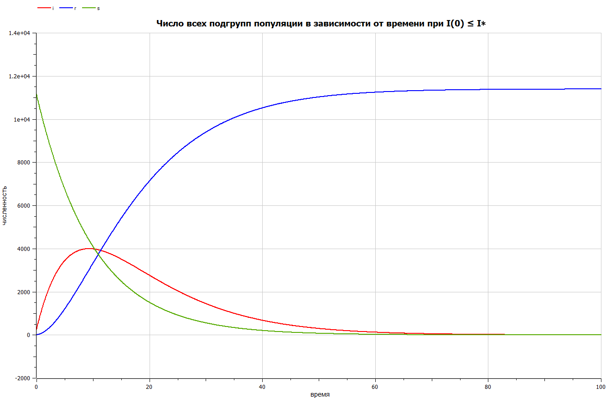

---
## Front matter
lang: ru-RU
title: Задача об эпидемии
subtitle: Лабораторная работа №6
author:
  - Манаева В.Е., 1032201197
institute:
  - Российский университет дружбы народов, Москва, Россия
date: 2 марта 2023

## i18n babel
babel-lang: russian
babel-otherlangs: english

## Formatting pdf
toc: false
toc-title: Содержание
slide_level: 2
aspectratio: 169
section-titles: true
theme: metropolis
header-includes:
 - \metroset{progressbar=frametitle,sectionpage=progressbar,numbering=fraction}
 - '\makeatletter'
 - '\beamer@ignorenonframefalse'
 - '\makeatother'
---

## Цели и задачи

- Изучить модель, описывающую задачу об эпидемии;
- Записать на языках OpenModelica и Julia программы, которые бы решали данные задачи с возможностью вносить разные входящие данные;
- Сравнить результат работы данных программ между собой.

## Условия

На одном острове вспыхнула эпидемия. Известно, что из всех проживающих на острове ($N=11 400$) в момент начала эпидемии ($t=0$) число заболевших людей (являющихся распространителями инфекции) $I(0)=250$, число здоровых людей с иммунитетом к болезни $R(0)=47$. Таким образом, число людей восприимчивых к болезни, но пока здоровых, в начальный момент времени $S(0)=N-I(0)- R(0)$. Постройте графики изменения числа особей в каждой из трех групп.

Рассмотрите, как будет протекать эпидемия в случае:

1) если $I(0) \le I^{\ast}$
2) если $I(0) > I^{\ast}$

Зададим параметр заболеваемости как $0.1$, а параметр выздоровления как $0.11$.

# Процесс работы

## Julia 

Был написан код на Julia с использованием библиотек PyPlot.jl и DifferentialEquations.jl

{#fig:001 width=50%}

## OpenModelica 

Был написан код на OpenModelica

{#fig:002 width=50%}

# Результаты

## Графики, построенные для первой модели

Графики, построенные программами для первой задачи, одинаковы.

 | 
:-------------------------:|:-------------------------:
{#fig:003 width=40%} | {#fig:003 width=40%}

## Графики, построенные для второй модели

Аналогичная ситуация и для графиков, построенных для второго условия.

 | 
:-------------------------:|:-------------------------:
{#fig:003 width=50%}|{#fig:004 width=50%}

## Скринкасты

Были записаны скринкасты [лабораторной работы](https://youtu.be/ABaNLH02bPE "лабораторной работы") и [презентации лабораторной работы](https://youtu.be/KARDSixoAWw "презентации лабораторной работы").

{#fig:005 width=60% }
