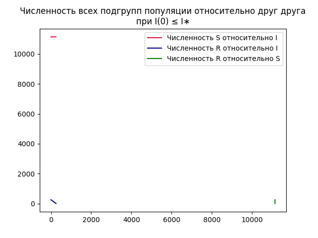
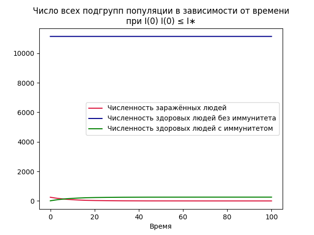
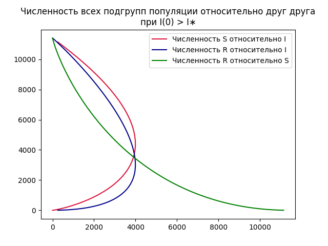
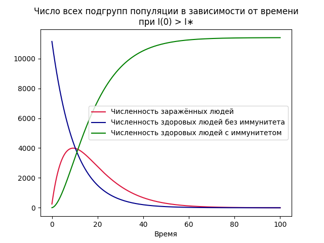
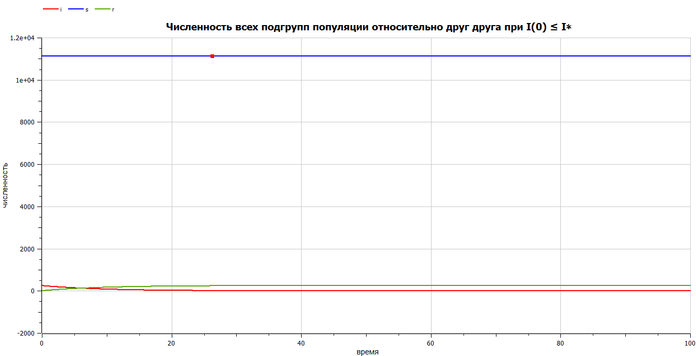
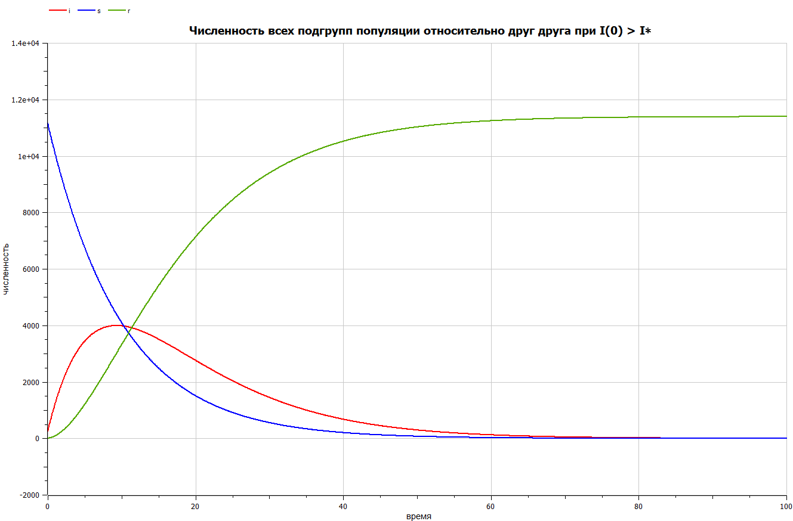

---
## Front matter
title: "Отчёт по лабораторной работе №6"
subtitle: "Предмет: Математическое моделирование"
author: "Манаева Варвара Евгеньевна, НФИбд-01-20.
1032201197"

## Generic otions
lang: ru-RU
toc-title: "Содержание"

## Bibliography
bibliography: bib/cite.bib
csl: pandoc/csl/gost-r-7-0-5-2008-numeric.csl

## Pdf output format
toc: true # Содержание
toc-depth: 3
lof: true # Список рисунков
lot: false # Список таблиц
fontsize: 12pt
linestretch: 1.5
papersize: a4
documentclass: scrreprt
## I18n polyglossia
polyglossia-lang:
  name: russian
  options:
	- spelling=modern
	- babelshorthands=true
polyglossia-otherlangs:
  name: english
## I18n babel
babel-lang: russian
babel-otherlangs: english
## Fonts
mainfont: PT Serif
romanfont: PT Serif
sansfont: PT Sans
monofont: PT Mono
mainfontoptions: Ligatures=TeX
romanfontoptions: Ligatures=TeX
sansfontoptions: Ligatures=TeX,Scale=MatchLowercase
monofontoptions: Scale=MatchLowercase,Scale=0.9
## Biblatex
biblatex: true
biblio-style: "gost-numeric"
biblatexoptions:
  - parentracker=true
  - backend=biber
  - hyperref=auto
  - language=auto
  - autolang=other*
  - citestyle=gost-numeric
## Pandoc-crossref LaTeX customization
figureTitle: "Рис."
tableTitle: "Таблица"
listingTitle: "Листинг"
lofTitle: "Список иллюстраций"
lotTitle: "Список таблиц"
lolTitle: "Листинги"
## Misc options
indent: true
header-includes:
  - \usepackage{indentfirst}
  - \usepackage{float} # keep figures where there are in the text
  - \floatplacement{figure}{H} # keep figures where there are in the text
---

# Цель работы

Изучить простейшую модель задачи об эпидемии и решить задания лабораторной работы.

Задачи:

- Изучить теоретическую справку;
- Запрограммировать решение на Julia;
- Запрограммировать решение на OpenModelica;
- Сравнить результаты работы программ;

# Задание лабораторной работы
## Вариант №28 [@lab-task:mathmod]

На одном острове вспыхнула эпидемия. Известно, что из всех проживающих на острове ($N=11 400$) в момент начала эпидемии ($t=0$) число заболевших людей (являющихся распространителями инфекции) $I(0)=250$, число здоровых людей с иммунитетом к болезни $R(0)=47$. Таким образом, число людей восприимчивых к болезни, но пока здоровых, в начальный момент времени $S(0)=N-I(0)- R(0)$. Постройте графики изменения числа особей в каждой из трех групп.

Рассмотрите, как будет протекать эпидемия в случае:

1) если $ I(0) \le I^* $
2) если $ I(0) > I^* $

# Теоретическое введение

## Общая информация о модели [@lab-example:mathmod]

Рассмотрим простейшую модель эпидемии. Предположим, что некая популяция, состоящая из $N$ особей, (считаем, что популяция изолирована) подразделяется на три группы. Первая группа - это восприимчивые к болезни, но пока здоровые особи, обозначим их через $S(t)$. Вторая группа – это число инфицированных особей, которые также при этом являются распространителями инфекции, обозначим их $I(t)$. А третья группа, обозначающаяся через $R(t)$ – это здоровые особи с иммунитетом к болезни.

До того, как число заболевших не превышает критического значения $I^{\ast}$, считаем, что все больные изолированы и не заражают здоровых. Когда $I(t) > I^{\ast}$, тогда инфицирование способны заражать восприимчивых к болезни особей. Таким образом, скорость изменения числа $S(t)$ меняется по следующему закону:

\begin{equation}
\label{eq1}
\frac{dS}{dt} = 
\begin{cases}
-\alpha S,&\text{если } I(t)>I^{\ast} \\
0,&\text{если } I(t) \le I^{\ast}
\end{cases}
\end{equation}

Поскольку каждая восприимчивая к болезни особь, которая, в конце концов, заболевает, сама становится инфекционной, то скорость изменения числа инфекционных особей представляет разность за единицу времени между заразившимися и теми, кто уже болеет и лечится, т.е.:

\begin{equation}
\label{eq2}
\frac{dI}{dt} = 
\begin{cases}
\alpha S - \beta I,& \text{если } I(t) > I^{\ast} \\
-\beta I,& \text{} I(t) \le I^{\ast}
\end{cases}
\end{equation}

А скорость изменения выздоравливающих особей (при этом приобретающие иммунитет к болезни):

\begin{equation}
\label{eq3}
\frac{dR}{dt} = \beta I
\end{equation}

Постоянные пропорциональности, $\alpha, beta$ - это коэффициенты заболеваемости и выздоровления соответственно. Для того, чтобы решения соответствующих уравнений определялось однозначно, необходимо задать начальные условия. Считаем, что на начало эпидемии в момент времени $t = 0$ нет особей с иммунитетом к болезни R(0)=0, а число инфицированных и восприимчивых к болезни особей $I(0)$ и $S(0)$ соответственно. Для анализа картины протекания эпидемии необходимо рассмотреть два случая:

- $I(0) \le I^{\ast}$
- $I(0) > I^{\ast}$

# Выполнение лабораторной работы

## Комментарии к условию

Все начальные значения функций $I(0), R(0), S(0)$ заданы в условии, однако параметры заболеваемости и выздоровления не заданы условием. Так, зададим параметр заболеваемости как $0.1$, а параметр выздоровления как $0.11$.

## Решение с помощью программ
### Julia
#### Программный код решения на Julia

Решить дифференциальное уравнение, расписанное в постановке задачи лабораторной работы, поможет библиотека DifferentialEquations[@diff-eq-doc:julka].
Итоговые изображения в полярных координатах будут строиться через библиотеку PyPlot.

    using PyPlot;
    using DifferentialEquations;
    function LessThenThreshold!(du, u, p, t)
        du[1] = -p[2]*u[1]      #= I =#
        du[2] = 0               #= S =#
        du[3] = p[2]*u[1]       #= R =#
    end
    function MoreThenThreshold!(du, u, p, t)
        du[1] = p[1]*u[2] - p[2]*u[1]
        du[2] = -p[1]*u[2]      #= S =#
        du[3] = p[2]*u[1]
    end
    const u0 = Float64[250.0, 11400.0 - 7.0 - 250.0, 7.0]
    const p = Float64[0.1, 0.11]
    const tspan = [0.0, 1000.0]
    prob1 = ODEProblem(LessThenThreshold!,u0,tspan, p)
    prob2 = ODEProblem(MoreThenThreshold!,u0,tspan, p)
    sol1 = solve(prob1, dtmax=0.05)
    sol2 = solve(prob2, dtmax=0.05);
    
    R1 = [tu[1] for tu in sol1.u]
    R2 = [tu[2] for tu in sol1.u]
    R3 = [tu[3] for tu in sol1.u]
    
    clf()
    plot(R1, R2, label="Численность S относительно I", color="crimson")
    plot(R1, R3, label="Численность R относительно I", color="darkblue")
    plot(R2, R3, label="Численность R относительно S", color="green")
    title("Численность всех подгрупп популяции относительно друг друга\nпри I(0) ≤ I∗")
    legend(loc=1)
    savefig("C:\\Users\\emanaev\\work\\study\\2022-2023\\Математическое_моделирование\\study_2022-2023_mathmod\\labs\\lab6\\report\\image\\graph1.png")
    savefig("C:\\Users\\emanaev\\work\\study\\2022-2023\\Математическое_моделирование\\study_2022-2023_mathmod\\labs\\lab6\\presentation\\image\\graph1.png")
    clf()
    
    plot(sol1.t, R1, label="Численность заражённых людей", color="crimson")
    plot(sol1.t, R2, label="Численность здоровых людей без иммунитета", color="darkblue")
    plot(sol1.t, R3, label="Численность здоровых людей с иммунитетом", color="green")
    xlabel("Время")
    title("Число всех подгрупп популяции в зависимости от времени\nпри I(0) I(0) ≤ I∗")
    legend(loc=1)
    savefig("C:\\Users\\emanaev\\work\\study\\2022-2023\\Математическое_моделирование\\study_2022-2023_mathmod\\labs\\lab6\\report\\image\\graph1_t.png")
    savefig("C:\\Users\\emanaev\\work\\study\\2022-2023\\Математическое_моделирование\\study_2022-2023_mathmod\\labs\\lab6\\presentation\\image\\graph1_t.png")
    clf()
    
    R1 = [tu[1] for tu in sol2.u]
    R2 = [tu[2] for tu in sol2.u]
    R3 = [tu[3] for tu in sol2.u]
    
    clf()
    plot(R1, R2, label="Численность S относительно I", color="crimson")
    plot(R1, R3, label="Численность R относительно I", color="darkblue")
    plot(R2, R3, label="Численность R относительно S", color="green")
    title("Численность всех подгрупп популяции относительно друг друга\nпри I(0) > I∗")
    legend(loc=1)
    savefig("C:\\Users\\emanaev\\work\\study\\2022-2023\\Математическое_моделирование\\study_2022-2023_mathmod\\labs\\lab6\\report\\image\\graph2.png")
    savefig("C:\\Users\\emanaev\\work\\study\\2022-2023\\Математическое_моделирование\\study_2022-2023_mathmod\\labs\\lab6\\presentation\\image\\graph2.png")
    clf()
    
    plot(sol2.t, R1, label="Численность заражённых людей", color="crimson")
    plot(sol2.t, R2, label="Численность здоровых людей без иммунитета", color="darkblue")
    plot(sol2.t, R3, label="Численность здоровых людей с иммунитетом", color="green")
    xlabel("Время")
    title("Число всех подгрупп популяции в зависимости от времени\nпри I(0) > I∗")
    legend(loc=1)
    savefig("C:\\Users\\emanaev\\work\\study\\2022-2023\\Математическое_моделирование\\study_2022-2023_mathmod\\labs\\lab6\\report\\image\\graph2_t.png")
    savefig("C:\\Users\\emanaev\\work\\study\\2022-2023\\Математическое_моделирование\\study_2022-2023_mathmod\\labs\\lab6\\presentation\\image\\graph2_t.png")
    clf()

#### Результаты работы кода на Julia

Решение для нестационарного состояния, заданного заданием лабораторной работы (рис. @fig:001, @fig:011).

{#fig:001}

{#fig:011}

Решение для стационарного состояния, заданного заданием лабораторной работы (рис. @fig:002, @fig:022).

{#fig:002}

{#fig:022}

### OPenModelica
#### Программный код решения на OPenModelica

Если $I(0) \le I^{\ast}$

	model epidemia
      Real i(start=250);
      Real s(start=11400-7-250);
      Real r(start=7);
      parameter Real a( start=0.1);
      parameter Real b( start=0.11);
    
      equation
        der(i) = -b*i
        der(s) = 0
        der(r) = b*i
    
      annotation(experiment(StartTime=0, StopTime=100, Tolerance=1e-6, Interval=0.05));
    end epidemia;

Если $I(0) > I^{\ast}$

	model epidemia
      Real i(start=250);
      Real s(start=11400-7-250);
      Real r(start=7);
      parameter Real a( start=0.1);
      parameter Real b( start=0.11);
    
      equation
        der(i) = -b*i + a*s
        der(s) = -a*s
        der(r) = b*i
    
      annotation(experiment(StartTime=0, StopTime=100, Tolerance=1e-6, Interval=0.05));
    end epidemia;

#### Результаты работы кода на OpenModelica

Решение для нестационарного состояния, заданного заданием лабораторной работы (рис. @fig:033):

{#fig:033}

Решение для стационарного состояния, заданного заданием лабораторной работы (рис. @fig:044):

{#fig:044}

# Выводы

Была изучена модель задачи об эпидемии. Были запрограммированы решения для задачи лабораторной работы на Julia и OpenModelica.
Были построены графики численности разных подгрупп популяции для двух условий задачи.

Были записаны скринкасты [лабораторной работы](https://youtu.be/ABaNLH02bPE "лабораторной работы") и [презентации лабораторной работы](https://youtu.be/KARDSixoAWw "презентации лабораторной работы").

# Список литературы

