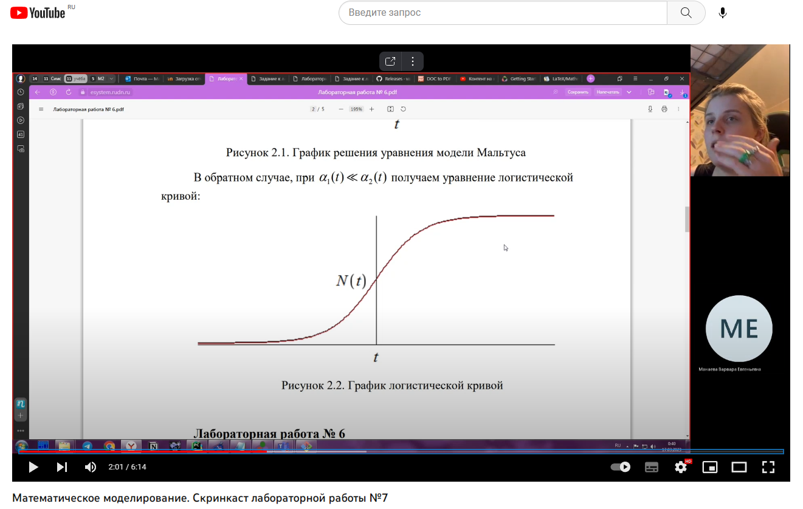

---
## Front matter
lang: ru-RU
title: Распространение рекламы
subtitle: Лабораторная работа №7
author:
  - Манаева В.Е., 1032201197
institute:
  - Российский университет дружбы народов, Москва, Россия
date: 2 марта 2023

## i18n babel
babel-lang: russian
babel-otherlangs: english

## Formatting pdf
toc: false
toc-title: Содержание
slide_level: 2
aspectratio: 169
section-titles: true
theme: metropolis
header-includes:
 - \metroset{progressbar=frametitle,sectionpage=progressbar,numbering=fraction}
 - '\makeatletter'
 - '\beamer@ignorenonframefalse'
 - '\makeatother'
---

## Цели и задачи

- Изучить модель, описывающую распространение рекламы;
- Записать на языках OpenModelica и Julia программы, которые бы решали данные задачи с возможностью вносить разные входящие данные;
- Сравнить результат работы данных программ между собой.

## Условия

Постройте график распространения рекламы, математическая модель которой описывается следующим уравнением:

1.	$\frac{dn}{dt} = (0.48 + 0.000081n(t))(N-n(t))$
2.	$\frac{dn}{dt} = (0.000049 + 0.82n(t))(N-n(t))$
3.	$\frac{dn}{dt} = (0.6t + 0.3cos{2t} n(t))(N-n(t))$

При этом объем аудитории $N = 1665$, в начальный момент о товаре знает 18 человек.
Для случая 2 определите в какой момент времени скорость распространения рекламы будет иметь максимальное значение.

# Процесс работы

## Julia 

Был написан код на Julia с использованием библиотек PyPlot.jl и DifferentialEquations.jl

{#fig:011 width=50%}

## OpenModelica 

Был написан код на OpenModelica

{#fig:022 width=50%}

# Результаты

## Графики, построенные для первой модели

Графики, построенные программами для первой задачи, одинаковы.

 | 
:-------------------------:|:-------------------------:
{#fig:001 width=40%} | {#fig:002 width=40%}

## Графики, построенные для второй модели

Аналогичная ситуация и для графиков, построенных для второго условия.

 | 
:-------------------------:|:-------------------------:
{#fig:003 width=50%}|{#fig:004 width=50%}

## Графики, построенные для второй модели

Аналогичная ситуация и для графиков, построенных для третьего условия.

 | 
:-------------------------:|:-------------------------:
{#fig:005 width=50%}|{#fig:006 width=50%}

## Скринкасты

Были записаны скринкасты [лабораторной работы](https://youtu.be/itEcZBPv02Q "лабораторной работы") и [презентации лабораторной работы](https://youtu.be/XQl05zQ11n4 "презентации лабораторной работы").

{#fig:005 width=60% }
