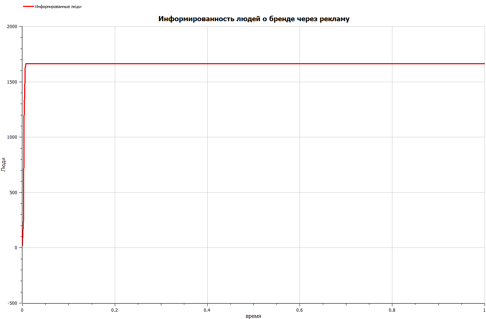

---
## Front matter
title: "Отчёт по лабораторной работе №7"
subtitle: "Предмет: Математическое моделирование"
author: "Манаева Варвара Евгеньевна, НФИбд-01-20.
1032201197"

## Generic otions
lang: ru-RU
toc-title: "Содержание"

## Bibliography
bibliography: bib/cite.bib
csl: pandoc/csl/gost-r-7-0-5-2008-numeric.csl

## Pdf output format
toc: true # Содержание
toc-depth: 3
lof: true # Список рисунков
lot: false # Список таблиц
fontsize: 12pt
linestretch: 1.5
papersize: a4
documentclass: scrreprt
## I18n polyglossia
polyglossia-lang:
  name: russian
  options:
	- spelling=modern
	- babelshorthands=true
polyglossia-otherlangs:
  name: english
## I18n babel
babel-lang: russian
babel-otherlangs: english
## Fonts
mainfont: PT Serif
romanfont: PT Serif
sansfont: PT Sans
monofont: PT Mono
mainfontoptions: Ligatures=TeX
romanfontoptions: Ligatures=TeX
sansfontoptions: Ligatures=TeX,Scale=MatchLowercase
monofontoptions: Scale=MatchLowercase,Scale=0.9
## Biblatex
biblatex: true
biblio-style: "gost-numeric"
biblatexoptions:
  - parentracker=true
  - backend=biber
  - hyperref=auto
  - language=auto
  - autolang=other*
  - citestyle=gost-numeric
## Pandoc-crossref LaTeX customization
figureTitle: "Рис."
tableTitle: "Таблица"
listingTitle: "Листинг"
lofTitle: "Список иллюстраций"
lotTitle: "Список таблиц"
lolTitle: "Листинги"
## Misc options
indent: true
header-includes:
  - \usepackage{indentfirst}
  - \usepackage{float} # keep figures where there are in the text
  - \floatplacement{figure}{H} # keep figures where there are in the text
---

Изучить простейшую модель распространения рекламы и решить задания лабораторной работы.

Задачи:

- Изучить теоретическую справку;
- Запрограммировать решение на Julia;
- Запрограммировать решение на OpenModelica;
- Сравнить результаты работы программ;

# Задание лабораторной работы
## Вариант №28 [@lab-task:mathmod]

Постройте график распространения рекламы, математическая модель которой описывается следующим уравнением:

1.	$\frac{dn}{dt} = (0.48 + 0.000081n(t))(N-n(t))$
2.	$\frac{dn}{dt} = (0.000049 + 0.82n(t))(N-n(t))$
3.	$\frac{dn}{dt} = (0.6t + 0.3cos{2t} n(t))(N-n(t))$

При этом объем аудитории $N = 1665$, в начальный момент о товаре знает 18 человек.
Для случая 2 определите в какой момент времени скорость распространения рекламы будет иметь максимальное значение.

# Теоретическое введение
## Общая информация о модели [@lab-example:mathmod]

Организуется рекламная кампания нового товара или услуги. 
Необходимо, чтобы прибыль будущих продаж с избытком покрывала издержки на рекламу. 
Вначале расходы могут превышать прибыль, поскольку лишь малая часть потенциальных покупателей будет информирована о новинке. 
Затем, при увеличении числа продаж, возрастает и прибыль, и, наконец, наступит момент, когда рынок насытиться, и рекламировать товар станет бесполезным.

Предположим, что торговыми учреждениями реализуется некоторая продукция, о которой в момент времени $t$ из числа потенциальных покупателей $N$ знает лишь $n$ покупателей. 
Для ускорения сбыта продукции запускается реклама по радио, телевидению и других средств массовой информации. 
После запуска рекламной кампании информация о продукции начнет распространяться среди потенциальных покупателей путем общения друг с другом. 
Таким образом, после запуска рекламных объявлений скорость изменения числа знающих о продукции людей пропорциональна как числу знающих о товаре покупателей, так и числу покупателей о нем не знающих

Модель рекламной кампании описывается следующими величинами.

Считаем, что $\frac{dn}{dt}$ - скорость изменения со временем числа потребителей, узнавших о товаре и готовых его купить,
$t$ - время, прошедшее с начала рекламной кампании,
$N$ - общее число потенциальных платежеспособных покупателей,
$n(t)$ - число  уже информированных клиентов.
Эта величина пропорциональна числу покупателей, еще не знающих о нем, это описывается следующим образом: 
$\alpha _1(t)(N-n(t))$, где $\alpha _1>0$ -  характеризует интенсивность рекламной кампании (зависит от затрат на рекламу в данный момент времени).
Помимо этого, узнавшие о товаре потребители также распространяют полученную информацию среди потенциальных покупателей, не знающих о нем
(в этом случае работает т.н. сарафанное радио). Этот вклад в рекламу описывается величиной  $\alpha _2(t)n(t)(N-n(t))$. 
Эта величина увеличивается с увеличением потребителей узнавших о товаре.
Математическая модель распространения рекламы описывается уравнением:

$$\frac{dn}{dt} = (\alpha _1(t) + \alpha _2(t)n(t))(N-n(t))$$

При $\alpha _1(t) >> \alpha _2(t)$ получается модель типа модели Мальтуса.

В обратном случае ($\alpha _1(t) << \alpha _2(t)$) получаем уравнение логистической кривой

# Выполнение лабораторной работы
## Решение с помощью программ
### Julia
#### Программный код решения на Julia

Решить дифференциальное уравнение, расписанное в постановке задачи лабораторной работы, поможет библиотека DifferentialEquations[@diff-eq-doc:julka].
Итоговые изображения в полярных координатах будут строиться через библиотеку PyPlot.

    using PyPlot;
    using DifferentialEquations;
    function f(du, u, p, t)
        du[1] = (a1 * t + a2 * t * u[1]) * (N - u[1])
    end
    function f2(du, u, p, t)
        du[1] = (a1 * t + a2 * sin(3*t) * u[1]) * (N - u[1])
    end
    range = (0, 1)
    N = 1665
    N0 = 18
    a1 = 0.48
    a2 = 0.000081
    ode = ODEProblem(f, [N0], range)
    sol = solve(ode, dtmax=0.01)
    n = [u[1] for u in sol.u];
    
    clf()
    plot(sol.t, n)
    xlabel("время")
    ylabel("Проинформированные люди")
    title("Случай 1")
    savefig("C:\\Users\\emanaev\\work\\study\\2022-2023\\Математическое_моделирование\\study_2022-2023_mathmod\\labs\\lab7\\report\\image\\graph1_t.png")
    savefig("C:\\Users\\emanaev\\work\\study\\2022-2023\\Математическое_моделирование\\study_2022-2023_mathmod\\labs\\lab7\\presentation\\image\\graph1_t.png")
    clf()
    
    a1 = 0.000049
    a2 = 0.82
    ode = ODEProblem(f, [N0], range)
    sol = solve(ode, dtmax=0.01)
    n = [u[1] for u in sol.u];
    
    plot(sol.t, n)
    xlabel("время")
    ylabel("Проинформированные люди")
    title("Случай 2")
    savefig("C:\\Users\\emanaev\\work\\study\\2022-2023\\Математическое_моделирование\\study_2022-2023_mathmod\\labs\\lab7\\report\\image\\graph2_t.png")
    savefig("C:\\Users\\emanaev\\work\\study\\2022-2023\\Математическое_моделирование\\study_2022-2023_mathmod\\labs\\lab7\\presentation\\image\\graph2_t.png")
    clf()
    
    a1 = 0.6
    a2 = 0.3
    ode = ODEProblem(f2, [N0], range)
    sol = solve(ode, dtmax=0.01)
    n = [u[1] for u in sol.u];
    
    plot(sol.t, n)
    xlabel("время")
    ylabel("Проинформированные люди")
    title("Случай 3")
    savefig("C:\\Users\\emanaev\\work\\study\\2022-2023\\Математическое_моделирование\\study_2022-2023_mathmod\\labs\\lab7\\report\\image\\graph3_t.png")
    savefig("C:\\Users\\emanaev\\work\\study\\2022-2023\\Математическое_моделирование\\study_2022-2023_mathmod\\labs\\lab7\\presentation\\image\\graph3_t.png")
    clf()

### OPenModelica
#### Программный код решения на OPenModelica

    model laba7
    parameter Real N= 1665;
    parameter Real N0= 18;
    Real n(start=N0);
    
    function k
      input Real t;
      output Real result;
    algorithm
      result:= 0.48;
    end k;
    
    function p
      input Real t;
      output Real result;
    algorithm
      result:=  0.000081;
    end p;
    
    equation
      der(n)=(k(time)+p(time)*n)*(N-n);
    
    end laba7;

    model laba7_2
    
    parameter Real N= 1665;
    parameter Real N0= 18;
    Real n(start=N0);
    
    function k
      input Real t;
      output Real result;
    algorithm
      result:= 0.000049;
    end k;
    
    function p
      input Real t;
      output Real result;
    algorithm
      result:=  0.82;
    end p;
    
    equation
      der(n)=(k(time)+p(time)*n)*(N-n);
    
    end laba7_2;
    
    model laba7_3
    
    parameter Real N= 1665;
    parameter Real N0= 18;
    Real n(start=N0);
    
    function k
      input Real t;
      output Real result;
    algorithm
      result:= 0.6*t;
    end k;
    
    function p
      input Real t;
      output Real result;
    algorithm
      result:=  0.3*sin(3*t);
    end p;
    
    equation
      der(n)=(k(time)+p(time)*n)*(N-n);
    
    end laba7_3;

### Результаты работы кода

Решение для условия 1 (рис. @fig:001, @fig:011).

{#fig:001}

{#fig:011}

Решение для условия 2 (рис. @fig:002, @fig:022).

{#fig:002}

{#fig:022}

Решение для условия 3 (рис. @fig:003, @fig:033).

{#fig:003}

{#fig:033}

# Выводы

В ходе выполнения лабораторной работы была изучена модель эффективности рекламы и построены графики. 
Также эти графики были изучены и сделаны выводе о работе программ и эффективности распространения рекламы.

Были записаны скринкасты [лабораторной работы](https://youtu.be/itEcZBPv02Q "лабораторной работы") и [презентации лабораторной работы](https://youtu.be/XQl05zQ11n4 "презентации лабораторной работы").

# Список литературы 
