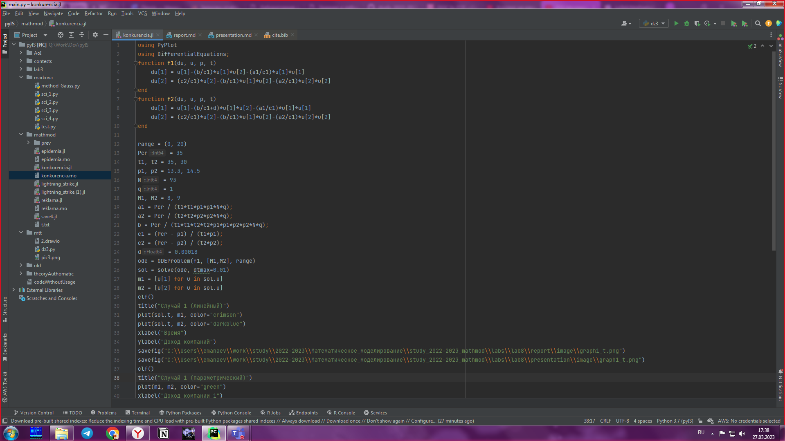
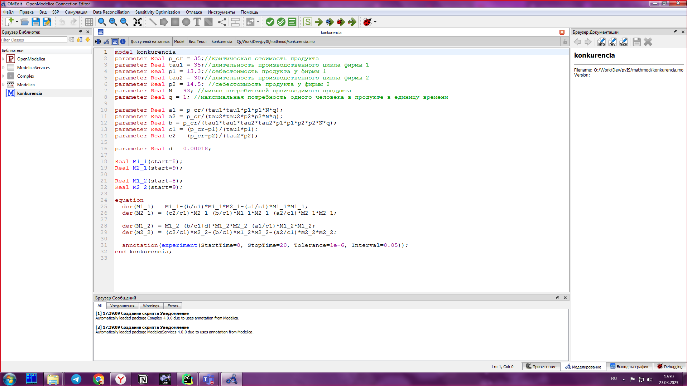
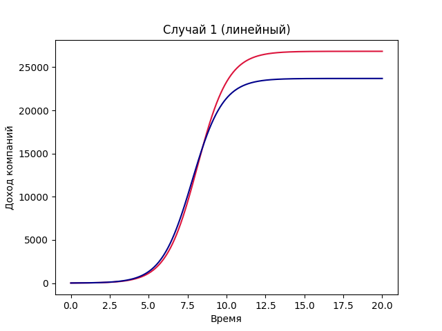
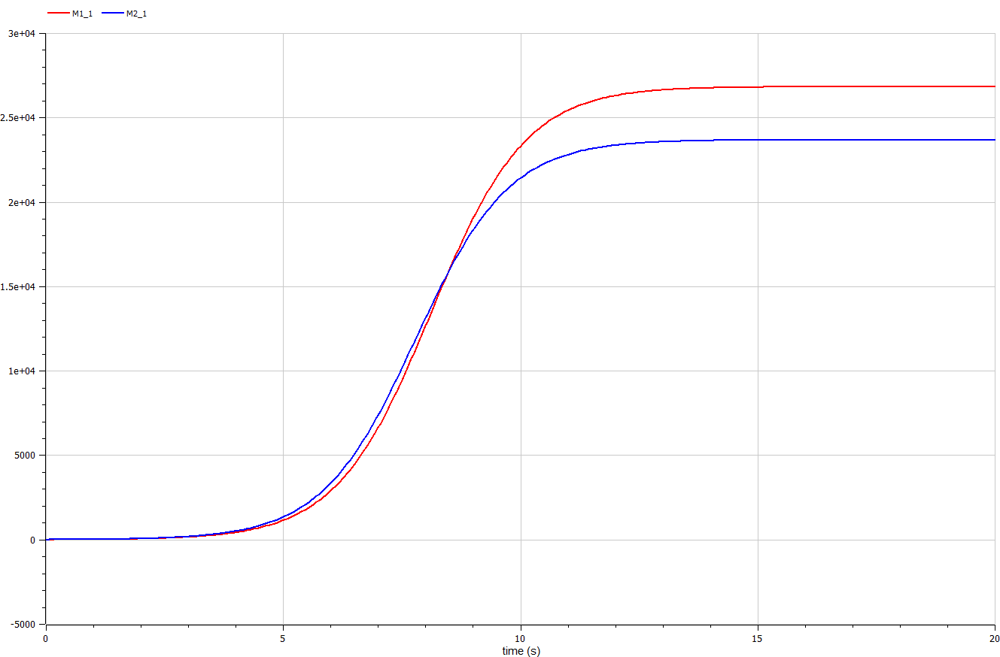
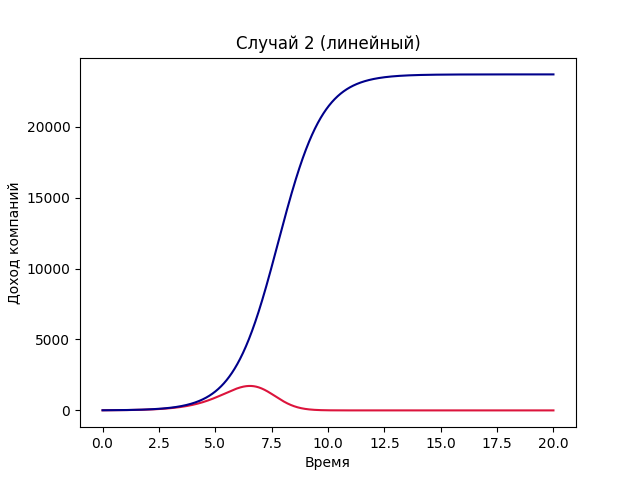
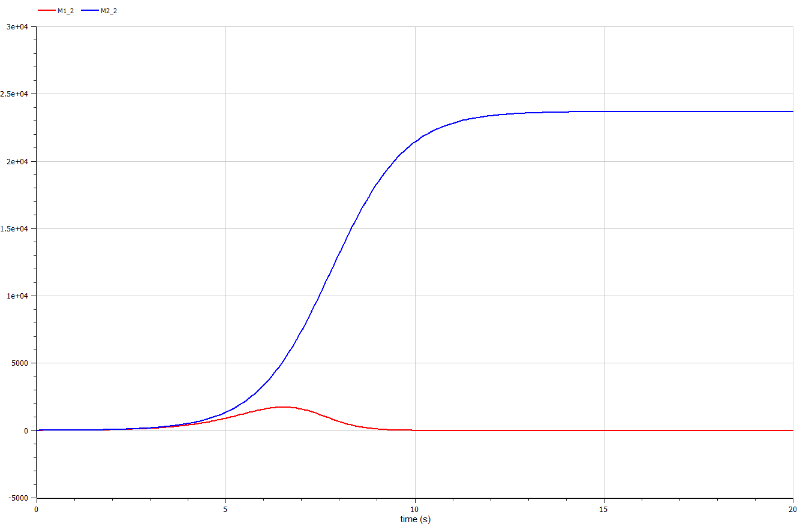
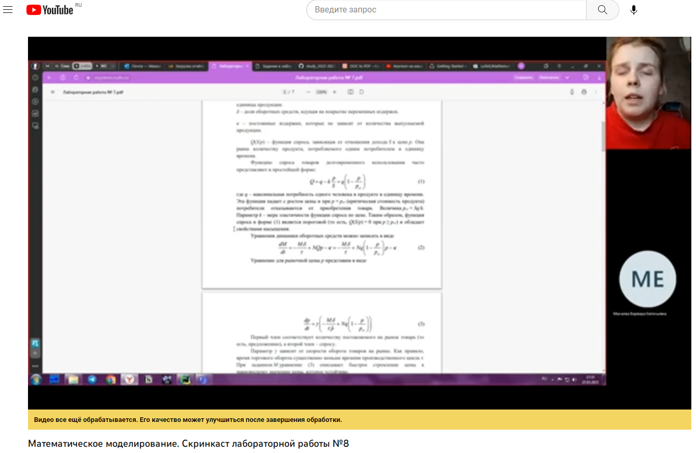

---
## Front matter
lang: ru-RU
title: Конкуренция фирм
subtitle: Лабораторная работа №8
author:
  - Манаева В.Е., 1032201197
institute:
  - Российский университет дружбы народов, Москва, Россия
date: 2 марта 2023

## i18n babel
babel-lang: russian
babel-otherlangs: english

## Formatting pdf
toc: false
toc-title: Содержание
slide_level: 2
aspectratio: 169
section-titles: true
theme: metropolis
header-includes:
 - \metroset{progressbar=frametitle,sectionpage=progressbar,numbering=fraction}
 - '\makeatletter'
 - '\beamer@ignorenonframefalse'
 - '\makeatother'
---

## Цели и задачи

- Изучить модель, описывающую конкуренцию фирм;
- Записать на языках OpenModelica и Julia программы, которые бы решали данные задачи с возможностью вносить разные входящие данные;
- Сравнить результат работы данных программ между собой.

## Условие задачи

Случай 1

Динамика изменения объемов продаж фирмы 1 и фирмы 2 описывается следующей системой уравнений:

$$\frac{dM_1}{d\Theta} = M_1 - \frac{b}{c_1}M_1 M_2 - \frac{a1}{c1} M_1^2 $$

$$ \frac{dM_2}{d\Theta} = \frac{c_2}{c_1} M_2 - \frac{b}{c_1} M_1 M_2 - \frac{a_2}{c_1} M_2^2$$

также введена нормировка $t = c_1 \Theta$ и где 

$$ a_i = \frac{p_{cr}}{\tau_i^2 \widetilde{p}_1^2 Nq }, b = \frac{p_{cr}}{\tau_1^2 \widetilde{p}_1^2 \tau_2^2 \widetilde{p}_2^2 Nq}, c_i = \frac{p_{cr} - \widetilde{p}_i}{\tau_i \widetilde{p}_i} $$

## Условие задачи

Случай 2

Динамика изменения объемов продаж фирмы 1 и фирмы 2 описывается следующей системой уравнений:

$$\frac{dM_1}{d\Theta} = M_1 - (\frac{b}{c_1} + 0.00018)M_1 M_2 - \frac{a1}{c1} M_1^2 $$

$$ \frac{dM_2}{d\Theta} = \frac{c_2}{c_1} M_2 - \frac{b}{c_1} M_1 M_2 - \frac{a_2}{c_1} M_2^2$$

## Для обоих случаев рассмотрим задачу со следующими начальными условиями и параметрами

$$ M_0^1=8 \: M_0^2=9 $$
$$ p_{cr}=35 \: N=93 \: q=1 $$
$$ \tau_1=35 \: \tau_2=30 $$
$$ \widetilde{p}_1=13.3 \: \widetilde{p}_2=14.5 $$

# Процесс работы

## Julia 

Был написан код на Julia с использованием библиотек PyPlot.jl и DifferentialEquations.jl

{#fig:001 width=50%}

## OpenModelica 

Был написан код на OpenModelica

{#fig:002 width=50%}

# Результаты

## Графики, построенные для первой модели

Графики, построенные программами для первой задачи, одинаковы.

 | 
:-------------------------:|:-------------------------:
{#fig:003 width=40%} | {#fig:003 width=40%}

## Графики, построенные для второй модели

Аналогичная ситуация и для графиков, построенных для второго условия.

 | 
:-------------------------:|:-------------------------:
{#fig:003 width=50%}|{#fig:004 width=50%}

## Скринкасты

Были записаны скринкасты [лабораторной работы](https://www.youtube.com/watch?v=htc8PLBXYsY "лабораторной работы") и [презентации лабораторной работы](https://youtu.be/rg31IkKNUNE "презентации лабораторной работы").

{#fig:005 width=60% }
