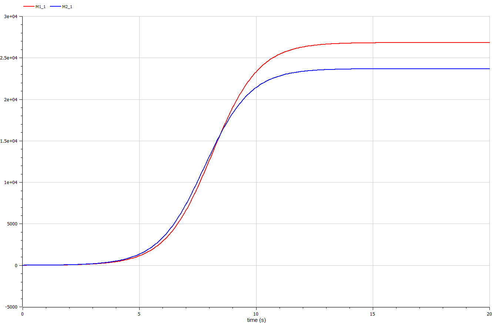

---
## Front matter
title: "Отчёт по лабораторной работе №8"
subtitle: "Предмет: Математическое моделирование"
author: "Манаева Варвара Евгеньевна, НФИбд-01-20.
1032201197"

## Generic otions
lang: ru-RU
toc-title: "Содержание"

## Bibliography
bibliography: bib/cite.bib
csl: pandoc/csl/gost-r-7-0-5-2008-numeric.csl

## Pdf output format
toc: true # Содержание
toc-depth: 3
lof: true # Список рисунков
lot: false # Список таблиц
fontsize: 12pt
linestretch: 1.5
papersize: a4
documentclass: scrreprt
## I18n polyglossia
polyglossia-lang:
  name: russian
  options:
	- spelling=modern
	- babelshorthands=true
polyglossia-otherlangs:
  name: english
## I18n babel
babel-lang: russian
babel-otherlangs: english
## Fonts
mainfont: PT Serif
romanfont: PT Serif
sansfont: PT Sans
monofont: PT Mono
mainfontoptions: Ligatures=TeX
romanfontoptions: Ligatures=TeX
sansfontoptions: Ligatures=TeX,Scale=MatchLowercase
monofontoptions: Scale=MatchLowercase,Scale=0.9
## Biblatex
biblatex: true
biblio-style: "gost-numeric"
biblatexoptions:
  - parentracker=true
  - backend=biber
  - hyperref=auto
  - language=auto
  - autolang=other*
  - citestyle=gost-numeric
## Pandoc-crossref LaTeX customization
figureTitle: "Рис."
tableTitle: "Таблица"
listingTitle: "Листинг"
lofTitle: "Список иллюстраций"
lotTitle: "Список таблиц"
lolTitle: "Листинги"
## Misc options
indent: true
header-includes:
  - \usepackage{indentfirst}
  - \usepackage{float} # keep figures where there are in the text
  - \floatplacement{figure}{H} # keep figures where there are in the text
---

# Цель работы

Изучить модель конкуренции для двух фирм и в двух случаях. Построить графики с помощью представленных уравнений, описивающих случаи.

Задачи:

- Изучить теоретическую справку;
- Запрограммировать решение на Julia;
- Запрограммировать решение на OpenModelica;
- Сравнить результаты работы программ;

# Задание лабораторной работы
## Вариант №28 [@lab-task:mathmod]

Случай 1

Рассмотрим две фирмы, производящие взаимозаменяемые товары одинакового качества и находящиеся в одной рыночной нише. Считаем, что в рамках нашей модели конкурентная борьба ведётся только рыночными методами. То есть, конкуренты могут влиять на противника путем изменения параметров своего производства: себестоимость, время цикла, но не могут прямо вмешиваться в ситуацию на рынке («назначать» цену или влиять на потребителей каким-либо иным способом.) Будем считать, что постоянные издержки пренебрежимо малы, и в модели учитывать не будем. В этом случае динамика изменения объемов продаж фирмы 1 и фирмы 2 описывается следующей системой уравнений:

$$\frac{dM_1}{d\Theta} = M_1 - \frac{b}{c_1}M_1 M_2 - \frac{a1}{c1} M_1^2 $$

$$ \frac{dM_2}{d\Theta} = \frac{c_2}{c_1} M_2 - \frac{b}{c_1} M_1 M_2 - \frac{a_2}{c_1} M_2^2 $$

где 

$$ a_1 = \frac{p_{cr}}{\tau_1^2 \widetilde{p}_1^2 Nq } $$
$$ a_2 = \frac{p_{cr}}{\tau_2^2 \widetilde{p}_2^2 Nq } $$ 
$$ b = \frac{p_{cr}}{\tau_1^2 \widetilde{p}_1^2 \tau_2^2 \widetilde{p}_2^2 Nq} $$
$$ c_1 = \frac{p_{cr} - \widetilde{p}_1}{\tau_1 \widetilde{p}_1} $$
$$ c_2 = \frac{p_{cr} - \widetilde{p}_2}{\tau_2 \widetilde{p}_2} $$

также введена нормировка $t = c_1 \Theta$

Случай 2

Рассмотрим модель, когда, помимо экономического фактора влияния (изменение себестоимости, производственного цикла, использование кредита и т.п.), используются еще и социально-психологические факторы – формирование общественного предпочтения одного товара другому, не зависимо от их качества и цены. В этом случае взаимодействие двух фирм будет зависеть друг от друга, соответственно коэффициент перед $M_1 M_2$ будет отличаться. Пусть в рамках рассматриваемой модели динамика изменения объемов продаж фирмы 1 и фирмы 2 описывается следующей системой уравнений:

$$ \frac{dM_1}{d\Theta} = M_1 - (\frac{b}{c_1} + 0.0018)M_1 M_2 - \frac{a1}{c1} M_1^2 $$

$$ \frac{dM_2}{d\Theta} = \frac{c_2}{c_1} M_2 - \frac{b}{c_1} M_1 M_2 - \frac{a_2}{c_1} M_2^2$$

Для обоих случаев рассмотрим задачу со следующими начальными условиями и параметрами:

$$ M_0^1=8 \: M_0^2=9 $$
$$ p_{cr}=35 \: N=93 \: q=1 $$
$$ \tau_1=35 \: \tau_2=30 $$
$$ \widetilde{p}_1=13.3 \: \widetilde{p}_2=14.5 $$

# Теоретическое введение

## Общая информация о модели [@lab-example:mathmod]

Для построения модели конкуренции хотя бы двух фирм необходимо рассмотреть модель одной фирмы. Вначале рассмотрим модель фирмы, производящей продукт долговременного пользования, когда цена его определяется балансом спроса и предложения. Примем, что этот продукт занимает определенную нишу рынка и конкуренты в ней отсутствуют. 

Обозначим:

$N$ - число потребителей производимого продукта. 

$S$ – доходы потребителей данного продукта. Считаем, что доходы всех потребителей одинаковы. Это предположение справедливо, если речь идет об одной рыночной нише, т.е. производимый продукт ориентирован на определенный слой населения. 

$M$ – оборотные средства предприятия 

$\tau$ - длительность производственного цикла

$p$ - рыночная цена товара 

$\widetilde{p}$ - себестоимость продукта, то есть переменные издержки на производство единицы продукции

$\delta$ - доля оборотных средств, идущая на покрытие переменных издержек

$k$ - постоянные издержки, которые не зависят от количества выпускаемой продукции

$Q(S/p)$ – функция спроса, зависящая от отношения дохода $S$ к цене $p$. Она равна количеству продукта, потребляемого одним потребителем в единицу времени.

Функцию спроса товаров долговременного использования часто представляют в простейшей форме: 

$$Q = q - k\frac{p}{S} = q(1 - \frac{p}{p_{cr}})$$

где $q$ – максимальная потребность одного человека в продукте в единицу времени.
Эта функция падает с ростом цены и при $p = p_{cr}$ (критическая стоимость продукта) потребители отказываются от приобретения товара. Величина $p_{cr} = Sq/k$. Параметр $k$ – мера эластичности функции спроса по цене. Таким образом, функция спроса является пороговой (то есть, $Q(S/p) = 0$ при $p \geq p_{cr}$) и обладает свойствами насыщения.

Уравнения динамики оборотных средств можно записать в виде:

$$\frac{dM}{dt} = -\frac{M \delta}{\tau} + NQp - k = -\frac{M\delta}{\tau} + Nq(1 - \frac{p}{p_{cr}})p - k$$

Уравнение для рыночной цены $p$ представим в виде:

$$\frac{dp}{dt} = \gamma (-\frac{M\delta}{\tau \widetilde{p}} + Nq(1-\frac{p}{p_{cr}}) )$$

Первый член соответствует количеству поставляемого на рынок товара (то есть, предложению), а второй член – спросу.
Параметр $\gamma$ зависит от скорости оборота товаров на рынке. Как правило, время торгового оборота существенно меньше времени производственного цикла $\tau$. При заданном M уравнение описывает быстрое стремление цены к равновесному значению цены, которое устойчиво.

В этом случае уравнение можно заменить алгебраическим соотношением

$$ -\frac{M\delta}{\tau \widetilde{p}} + Nq(1-\frac{p}{p_{cr}}) = 0$$

равновесное значение цены $p$ равно

$$ p = p_{cr}(1 - \frac{M\delta}{\tau \widetilde{p} Nq})$$

Тогда уравнения динамики оборотных средств приобретает вид

$$\frac{dM}{dt} = -\frac{M \delta}{\tau}(\frac{p}{p_{cr}}-1) - M^2 ( \frac{\delta}{\tau \widetilde{p} })^2 \frac{p_{cr}}{Nq} - k$$

Это уравнение имеет два стационарных решения, соответствующих условию $dM/dt=0$

$$ \widetilde{M_{1,2}} = \frac{1}{2} a \pm \sqrt{\frac{a^2}{4} - b}$$

где

$$ a = Nq(1 - \frac{\widetilde{p}}{p_{cr}} \widetilde{p} \frac{\tau}{\delta}), b = kNq \frac{(\tau \widetilde{p})^2}{p_{cr}\delta ^2} $$

Получается, что при больших постоянных издержках (в случае $a^2 < 4b$) стационарных состояний нет. Это означает, что в этих условиях фирма не может функционировать стабильно, то есть, терпит банкротство. Однако, как правило, постоянные затраты малы по сравнению с переменными (то есть, $b << a^2$) и играют роль, только в случае, когда оборотные средства малы. 

При $b << a$ стационарные значения $M$ равны

$$ \widetilde{M_{+}} = Nq \frac{\tau}{\delta}(1 - \frac{\widetilde{p}}{p_{cr}})\widetilde{p}, \widetilde{M_{-}} = k\widetilde{p} \frac{\tau}{\delta(p_{cr} - \widetilde{p})} $$

Первое состояние $\widetilde{M_{+}}$ устойчиво и соответствует стабильному функционированию предприятия. Второе состояние \widetilde{M_{-} неустойчиво, так, что при $M < \widetilde{M_{-}}$ оборотные средства падают ($dM/dt < 0$), то есть, фирма идет к банкротству. По смыслу $\widetilde{M_{-}}$ соответствует начальному капиталу, необходимому для входа в рынок.

В обсуждаемой модели параметр $\delta$ всюду входит в сочетании с $\tau$. Это значит, что уменьшение доли оборотных средств, вкладываемых в производство, эквивалентно удлинению производственного цикла. Поэтому мы в дальнейшем положим: $\delta = 1$, а параметр $\tau$ будем считать временем цикла, с учётом сказанного.

# Выполнение лабораторной работы
## Решение с помощью программ
### Julia
#### Программный код решения на Julia

Решить дифференциальное уравнение, расписанное в постановке задачи лабораторной работы, поможет библиотека DifferentialEquations[@diff-eq-doc:julka].
Итоговые изображения в полярных координатах будут строиться через библиотеку PyPlot.

    using PyPlot
    using DifferentialEquations;
    function f1(du, u, p, t)
        du[1] = u[1]-(b/c1)*u[1]*u[2]-(a1/c1)*u[1]*u[1]
        du[2] = (c2/c1)*u[2]-(b/c1)*u[1]*u[2]-(a2/c1)*u[2]*u[2]
    end
    function f2(du, u, p, t)
        du[1] = u[1]-(b/c1+d)*u[1]*u[2]-(a1/c1)*u[1]*u[1]
        du[2] = (c2/c1)*u[2]-(b/c1)*u[1]*u[2]-(a2/c1)*u[2]*u[2]
    end
    
    range = (0, 20)
    Pcr = 35
    t1, t2 = 35, 30
    p1, p2 = 13.3, 14.5
    N = 93
    q = 1
    M1, M2 = 8, 9
    a1 = Pcr / (t1*t1*p1*p1*N*q);
    a2 = Pcr / (t2*t2*p2*p2*N*q);
    b = Pcr / (t1*t1*t2*t2*p1*p1*p2*p2*N*q);
    c1 = (Pcr - p1) / (t1*p1);
    c2 = (Pcr - p2) / (t2*p2);
    d = 0.00018
    ode = ODEProblem(f1, [M1,M2], range)
    sol = solve(ode, dtmax=0.01)
    m1 = [u[1] for u in sol.u]
    m2 = [u[2] for u in sol.u]
    clf()
    title("Случай 1 (линейный)")
    plot(sol.t, m1, color="crimson")
    plot(sol.t, m2, color="darkblue")
    xlabel("Время")
    ylabel("Доход компаний")
    savefig("C:\\Users\\emanaev\\work\\study\\2022-2023\\Математическое_моделирование\\study_2022-2023_mathmod\\labs\\lab8\\report\\image\\graph1_t.png")
    savefig("C:\\Users\\emanaev\\work\\study\\2022-2023\\Математическое_моделирование\\study_2022-2023_mathmod\\labs\\lab8\\presentation\\image\\graph1_t.png")
    clf()
    
    ode = ODEProblem(f2, [M1,M2], range)
    sol = solve(ode, dtmax=0.01)
    m1 = [u[1] for u in sol.u]
    m2 = [u[2] for u in sol.u]
    
    title("Случай 2 (линейный)")
    plot(sol.t, m1, color="crimson")
    plot(sol.t, m2, color="darkblue")
    xlabel("Время")
    ylabel("Доход компаний")
    savefig("C:\\Users\\emanaev\\work\\study\\2022-2023\\Математическое_моделирование\\study_2022-2023_mathmod\\labs\\lab8\\report\\image\\graph2_t.png")
    savefig("C:\\Users\\emanaev\\work\\study\\2022-2023\\Математическое_моделирование\\study_2022-2023_mathmod\\labs\\lab8\\presentation\\image\\graph2_t.png")
    clf()

#### Результаты работы кода на Julia

Решение для нестационарного состояния, заданного заданием лабораторной работы (рис. @fig:001, @fig:011).

{#fig:011}

Решение для стационарного состояния, заданного заданием лабораторной работы (рис. @fig:002, @fig:022).

{#fig:022}

### OPenModelica
#### Программный код решения на OPenModelica

    model konkurencia
    parameter Real p_cr = 35;//критическая стоимость продукта
    parameter Real tau1 = 35;//длительность производственного цикла фирмы 1
    parameter Real p1 = 13.3;//себестоимость продукта у фирмы 1
    parameter Real tau2 = 30;//длительность производственного цикла фирмы 2
    parameter Real p2 = 14.5; //себестоимость продукта у фирмы 2
    parameter Real N = 93; //число потребителей производимого продукта
    parameter Real q = 1; //максимальная потребность одного человека в продукте в единицу времени
    
    parameter Real a1 = p_cr/(tau1*tau1*p1*p1*N*q);
    parameter Real a2 = p_cr/(tau2*tau2*p2*p2*N*q);
    parameter Real b = p_cr/(tau1*tau1*tau2*tau2*p1*p1*p2*p2*N*q);
    parameter Real c1 = (p_cr-p1)/(tau1*p1);
    parameter Real c2 = (p_cr-p2)/(tau2*p2);
    
    parameter Real d = 0.00018;
    
    Real M1_1(start=8);
    Real M2_1(start=9);
    
    Real M1_2(start=8);
    Real M2_2(start=9);
    
    equation
      der(M1_1) = M1_1-(b/c1)*M1_1*M2_1-(a1/c1)*M1_1*M1_1;
      der(M2_1) = (c2/c1)*M2_1-(b/c1)*M1_1*M2_1-(a2/c1)*M2_1*M2_1;
      
      der(M1_2) = M1_2-(b/c1+d)*M1_2*M2_2-(a1/c1)*M1_2*M1_2;
      der(M2_2) = (c2/c1)*M2_2-(b/c1)*M1_2*M2_2-(a2/c1)*M2_2*M2_2;
      
      annotation(experiment(StartTime=0, StopTime=20, Tolerance=1e-6, Interval=0.05));
    end konkurencia;

#### Результаты работы кода на OpenModelica

Решение для нестационарного состояния, заданного заданием лабораторной работы (рис. @fig:033):

{#fig:033}

Решение для стационарного состояния, заданного заданием лабораторной работы (рис. @fig:044):

{#fig:044}

# Выводы

В ходе выполнения лабораторной работы была изучена модель конкуренции для двух фирм в двух случаях. Были запрограммированы решения для задачи лабораторной работы на Julia и OpenModelica.
Были построены графики прибыли компаний для двух условий задачи.

Были записаны скринкасты [лабораторной работы](https://www.youtube.com/watch?v=htc8PLBXYsY "лабораторной работы") и [презентации лабораторной работы](https://youtu.be/rg31IkKNUNE "презентации лабораторной работы").

# Список литературы

