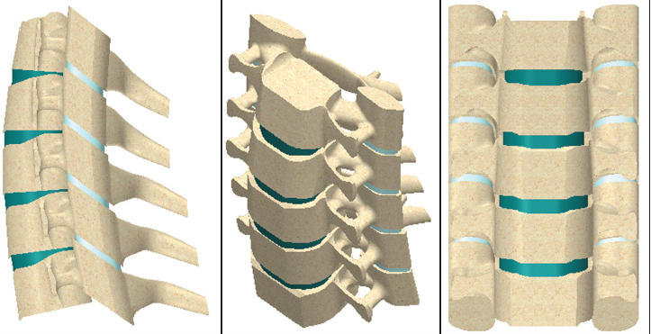
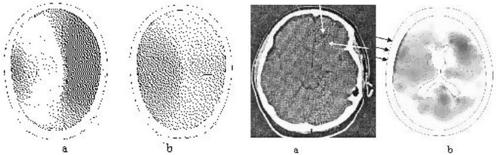
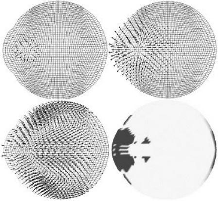
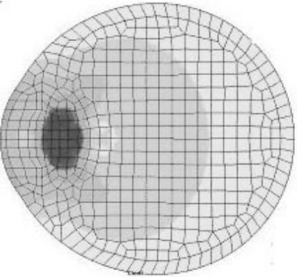

---
## Front matter
lang: ru-RU
title: Модель гармонических колебаний
subtitle: Лабораторная работа №4
author:
  - Манаева В.Е.
institute:
  - Российский университет дружбы народов, Москва, Россия
date: 18 февраля 2023

## i18n babel
babel-lang: russian
babel-otherlangs: english

## Formatting pdf
toc: false
toc-title: Содержание
slide_level: 2
aspectratio: 169
section-titles: true
theme: metropolis
header-includes:
 - \metroset{progressbar=frametitle,sectionpage=progressbar,numbering=fraction}
 - '\makeatletter'
 - '\beamer@ignorenonframefalse'
 - '\makeatother'
---

## Актуальность

Медицина - одна из важнейших сфер для сохранения и развития человечества.

{#fig:001 width=70%}

# Общие термины
## Математическое моделирование

Математическое моделирование – это исследование явлений, процессов, систем или объектов путем построения и изучения их моделей и использования последних для определения или уточнения характеристик и рациональных способов построения вновь конструируемых технологических процессов, систем и объектов.

{#fig:002 width=70%}

## Сферы применения (1): иммунология

{#fig:003 width=70%}

## Сферы применения (2): эпидемиология

{#fig:004 width=70%}

## Сферы применения (3): применение биологических моделей

{#fig:005 width=70%}

# Расширенные примеры
## Имитационное моделирование

Имитационное моделирование — это метод исследования, при котором изучаемая система заменяется моделью, с достаточной точностью описывающей реальную систему и с ней проводятся эксперименты с целью получения информации об этой системе. Экспериментирование с моделью называют имитацией (имитация — это постижение сути явления, не прибегая к экспериментам на реальном объекте).

## Позвоночник

{#fig:006 width=70%}

## Травмы головного мозга

{#fig:006 width=85%}

## Лазерная операция на глазе (1)

{#fig:006 width=70%}

## Лазерная операция на глазе (2)

{#fig:006 width=70%}
