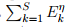

---
## Front matter
lang: ru-RU
title: Моделирование электрического пробоя
subtitle: Проектная работа. Этап №1
author:
  - "Евдокимов М.М., НФИбд-01-20"
  - "Евдокимов И.А., НФИбд-01-20"
  - "Манаева В.Е., НФИбд-01-20"
  - "Покрас И.М., НФИбд-02-20"
  - "Сулицкий Б.Р., НФИбд-02-20"
  - "Новосельцев Д.С., НФИбд-02-20"
institute:
  - Российский университет дружбы народов, Москва, Россия
date: 25 февраля 2023

## i18n babel
babel-lang: russian
babel-otherlangs: english

## Formatting pdf
toc: false
toc-title: Содержание
slide_level: 2
aspectratio: 169
section-titles: true
theme: metropolis
header-includes:
 - \metroset{progressbar=frametitle,sectionpage=progressbar,numbering=fraction}
 - '\makeatletter'
 - '\beamer@ignorenonframefalse'
 - '\makeatother'
---

## Цели и задачи

Изучить электрический пробой, его вариации и источники.

Задачи первого этапа проекта:

- Составить обзор физического явления электрического пробоя;
- Составить теоретическое описание модели;
- Обосновать практическое применение модели;

# Теоретическое введение

## Электрический пробой

Электрический пробой — явление резкого возрастания тока в твёрдом, жидком или газообразном диэлектрике (или полупроводнике) или воздухе, возникающее при приложении напряжения выше критического (напряжение пробоя).

{#fig:001 width=80%}

## Виды электрического пробоя

Электрические пробои разделяются по средам, в которых они происходят:

1.	Вакуум; 
2.	Газ; 
3.	Твердые тела;
4.	Жидкости.

## Электрический пробой в вакууме

Вакуумный пробой (электрический пробой вакуума) - это потеря вакуумным промежутком между электродами свойств электрического изолятора при приложении к нему электрического поля, напряжение которого превышает определённую величину.

## Электрический пробой в газах

Пробой газообразных диэлектриков обусловлен явлениями ударной (ионизация молекулы/атома при «ударе о него» электрона или другой заряженной частицы) и фотонной (ионизация молекулы/атома непосредственно при абсорбции фотонов), энергия которых равна или больше энергии ионизации.

Различают 2 классификации пробоя газа:

1.	Пробой газа при неоднородном поле;
2.	Пробой газа в однородном поле.

## Электрический пробой в твёрдой среде

В твёрдых телах существует множество механизмов пробоя. Вот основные из них:

1. Внутренний пробой;
2. Тепловой пробой;
3. Разрядный пробой;
4. Электрохимический пробой.

## Электрический пробой в жидкой среде

Электрическая форма пробоя, развивающаяся за время от $10^5$ до $10^8$ секунды, наблюдается в тщательно очищенных жидких диэлектриках и связывается с инжекцией электронов с катода. $E_{applied}$ при этом достигает $103$ МВ/м.

Фактически на электрический пробой жидких диэлектриков влияют многие факторы, к числу которых относятся:

- дегазация жидкости и электродов;
- длительность воздействия напряжения;
- скорость возрастания напряжения и его частота;
- температура, давление и др.

# Формулы

 |
:--------------|--------------:
{#fig:001} | {#fig:001 width=40%}

{#fig:001}

## Формулы

{#fig:001} 

## Формулы

{#fig:001} 

 |
:--------------|--------------:
{#fig:001} | {#fig:001}

