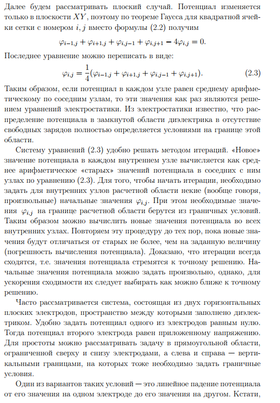

---
## Front matter
title: "Отчёт об этапе проекта №1"
subtitle: "Предмет: Математическое моделирование"
author: 
  - "Евдокимов М.М., НФИбд-01-20"
  - "Евдокимов И.А., НФИбд-01-20"
  - "Манаева В.Е., НФИбд-01-20"
  - "Покрас И.М., НФИбд-02-20"
  - "Сулицкий Б.Р., НФИбд-02-20"
  - "Новосельцев Д.С., НФИбд-02-20"
## Generic otions
lang: ru-RU
toc-title: "Содержание"

## Bibliography
bibliography: bib/cite.bib
csl: pandoc/csl/gost-r-7-0-5-2008-numeric.csl

## Pdf output format
toc: true # Содержание
toc-depth: 3
lof: true # Список рисунков
lot: true # Список таблиц
fontsize: 12pt
linestretch: 1.5
papersize: a4
documentclass: scrreprt
## I18n polyglossia
polyglossia-lang:
  name: russian
  options:
	- spelling=modern
	- babelshorthands=true
polyglossia-otherlangs:
  name: english
## I18n babel
babel-lang: russian
babel-otherlangs: english
## Fonts
mainfont: PT Serif
romanfont: PT Serif
sansfont: PT Sans
monofont: PT Mono
mainfontoptions: Ligatures=TeX
romanfontoptions: Ligatures=TeX
sansfontoptions: Ligatures=TeX,Scale=MatchLowercase
monofontoptions: Scale=MatchLowercase,Scale=0.9
## Biblatex
biblatex: true
biblio-style: "gost-numeric"
biblatexoptions:
  - parentracker=true
  - backend=biber
  - hyperref=auto
  - language=auto
  - autolang=other*
  - citestyle=gost-numeric
## Pandoc-crossref LaTeX customization
figureTitle: "Рис."
tableTitle: "Таблица"
listingTitle: "Листинг"
lofTitle: "Список иллюстраций"
lotTitle: "Список таблиц"
lolTitle: "Листинги"
## Misc options
indent: true
header-includes:
  - \usepackage{indentfirst}
  - \usepackage{float} # keep figures where there are in the text
  - \floatplacement{figure}{H} # keep figures where there are in the text
---

# Задание этапа
## Этап №1. Проект №2

Тема проекта: электрический пробой.

Задание первого этапа проектной работы:** Модель.** Презентация по научной проблеме. Теоретическое описание задачи. Описание модели. 

# Цель работы

Изучить электрический пробой, его вариации и источники.

Задачи первого этапа проекта:

- Составить обзор физического явления электрического пробоя;
- Составить теоретическое описание модели;
- Обосновать практическое применение модели;

Задачи проекта: 

1. Напишите программу вычисления электрического потенциала итерационным методом.
2. Рассмотрите пробой в геометрии «острие – плоскость» с использованием флуктуационного критерия роста.
3. То же в геометрии «точка – окружность». Как меняется густота ветвей с радиусом стримерной структуры? Для этого можно рассмотреть отношение числа точек пересечения структуры с окружностью некоторого радиуса к длине этой окружности.
4. Реализуйте в геометрии «острие – плоскость» или «точка – окружность» однозвенную или многозвенную модель со степенной зависимостью вероятности роста от напряженности поля $p ~ E^\eta$·. Рассмотрите случаи $\eta = 0; 1; 2$. Как меняется геометрия стримерной структуры?

# Теоретическое введение

## Общая информация о модели

[Илья]

**Электрический пробой** – это разрушение диэлектрика, обусловленное ударной ионизацией электронами из-за разрыва связей между атомами, ионами или молекулами. Все изоляционные материалы подвергаются пробою, когда электрическое поле, вызванное приложенным напряжением, превышает электрическую прочность материала. Пробой может происходить в течение очень короткого времени - $10^{-5} - 10^{-8}$ секунд, а также может привести к непрерывной электрической дуге, которая представляет собой мощный установившийся электрический разряд между двумя электродами в ионизированной газовой среде.[@model:uch]

Электрическая прочность при электрическом пробое зависит главным образом от внутреннего строения диэлектрика.
Электрическая прочность зависит не только от агрегатного состояния диэлектриков (газ, жидкость, твердый диэлектрик) и их структуры, но может изменяться в зависимости от толщины диэлектрика, формы электродов и условий теплоотвода.
Электрическая прочность при электрическом пробое является характеристикой материала. Тонкие пленки из диэлектрических материалов обладают более высокой электрической прочностью по сравнению с массивными образцами. Тонкие диэлектрические пленки, особенно аморфной структуры, широко используются в качестве изоляции при изготовлении микроэлектронных элементов и устройств.

Минимальное напряжение $U_{applied}$, приложенное к диэлектрику, и приводящее к образованию в нем проводящего канала, называется пробивным напряжением.

Существует несколько сред, в которых возможен электрический пробой:

1.	Вакуум; 
2.	Газ; 
3.	Твердые тела;
4.	Жидкости.

## Электрический пробой в вакууме [@phys:encyclopedy, стр.237-238]

Вакуумный пробой (электрический пробой вакуума) - это потеря вакуумным промежутком между электродами свойств электрического изолятора при приложении к нему электрического поля, напряжение которого превышает определённую величину. При вакуумном пробое промежуток заполняется ионизованными парами и среда в нём становится проводящей.
Первоначально электроды находятся в таком вакууме, при котором длина пробега частиц много больше расстояния между электродами, так что объёмная ионизация остаточного газа отсутствует. Развитие вакуумного пробоя может начаться с теплового взрыва естественных или искусственных микроострий на катоде за счёт токов автоэлектронной эмиссии. При этом вблизи катода образуется облако плазмы. Бомбардируемый электронами плазмы анод разогревается и поставляет в межэлектродный промежуток пары металла, ионизация которых приводит к возникновению сильноточного искрового разряда. Если мощность источника тока достаточно велика, то заключительной стадией вакуумного пробоя является вакуумная дуга в парах металлов электродов. Развитию вакуумный пробой могут способствовать диэлектрические вкрапления и адсорбированные плёнки на поверхности электродов.

Вакуумный пробой используется в приборах и устройствах газоразрядной и вакуумной электроники, в сильноточных ускорителях и мощных источниках жёсткого излучения.

Первым прибором вакуумной электроники была лампа А. Н. Лодыгина. Затем был создан электровакуумный диод Дж. А. Флеминга.

Электронные лампы стали основой разработанных систем радиосвязи, радиовещания.

## Электрический пробой в газах

[Ваня]

Пробой газообразных диэлектриков обусловлен явлениями ударной (ионизация молекулы/атома при «ударе о него» электрона или другой заряженной частицы) и фотонной (ионизация молекулы/атома непосредственно при абсорбции фотонов), энергия которых равна или больше энергии ионизации. 

Воздух - изоляционная среда для различной электронной аппаратуры. В случае сильных электрических полей физические процессы в воздухе происходят при нормальном атмосферном давлении. Но в радиоэлектронике приходится иметь дело с пробоем при повышенном давлении и значительном разрежении.

Относительно малое количество содержащихся в газе положительных и отрицательных ионов и электронов, находящихся в беспорядочном тепловом движении, при воздействии поля получают некоторую добавочную скорость и начинают в зависимости от знака заряда перемещаться в направлении поля или против. При этом заряженная частица приобретает дополнительную энергию.

Различают 2 классификации пробоя газа:

1.	Пробой газа при неоднородном поле;
2.	Пробой газа в однородном поле.

Оба случая заметно различаются. 

Так, однородное поле возникает между плоскими электродами с закругленными краями, а также между сферами, если расстояние между ними не более их диаметра. В таком поле длительность подготовки пробоя газа (для промежутка) составляет при достижении напряжением строго определенного значения, зависящего от температуры и давления газа. Между электродами внезапно возникает искра, которая затем переходит в дугу, если источник напряжения имеет достаточную мощность. 

В то время как неоднородное поле возникает между двумя остриями, острием и плоскостью, проводами, между сферическими поверхностями при расстоянии между ними, превышающем радиус сферы и т. д, а её особенностью является возникновение частичного разряда в виде короны в местах, где напряженность поля достигает критических значений, с дальнейшим переходом короны в искровой разряд и дугу при возрастании напряжения.

## Электрический пробой в твёрдой среде

В твёрдых телах существует множество механизмов пробоя. Вот основные из них:

1. Внутренний пробой;
2. Тепловой пробой;
3. Разрядный пробой;
4. Электрохимический пробой.

Внутренний пробой в твёрдых телах связан с тем, что носитель заряда на длине свободного пробега приобретает энергию, достаточную для ионизации молекул кристаллической решётки и увеличивает концентрацию носителей заряда. При этом лавинообразно создаются свободные носители заряда (увеличивается концентрация электронов), которые вносят основной вклад в общий ток. У полупроводников и диэлектриков существует разновидность частичного пробоя.

Тепловой пробой возникает при разогреве кристаллической решётки диэлектрика или полупроводника. При увеличении температуры свободным электронам легче ионизировать атомы решётки, поэтому пробивное напряжение уменьшается. Разогрев может происходить как в результате теплопередачи извне, так и вследствие протекания переменного тока внутри диэлектрика.

Разрядный пробой связан с ионизацией адсорбированных газов в пористых материалах, таких как слюда или пористая керамика. Находящиеся в порах газы ионизируются раньше, чем пробивается твёрдое вещество, возникающие при этом газовые разряды разрушают поверхность пор.

Электрохимический пробой электротехнических материалов [@phys:dielectrics] наблюдается при постоянном и переменном напряжениях низкой частоты, когда в материале развиваются процессы, обусловливающие необратимое уменьшение сопротивления изоляции (электрохимическое старение). Кроме того, электрохимический пробой может иметь место при высоких частотах, если в закрытых порах материала происходит ионизация газа, сопровождающаяся тепловым эффектом и восстановлением, например в керамике, окислов металлов переменной валентности.Этот вид пробоя имеет существенное значение при повышенных температурах и высокой влажности воздуха. Для развития электрохимического пробоя требуется длительное время, поскольку он связан с явлением электропроводности. В керамике, содержащей окислы металлов переменной валентности (например), электрохимический пробой встречается значительно чаще, чем в керамике, состоящей из окислов алюминия, кремния, магния, бария. Электрохимический пробой наблюдается и у многих органических материалов; он во многом зависит от материала электродов.

## Электрический пробой в жидкой среде

[Максим]

Электрическая форма пробоя, развивающаяся за время от $10^5$ до $10^8$ секунды, наблюдается в тщательно очищенных жидких диэлектриках и связывается с инжекцией электронов с катода. $E_{applied}$ при этом достигает $103$ МВ/м.

Механизм электрического пробоя жидкостей вначале считался аналогичным механизму пробоя газов, считая жидкость плотным газом. Это основывалось на схожести картины разряда и на некоторой схожести разрядных зависимостей. Однако прямое, непосредственное применение газовых аналогий неправильно.

Дело в том, что поведение электронов в жидкости кардинально отличается от поведения электронов в газе. Молекулы жидкости расположены столь близко друг другу, столь сильно взаимодействуют друг с другом, что электрон не может свободно двигаться и ускоряться в электрическом поле. В жидкости, кроме особо чистых сжиженных благородных газов, свободные электроны не могут существовать. При попадании свободных электронов в жидкость они сначала “сольватируются”, затем прилипают к нейтральным молекулам, образуя тем самым, отрицательные ионы.

Поэтому понятие длины свободного пробега для жидкости невозможно ввести. Грубая оценка принципиальных ограничений электрической прочности может быть сделана из следующих соображений. Считаем, что электрон может ускоряться на протяжении межмолекулярного расстояния. Используя в качестве длины пробега электрона “межмолекулярное расстояние”, можно получить оценку предельной электрической прочности жидкости.

В технически чистых жидких диэлектриках пробой носит тепловой характер. Энергия, выделяющаяся в ионизирующихся пузырьках газа, приводит к перегреву жидкости, что может послужить причиной закипания капелек влаги (локальный перегрев) и возникновению газового канала между электродами.
Любые крупные примеси в жидкости приводят к искажению электрического поля в жидкости, понижая электрическую прочность жидкого диэлектрика. На высоких частотах происходит разогрев жидкости за счет релаксационных потерь и наблюдается термическое разрушение жидкости.
Электрическая прочность жидких диэлектриков в значительной степени зависит от взвешенных в нем коллоидных частиц воды, смолистых веществ и других загрязнений. Под действием электри­ческих сил заряженные частицы воды или смолистых веществ выстраиваются в виде цепочек, по которым развивается электрический разряд, т. е. происходит пробой жидкого диэлектрика.

Фактически на электрический пробой жидких диэлектриков влияют многие факторы, к числу которых относятся:

- дегазация жидкости и электродов;
- длительность воздействия напряжения;
- скорость возрастания напряжения и его частота;
- температура, давление и др.

А теперь давайте рассмотрим данный процесс на примере. С повышением температуры часть коллоидных частиц $H_2O$ или смолистых веществ растворяется и образование токопроводящего канала в жидком диэлектрике затрудняется. В связи с этим электрическая прочность жидкого диэлектрика повышается. Вследствие зависимости $U_{applied}$. от процента содержания воды для трансформаторного масла.

Из-за нагрева конечно же образуются пузырьки газа, которые ведут себя аналогично. Будучи ионизированными, они под действием электрических сил образуют газовый канал между металлическими частями, находящимися под высоким напряжением. В этом случае электрический разряд происходит в газовом канале. Электрическая прочность жидких диэлектриков, содержащих воз­дух и другие газы в большой степени зависит от давления. С увеличением давления электрическая прочность увеличивается. Электрическая прочность дегазированного диэлектрика в меньшей степени зависит от давления.

# Построение модели электрического пробоя

[Варя]

{#fig:001 width=80%}

{#fig:002 width=80%}

{#fig:003 width=80%}

{#fig:003 width=80%}

[С модели НВП - Богдан]

{#fig:003 width=80%}

{#fig:003 width=80%}

[С модели стох запаздывания - Данила]

{#fig:003 width=80%}

{#fig:003 width=80%}

# Список литературы

