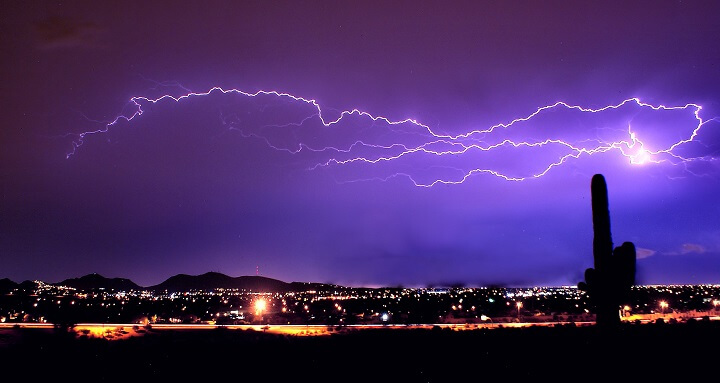
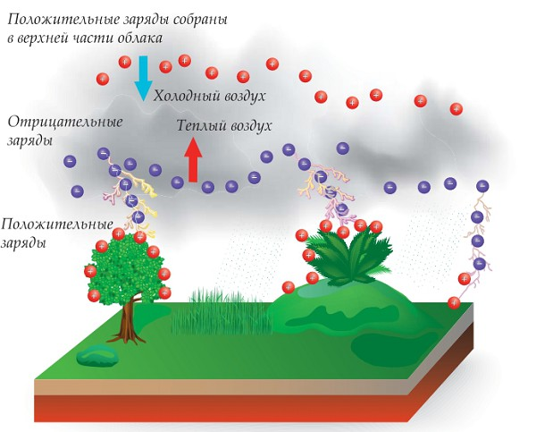
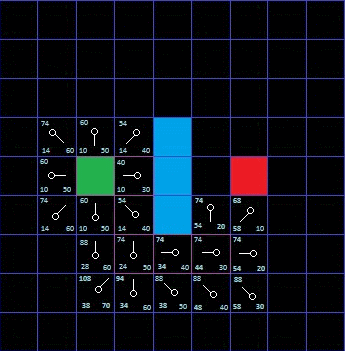
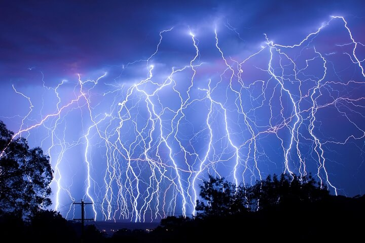

---
## Front matter
lang: ru-RU
title: Моделирование электрического пробоя
subtitle: Проектная работа. Этап №2
author:
  - "Евдокимов И.А., НФИбд-01-20"
  - "Евдокимов М.М., НФИбд-01-20"
  - "Манаева В.Е., НФИбд-01-20"
  - "Покрас И.М., НФИбд-02-20"
  - "Сулицкий Б.Р., НФИбд-02-20"
  - "Новосельцев Д.С., НФИбд-02-20"
institute:
  - Российский университет дружбы народов, Москва, Россия
date: 25 февраля 2023

## i18n babel
babel-lang: russian
babel-otherlangs: english

## Formatting pdf
toc: false
toc-title: Содержание
slide_level: 2
aspectratio: 169
section-titles: true
theme: metropolis
header-includes:
 - \metroset{progressbar=frametitle,sectionpage=progressbar,numbering=fraction}
 - '\makeatletter'
 - '\beamer@ignorenonframefalse'
 - '\makeatother'
---

## Цели и задачи

Разобрать алгоритмы электрического пробоя для дальнейшего написания.

Задачи второго этапа проекта:

- Выделить алгоритм, который будет использоваться для построения модели;
- Разобрать формулы, использующиеся в нём;
- Посмотреть, какие алгоритмы будут наиболее эффективными для вычисления формул;

# Алгоритм

## Условия модели

Модель: формирование молнии в неоднородном воздушном пространстве

{#fig:001 width=70%}

## Молния в природе

{#fig:002 width=60%}

## Упрощения для реализации модели

1. Статические заряды в воздухе;
2. Поверхность земли, куда бьёт молния, ровная;
3. Молния начинается в детерминированном местоположении;
4. Не учитываются электрохимические реакции.

## Особенности алгоритма

Очерёдность действий в алгоритме:

1. Создание поля;
2. Рабочий цикл:
	1. Выбор решения из очереди;
	2. Оценка напряжённости пространства;
	3. Выбор направления развития молнии;
	4. Добавление полученного решения и его веса в очередь для обработки;
3. Завершение.

# Формулы

Алгоритм генерации молний основан на нескольких следующих формулах:

 | | 
|:-:|:-:|:-:|
 | | 
$$ \overrightarrow{F_i} = k \frac{q_iq_0}{\varepsilon r_i^2} $$ | $$ \overrightarrow{E_i} = \frac{\overrightarrow{F_i}}{q_0} $$ | $$ \overrightarrow{E} = \sum^n_0 \overrightarrow{E_i} $$
 | | 
Сила, оказываемая зарядом электрического поля ($q_i$) на движущийся заряд ($q_0$) | Напряжённость, создающаяся $i$-тым зарядом в поле | Общая напряжённость электрического поля
 | | 
- | $$ \overrightarrow{E_i} = k \frac{q_i}{\varepsilon r_i^2} $$ | - 

# Алгоритмы выбора решения в очереди

Для поиска минимального решения по графу существуют (в числе прочих) следующие алгоритмы:

- BFS (поиск в ширину);
- DFS (поиск в глубину);
- A* (A-star);

Сконцентрируемся на A* как на наиболее оптимальном алгоритме.

## A-star

A* - алгоритм поиска по первому наилучшему совпадению на графе, который находит маршрут с наименьшей стоимостью от начальной вершины к конечной.

{#fig:003 width=40%}

# Прочие оптимизации

Для формул 

$$ \overrightarrow{E_i} = \frac{\overrightarrow{F_i}}{q_0} $$

и

$$ \overrightarrow{F_i} = k \frac{q_iq_0}{\varepsilon r_i^2} $$

## Молнии не бьют в одно место дважды...

{#fig:004 width=60%}