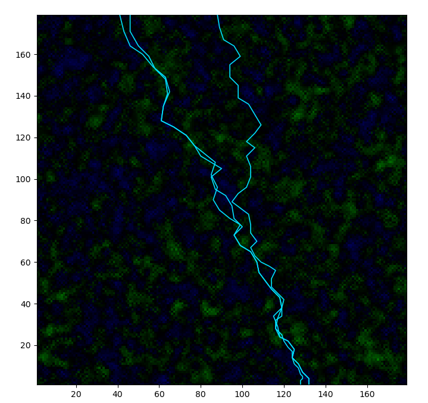

---
## Front matter
lang: ru-RU
title: Моделирование электрического пробоя
subtitle: Проектная работа. Этап №3
author:
  - "Евдокимов И.А., НФИбд-01-20"
  - "Евдокимов М.М., НФИбд-01-20"
  - "Манаева В.Е., НФИбд-01-20"
  - "Покрас И.М., НФИбд-02-20"
  - "Сулицкий Б.Р., НФИбд-02-20"
  - "Новосельцев Д.С., НФИбд-02-20"
institute:
  - Российский университет дружбы народов, Москва, Россия
date: 17 марта 2023

## i18n babel
babel-lang: russian
babel-otherlangs: english

## Formatting pdf
toc: false
toc-title: Содержание
slide_level: 2
aspectratio: 169
section-titles: true
theme: metropolis
header-includes:
 - \metroset{progressbar=frametitle,sectionpage=progressbar,numbering=fraction}
 - '\makeatletter'
 - '\beamer@ignorenonframefalse'
 - '\makeatother'
---

## Цели и задачи

Описание программной реализации проекта.

Задачи третьего этапа проекта:

- Написать программу, моделирующую электрический пробой по модели;
- Разобрать применение заявленных в предыдущих этапах формул;
- Продемонстрировать результаты реализации;

# Написание программы

## Краткая справка об алгоритме

Алгоритм генерации молний основан на нескольких следующих формулах:

 | 
|:-:|:-:|
 | 
$$ \overrightarrow{E_i} = k \frac{q_i}{\varepsilon r_i^2} $$ | $$ \overrightarrow{E} = \sum^n_0 \overrightarrow{E_i} $$
 | 
Напряжённость, создающаяся $i$-тым зарядом в точке | Общая напряжённость электрического поля в точке

## Решённые задачи

- Генерация зарядов в воздушном пространстве;
- Подсчёт напряжённости поля в конкретных точках;
- Создание поля;
- Генерация молнии в поле. 

# Код

## Функция генерации заряда в точке

	function z()
	    if rand(0:10) > 6
	        t = rand(-10:10)
	    else
	        t = 0
	    end
	    return t
	end

## Цикл подсчёта напряжённости в конкретной точке пространства

	for c in condition
        if (c[1] != b) || (c[2] != a)
        t += c[3] / ((c[1]-b)*(c[1]-b) + (c[2]-a)*(c[2]-a))
    end

## Цикл создания молний в пространстве

{#fig:011 width=55%}

# Результаты работы кода (изображения)
## Пространство

{#fig:001 width=45%}

## Молнии в пространстве (1)

{#fig:002 width=45%}

## Молнии в пространстве (2)

{#fig:003 width=45%}

## Молнии не бьют в одно место дважды. По нашему коду.

{#fig:004 width=45%}