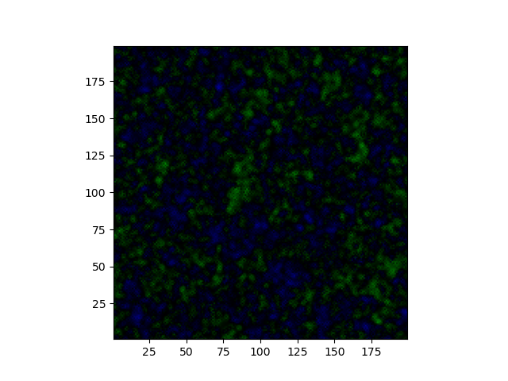
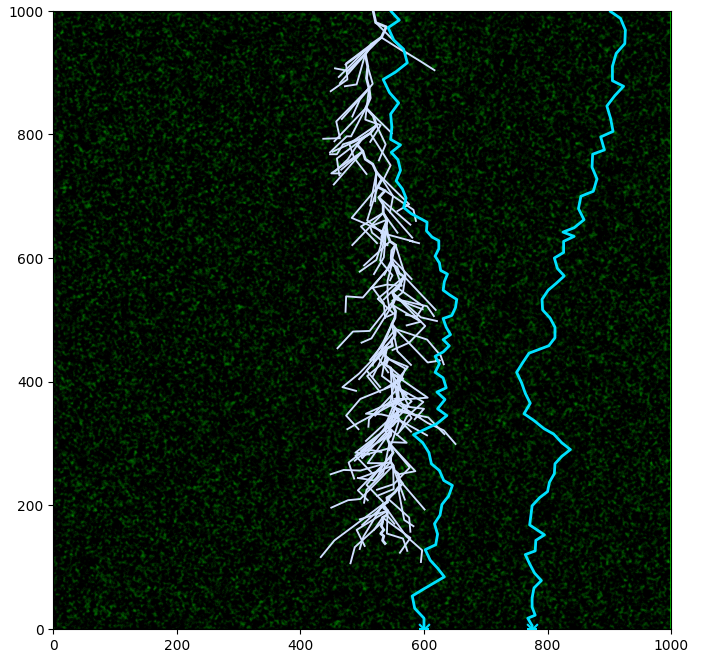
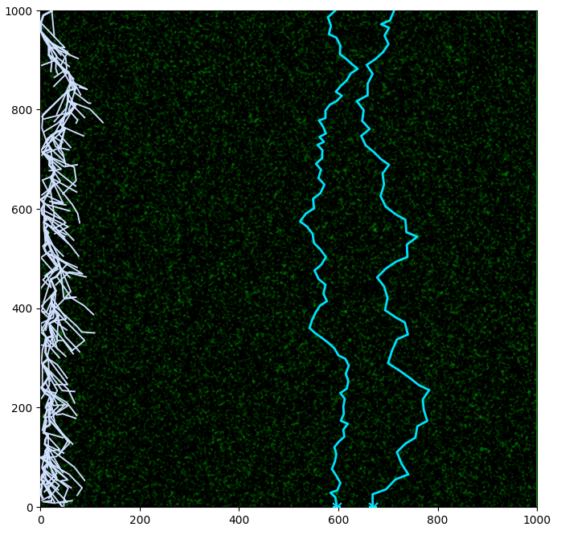
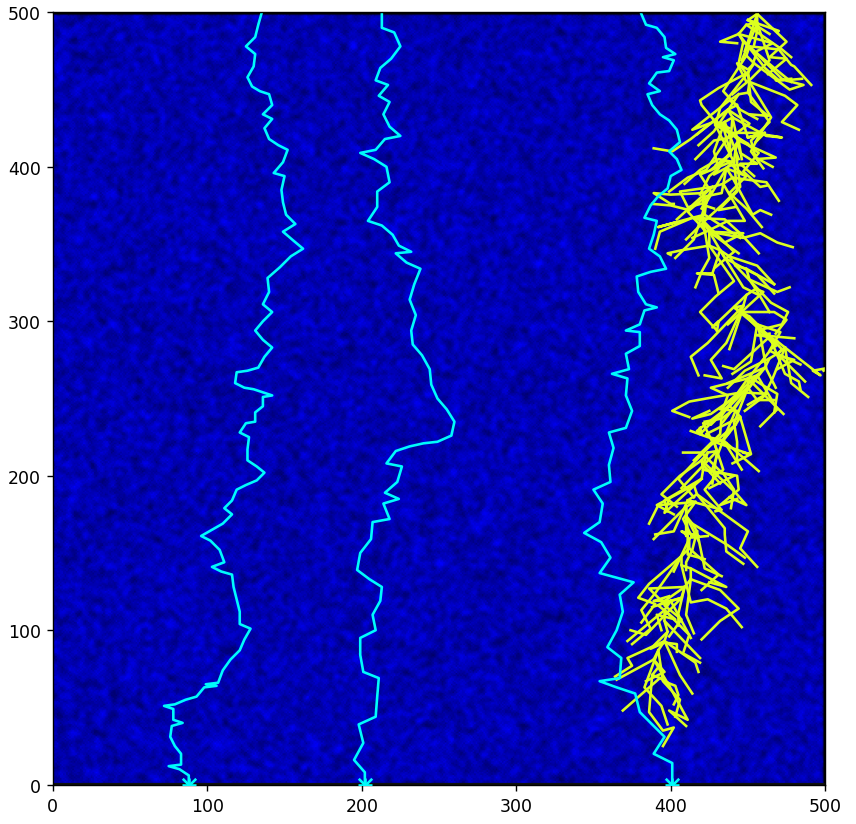

---
## Front matter
title: "Отчёт об этапе проекта №3"
subtitle: "Модель электрического пробоя"
author: 
  - "Евдокимов М.М., НФИбд-01-20"
  - "Евдокимов И.А., НФИбд-01-20"
  - "Манаева В.Е., НФИбд-01-20"
  - "Покрас И.М., НФИбд-02-20"
  - "Сулицкий Б.Р., НФИбд-02-20"
  - "Новосельцев Д.С., НФИбд-02-20"
## Generic otions
lang: ru-RU
toc-title: "Содержание"

## Bibliography
bibliography: bib/cite.bib
csl: pandoc/csl/gost-r-7-0-5-2008-numeric.csl

## Pdf output format
toc: true # Содержание
toc-depth: 3
lof: false # Список рисунков
lot: false # Список таблиц
fontsize: 12pt
linestretch: 1.5
papersize: a4
documentclass: scrreprt
## I18n polyglossia
polyglossia-lang:
  name: russian
  options:
	- spelling=modern
	- babelshorthands=true
polyglossia-otherlangs:
  name: english
## I18n babel
babel-lang: russian
babel-otherlangs: english
## Fonts
mainfont: PT Serif
romanfont: PT Serif
sansfont: PT Sans
monofont: PT Mono
mainfontoptions: Ligatures=TeX
romanfontoptions: Ligatures=TeX
sansfontoptions: Ligatures=TeX,Scale=MatchLowercase
monofontoptions: Scale=MatchLowercase,Scale=0.9
## Biblatex
biblatex: true
biblio-style: "gost-numeric"
biblatexoptions:
  - parentracker=true
  - backend=biber
  - hyperref=auto
  - language=auto
  - autolang=other*
  - citestyle=gost-numeric
## Pandoc-crossref LaTeX customization
figureTitle: "Рис."
tableTitle: "Таблица"
listingTitle: "Листинг"
lofTitle: "Список иллюстраций"
lotTitle: "Список таблиц"
lolTitle: "Листинги"
## Misc options
indent: true
header-includes:
  - \usepackage{indentfirst}
  - \usepackage{float} # keep figures where there are in the text
  - \floatplacement{figure}{H} # keep figures where there are in the text
---

# Текст

## Этап №3. Проект №2

Тема проекта: электрический пробой.

Задание второго этапа проектной работы: .

# Написание программы

## Краткая справка об алгоритме

Алгоритм генерации молний основан на нескольких следующих формулах:

 | | 
|:-:|:-:|:-:|
 | | 
$$ \overrightarrow{F_i} = k \frac{q_iq_0}{\varepsilon r_i^2} $$ | $$ \overrightarrow{E_i} = \frac{\overrightarrow{F_i}}{q_0} $$ | $$ \overrightarrow{E} = \sum^n_0 \overrightarrow{E_i} $$
 | | 
Сила, оказываемая зарядом электрического поля ($q_i$) на движущийся заряд ($q_0$) | Напряжённость, создающаяся $i$-тым зарядом в поле | Общая напряжённость электрического поля
 | | 
- | $$ \overrightarrow{E_i} = k \frac{q_i}{\varepsilon r_i^2} $$ | - 

## Решённые задачи

- Генерация зарядов в воздушном пространстве;
- Подсчёт напряжённости поля в конкретных точках;
- Создание поля;
- Генерация молнии в поле. 

# Код
## Общий

	using PyCall
	using Random
	@pyimport PIL.Image as img
	@pyimport matplotlib.pyplot as plt
	
	function z()
	    if rand(0:10) > 8
	        t = rand(-10:10)
	    else
	        t = 0
	    end
	    return t
	end
	
	x, y, limit = Int64(100), Int64(100), 80
	minA, maxA = 180, 360
	minB, maxB = 160, 380
	minE, maxE, count = 18.0, 21.0, 3
	losses, pL, brench_count = 0.97, pi / 180, 3
	colorL = ["#00e0fe", "#d0e0ff"]
	condition = []
	for c1 = 0:x, c2 = 0:y
	    if rand(0:10) > 9
	        push!(condition, [c1, c2, rand(-10:10)])
	    end
	    c1 = 0
	end
	space = [[0.0 for _ in 0:x] for _ in 0:y]
	lightnings = [[[rand(1:x-1)], [y-1], [rand(minE:.001:maxE)]] for _ in 0:count]
	branches = []
	image = img.new(mode="RGB", size=(y, x))
	for a in 1:y
	    println(a)
	    for b in 1:x
	        t = 0
	        for c in condition
	            if (c[1] != b) || (c[2] != a)
	            t += c[3] / ((c[1]-b)*(c[1]-b) + (c[2]-a)*(c[2]-a))
	        end
	        space[a][b] = round(t; digits = 3)
	        if space[a][b] >= 0
	            image.putpixel((a-1, b-1), (0, 0, round(Int, space[a][b]*2)))
	        else
	            image.putpixel((a-1, b-1), (0, round(Int, abs(space[a][b])*2), 0))
	        end
	    end
	end
	for e in 1:count
	    for _ in 1:limit
	        t = [-1, -1, -1]
	        for g in minA:maxA
	            temp = [abs(round(Int, (last(l[e][0]) + last(l[e][2]) * cos(g * pL)))),
	                    abs(round(Int, (last(l[e][1]) + last(l[e][2]) * sin(g * pL))))]
	            if (1 < temp[1] < x) && (1 < temp[2] < y)
	                if (temp[2] < last(l[e][2])) && (1 < temp[1] < x)
	                    if (last(l[e][2]) < last(l[e][3])) && (space[temp[1]][temp[2]] > 10)
	                        t = [last(l[e][1]), 0, space[temp[1]][temp[2]]]
	                        break
	                    elseif (t[3] < space[temp[1]][temp[2]]) || (space[temp[1]][temp[2]] == 100)
	                        t = [temp[1], temp[2], space[temp[1]][temp[2]]]
	                    end
	                end
	            end
	        end
	    end
	end
	
	for l in lightnings
	    ax.plot(light[1], light[2], color=color[1], linewidth=1.2, zorder=3)
	end
	fig, ax = plt.subplots()
	ax.set_xlim(0, x)
	ax.set_ylim(0, y)
	plt.imshow(image)
	plt.show()

## Функция генерации заряда в точке

	function z()
	    if rand(0:10) > 8
	        t = rand(-10:10)
	    else
	        t = 0
	    end
	    return t
	end

## Функция подсчёта напряжённости в точке

	for c in condition
        if (c[1] != b) || (c[2] != a)
        t += c[3] / ((c[1]-b)*(c[1]-b) + (c[2]-a)*(c[2]-a))
    end

# Результаты работы кода (изображения)
## Пространство

{#fig:001 width=45%}

## Молнии в пространстве (1)

{#fig:002 width=45%}

## Молнии в пространстве (2)

{#fig:003 width=45%}

## Молнии не бьют в одно место дважды. По нашему коду.

{#fig:004 width=45%}