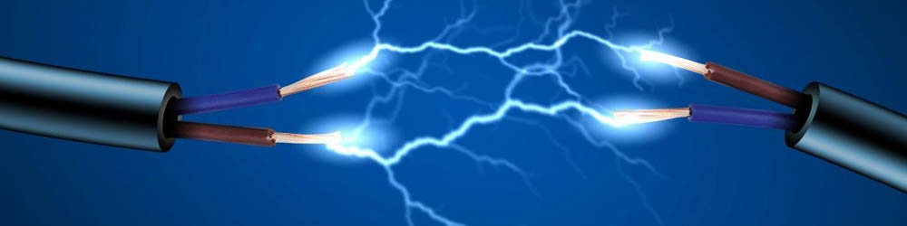
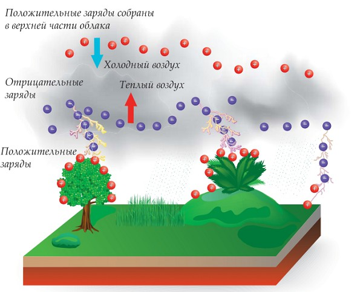
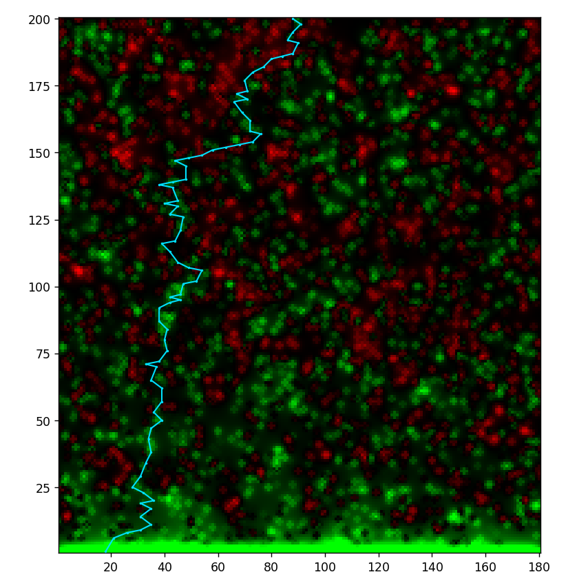
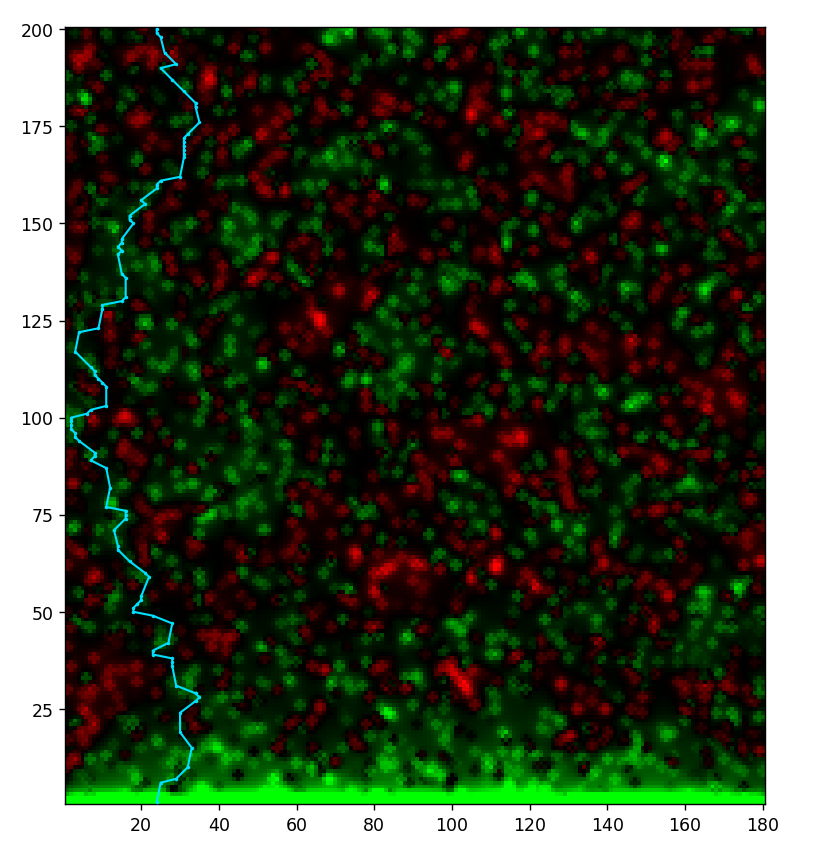

---
## Front matter
lang: ru-RU
title: Моделирование электрического пробоя
subtitle: Проектная работа. Этап №4
author:
  - "Евдокимов И.А., НФИбд-01-20"
  - "Евдокимов М.М., НФИбд-01-20"
  - "Манаева В.Е., НФИбд-01-20"
  - "Покрас И.М., НФИбд-02-20"
  - "Сулицкий Б.Р., НФИбд-02-20"
  - "Новосельцев Д.С., НФИбд-02-20"
institute:
  - Российский университет дружбы народов, Москва, Россия
date: 17 марта 2023

## i18n babel
babel-lang: russian
babel-otherlangs: english

## Formatting pdf
toc: false
toc-title: Содержание
slide_level: 2
aspectratio: 169
section-titles: true
theme: metropolis
header-includes:
 - \metroset{progressbar=frametitle,sectionpage=progressbar,numbering=fraction}
 - '\makeatletter'
 - '\beamer@ignorenonframefalse'
 - '\makeatother'
---

## Цели и задачи

Изучить электрический пробой, его вариации, построить модель и для модели написать программный код.

Задачи проекта: 

- Составить обзор физического явления электрического пробоя;
- Составить теоретическое описание модели;
- Составить математическое описание алгоритма, который используется для реализации модели;
- На основе составленного алгоритма написать программный код и изучить результаты реализации.

# Теоретические сведения

## Электрический пробой

Электрический пробой — явление резкого возрастания тока в твёрдом, жидком или газообразном диэлектрике (или полупроводнике) или воздухе, возникающее при приложении напряжения выше критического (напряжение пробоя).
Электрические пробои разделяются по средам, в которых они происходят:

1.	Вакуум; 
2.	Газ; 
3.	Твердые тела;
4.	Жидкости.

{#fig:001 width=80%}

## Электрический пробой в газах

Пробой газообразных диэлектриков обусловлен явлениями ударной (ионизация молекулы/атома при «ударе о него» электрона или другой заряженной частицы) и фотонной (ионизация молекулы/атома непосредственно при абсорбции фотонов), энергия которых равна или больше энергии ионизации.

Различают 2 классификации пробоя газа:

1.	Пробой газа при неоднородном поле;
2.	Пробой газа в однородном поле.

# Модель

## Молния в природе

{#fig:002 width=60%}

## Упрощения для реализации модели

1. Статические заряды в воздухе;
2. Поверхность земли, куда бьёт молния, ровная;
3. Молния начинается в детерминированном местоположении;
4. Не учитываются электрохимические реакции.

## Формулы

Алгоритм генерации молний основан на нескольких следующих формулах:

 | 
|:-:|:-:|
 | 
$$ \overrightarrow{E_i} = k \frac{q_i}{\varepsilon r_i^2} $$ | $$ \overrightarrow{E} = \sum^n_0 \overrightarrow{E_i} $$
 | 
Напряжённость, создающаяся $i$-тым зарядом в точке | Общая напряжённость электрического поля в точке

# Код
## Функция генерации заряда в точке

	for c1 = 1:x, c2 = 1:y
	    if rand(0:100) > 90
	        push!(condition, [c1, c2, rand(-20:20)])
	    end
	    c1 = 0
	end

## Цикл подсчёта напряжённости в конкретной точке пространства

	for c in condition
        if (c[1] == b) && (c[2] == a)
            t += c[3]
        elseif (c[1] != b) || (c[2] != a)
            t += c[3] / ((c[1]-b)^2 + (c[2]-a)^2)
        end
    end

# Результаты работы кода (изображения)
## Молнии в пространстве (1)

{#fig:002 width=45%}

## Молнии в пространстве (2)

{#fig:003 width=45%}

## На этом всё.

{#fig:004 height=75%}