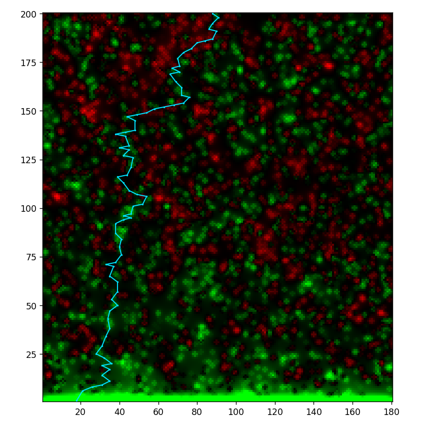
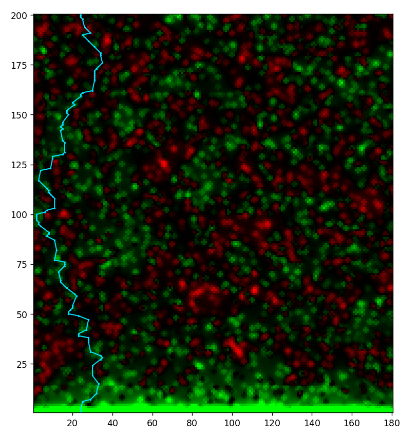

---
## Front matter
title: "Отчёт об этапе проекта №4"
subtitle: "Проект: Моделирование электрического пробоя"
author: 
  - "Евдокимов М.М., НФИбд-01-20"
  - "Евдокимов И.А., НФИбд-01-20"
  - "Манаева В.Е., НФИбд-01-20"
  - "Покрас И.М., НФИбд-02-20"
  - "Сулицкий Б.Р., НФИбд-02-20"
  - "Новосельцев Д.С., НФИбд-02-20"
## Generic otions
lang: ru-RU
toc-title: "Содержание"

## Bibliography
bibliography: bib/cite.bib
csl: pandoc/csl/gost-r-7-0-5-2008-numeric.csl

## Pdf output format
toc: true # Содержание
toc-depth: 3
lof: true # Список рисунков
lot: true # Список таблиц
fontsize: 12pt
linestretch: 1.5
papersize: a4
documentclass: scrreprt
## I18n polyglossia
polyglossia-lang:
  name: russian
  options:
	- spelling=modern
	- babelshorthands=true
polyglossia-otherlangs:
  name: english
## I18n babel
babel-lang: russian
babel-otherlangs: english
## Fonts
mainfont: PT Serif
romanfont: PT Serif
sansfont: PT Sans
monofont: PT Mono
mainfontoptions: Ligatures=TeX
romanfontoptions: Ligatures=TeX
sansfontoptions: Ligatures=TeX,Scale=MatchLowercase
monofontoptions: Scale=MatchLowercase,Scale=0.9
## Biblatex
biblatex: true
biblio-style: "gost-numeric"
biblatexoptions:
  - parentracker=true
  - backend=biber
  - hyperref=auto
  - language=auto
  - autolang=other*
  - citestyle=gost-numeric
## Pandoc-crossref LaTeX customization
figureTitle: "Рис."
tableTitle: "Таблица"
listingTitle: "Листинг"
lofTitle: "Список иллюстраций"
lotTitle: "Список таблиц"
lolTitle: "Листинги"
## Misc options
indent: true
header-includes:
  - \usepackage{indentfirst}
  - \usepackage{float} # keep figures where there are in the text
  - \floatplacement{figure}{H} # keep figures where there are in the text
---

# Введение
## Этап №4. Проект №2

Тема проекта: электрический пробой.

Задание четвёртого этапа проектной работы: **Защита проекта.** Коллективное обсуждение результата проекта, самооценка деятельности.

## Цель и задачи работы

Изучить электрический пробой, его вариации, построить модель и для модели написать программный код.

Задачи проекта: 

- Составить обзор физического явления электрического пробоя;
- Составить теоретическое описание модели;
- Составить математическое описание алгоритма, который используется для реализации модели;
- На основе составленного алгоритма написать программный код и изучить результаты реализации.

# Теоретическая информация

## Общая информация о модели

**Электрический пробой** – это разрушение диэлектрика, обусловленное ударной ионизацией электронами из-за разрыва связей между атомами, ионами или молекулами. Все изоляционные материалы подвергаются пробою, когда электрическое поле, вызванное приложенным напряжением, превышает электрическую прочность материала. Пробой может происходить в течение очень короткого времени - $10^{-5} - 10^{-8}$ секунд, а также может привести к непрерывной электрической дуге, которая представляет собой мощный установившийся электрический разряд между двумя электродами в ионизированной газовой среде.[@model:uch]

Электрическая прочность при электрическом пробое зависит главным образом от внутреннего строения диэлектрика.
Электрическая прочность зависит не только от агрегатного состояния диэлектриков (газ, жидкость, твердый диэлектрик) и их структуры, но может изменяться в зависимости от толщины диэлектрика, формы электродов и условий теплоотвода.
Электрическая прочность при электрическом пробое является характеристикой материала. Тонкие пленки из диэлектрических материалов обладают более высокой электрической прочностью по сравнению с массивными образцами. Тонкие диэлектрические пленки, особенно аморфной структуры, широко используются в качестве изоляции при изготовлении микроэлектронных элементов и устройств.

Минимальное напряжение $U_{applied}$, приложенное к диэлектрику, и приводящее к образованию в нем проводящего канала, называется пробивным напряжением.

Существует несколько сред, в которых возможен электрический пробой:

1.	Вакуум; 
2.	Газ; 
3.	Твердые тела;
4.	Жидкости.

## Электрический пробой в вакууме [@phys:encyclopedy, стр.237-238]

Вакуумный пробой (электрический пробой вакуума) - это потеря вакуумным промежутком между электродами свойств электрического изолятора при приложении к нему электрического поля, напряжение которого превышает определённую величину. При вакуумном пробое промежуток заполняется ионизованными парами и среда в нём становится проводящей.
Первоначально электроды находятся в таком вакууме, при котором длина пробега частиц много больше расстояния между электродами, так что объёмная ионизация остаточного газа отсутствует. Развитие вакуумного пробоя может начаться с теплового взрыва естественных или искусственных микроострий на катоде за счёт токов автоэлектронной эмиссии. При этом вблизи катода образуется облако плазмы. Бомбардируемый электронами плазмы анод разогревается и поставляет в межэлектродный промежуток пары металла, ионизация которых приводит к возникновению сильноточного искрового разряда. Если мощность источника тока достаточно велика, то заключительной стадией вакуумного пробоя является вакуумная дуга в парах металлов электродов. Развитию вакуумный пробой могут способствовать диэлектрические вкрапления и адсорбированные плёнки на поверхности электродов.

Вакуумный пробой используется в приборах и устройствах газоразрядной и вакуумной электроники, в сильноточных ускорителях и мощных источниках жёсткого излучения.

Первым прибором вакуумной электроники была лампа А. Н. Лодыгина. Затем был создан электровакуумный диод Дж. А. Флеминга.

Электронные лампы стали основой разработанных систем радиосвязи, радиовещания.

## Электрический пробой в газах

Пробой газообразных диэлектриков обусловлен явлениями ударной (ионизация молекулы/атома при «ударе о него» электрона или другой заряженной частицы) и фотонной (ионизация молекулы/атома непосредственно при абсорбции фотонов), энергия которых равна или больше энергии ионизации. 

Воздух - изоляционная среда для различной электронной аппаратуры. В случае сильных электрических полей физические процессы в воздухе происходят при нормальном атмосферном давлении. Но в радиоэлектронике приходится иметь дело с пробоем при повышенном давлении и значительном разрежении.

Относительно малое количество содержащихся в газе положительных и отрицательных ионов и электронов, находящихся в беспорядочном тепловом движении, при воздействии поля получают некоторую добавочную скорость и начинают в зависимости от знака заряда перемещаться в направлении поля или против. При этом заряженная частица приобретает дополнительную энергию.

Различают 2 классификации пробоя газа:

1.	Пробой газа при неоднородном поле;
2.	Пробой газа в однородном поле.

Оба случая заметно различаются. 

Так, однородное поле возникает между плоскими электродами с закругленными краями, а также между сферами, если расстояние между ними не более их диаметра. В таком поле длительность подготовки пробоя газа (для промежутка) составляет при достижении напряжением строго определенного значения, зависящего от температуры и давления газа. Между электродами внезапно возникает искра, которая затем переходит в дугу, если источник напряжения имеет достаточную мощность. 

В то время как неоднородное поле возникает между двумя остриями, острием и плоскостью, проводами, между сферическими поверхностями при расстоянии между ними, превышающем радиус сферы и т.д., а её особенностью является возникновение частичного разряда в виде короны в местах, где напряженность поля достигает критических значений, с дальнейшим переходом короны в искровой разряд и дугу при возрастании напряжения.

## Электрический пробой в твёрдой среде

В твёрдых телах существует множество механизмов пробоя. Вот основные из них:

1. Внутренний пробой;
2. Тепловой пробой;
3. Разрядный пробой;
4. Электрохимический пробой.

Внутренний пробой в твёрдых телах связан с тем, что носитель заряда на длине свободного пробега приобретает энергию, достаточную для ионизации молекул кристаллической решётки и увеличивает концентрацию носителей заряда. При этом лавинообразно создаются свободные носители заряда (увеличивается концентрация электронов), которые вносят основной вклад в общий ток. У полупроводников и диэлектриков существует разновидность частичного пробоя.

Тепловой пробой возникает при разогреве кристаллической решётки диэлектрика или полупроводника. При увеличении температуры свободным электронам легче ионизировать атомы решётки, поэтому пробивное напряжение уменьшается. Разогрев может происходить как в результате теплопередачи извне, так и вследствие протекания переменного тока внутри диэлектрика.

Разрядный пробой связан с ионизацией адсорбированных газов в пористых материалах, таких как слюда или пористая керамика. Находящиеся в порах газы ионизируются раньше, чем пробивается твёрдое вещество, возникающие при этом газовые разряды разрушают поверхность пор.

Электрохимический пробой электротехнических материалов [@phys:dielectrics] наблюдается при постоянном и переменном напряжениях низкой частоты, когда в материале развиваются процессы, обусловливающие необратимое уменьшение сопротивления изоляции (электрохимическое старение). Кроме того, электрохимический пробой может иметь место при высоких частотах, если в закрытых порах материала происходит ионизация газа, сопровождающаяся тепловым эффектом и восстановлением, например в керамике, окислов металлов переменной валентности.Этот вид пробоя имеет существенное значение при повышенных температурах и высокой влажности воздуха. Для развития электрохимического пробоя требуется длительное время, поскольку он связан с явлением электропроводности. В керамике, содержащей окислы металлов переменной валентности (например), электрохимический пробой встречается значительно чаще, чем в керамике, состоящей из окислов алюминия, кремния, магния, бария. Электрохимический пробой наблюдается и у многих органических материалов; он во многом зависит от материала электродов.

## Электрический пробой в жидкой среде

Электрическая форма пробоя, развивающаяся за время от $10^5$ до $10^8$ секунды, наблюдается в тщательно очищенных жидких диэлектриках и связывается с инжекцией электронов с катода. $E_{applied}$ при этом достигает $103$ МВ/м.

Механизм электрического пробоя жидкостей вначале считался аналогичным механизму пробоя газов, считая жидкость плотным газом. Это основывалось на схожести картины разряда и на некоторой схожести разрядных зависимостей. Однако прямое, непосредственное применение газовых аналогий неправильно.

Дело в том, что поведение электронов в жидкости кардинально отличается от поведения электронов в газе. Молекулы жидкости расположены столь близко друг другу, столь сильно взаимодействуют друг с другом, что электрон не может свободно двигаться и ускоряться в электрическом поле. В жидкости, кроме особо чистых сжиженных благородных газов, свободные электроны не могут существовать. При попадании свободных электронов в жидкость они сначала “сольватируются”, затем прилипают к нейтральным молекулам, образуя тем самым, отрицательные ионы.

Поэтому понятие длины свободного пробега для жидкости невозможно ввести. Грубая оценка принципиальных ограничений электрической прочности может быть сделана из следующих соображений. Считаем, что электрон может ускоряться на протяжении межмолекулярного расстояния. Используя в качестве длины пробега электрона “межмолекулярное расстояние”, можно получить оценку предельной электрической прочности жидкости.

В технически чистых жидких диэлектриках пробой носит тепловой характер. Энергия, выделяющаяся в ионизирующихся пузырьках газа, приводит к перегреву жидкости, что может послужить причиной закипания капелек влаги (локальный перегрев) и возникновению газового канала между электродами.
Любые крупные примеси в жидкости приводят к искажению электрического поля в жидкости, понижая электрическую прочность жидкого диэлектрика. На высоких частотах происходит разогрев жидкости за счет релаксационных потерь и наблюдается термическое разрушение жидкости.
Электрическая прочность жидких диэлектриков в значительной степени зависит от взвешенных в нем коллоидных частиц воды, смолистых веществ и других загрязнений. Под действием электри­ческих сил заряженные частицы воды или смолистых веществ выстраиваются в виде цепочек, по которым развивается электрический разряд, т. е. происходит пробой жидкого диэлектрика.

Фактически на электрический пробой жидких диэлектриков влияют многие факторы, к числу которых относятся:

- дегазация жидкости и электродов;
- длительность воздействия напряжения;
- скорость возрастания напряжения и его частота;
- температура, давление и др.

А теперь давайте рассмотрим данный процесс на примере. С повышением температуры часть коллоидных частиц $H_2O$ или смолистых веществ растворяется и образование токопроводящего канала в жидком диэлектрике затрудняется. В связи с этим электрическая прочность жидкого диэлектрика повышается. Вследствие зависимости $U_{applied}$. от процента содержания воды для трансформаторного масла.

Из-за нагрева конечно же образуются пузырьки газа, которые ведут себя аналогично. Будучи ионизированными, они под действием электрических сил образуют газовый канал между металлическими частями, находящимися под высоким напряжением. В этом случае электрический разряд происходит в газовом канале. Электрическая прочность жидких диэлектриков, содержащих воз­дух и другие газы в большой степени зависит от давления. С увеличением давления электрическая прочность увеличивается. Электрическая прочность дегазированного диэлектрика в меньшей степени зависит от давления.

# Модель

В работе будет строиться модель электрического пробоя воздуха для случая с неоднородным электрическим полем.

## Молния в природе

Модель построена на основании реального механизма образования линейной молнии в природе. Так, в облаках заряды разделяются на положительные и отрицательные, при этом отрицательные заряды на нижней поверхности облаков будут взаимодействовать с положительными зарядами на поверхности земли. После достижения порогового значения в несколько тысяч вольт, формируется пробой. 

## Упрощения для реализации модели

Упрощения, сделанные для уменьшения работы над моделями.

1. Статические заряды в воздухе;

В модели будут случайным образом заданы заряды в воздухе, создающие электрическое поле, в котором будет развиваться молния. Однако на сами заряды это поле воздействовать не будет, то есть, они не будут двигаться под воздействием электрического поля.

2. Поверхность земли, куда бьёт молния, ровная;

Это упрощает генерацию каждой конкретной молнии в модели.

3. Молния начинается в заранее определённом месте;

Опять же, упрощение для того, чтобы следить за генерацией молний различных форм.

4. Не учитываются электрохимические реакции, образование радикалов и так далее.

Таким образом обеспечивается неизменность электрического поля в модели. 

## Формулы и алгоритм

Для реализации создания молнии мы будем использовать разницу потенциалов в разных частях поля, которая как раз и влечёт за собой как само появление молнии, так и её "форму", то есть, линию, по которой движутся заряды. Для этого мы сгенерируем электрические заряды в нашем "поле". На их основании будет создано электрическое поле. Этот этап можно коротко назвать создание поля.

Далее идёт рабочий цикл, в котором из очереди будет доставаться один из шагов решения. Этот шаг будет обрабатываться и, если он не подходит под условие ответа, он обновляется и добавляется в очередь.

Если шаг решения будет соответствовать условию, которое мы обозначим как завершение рабочего цикла, этот шаг объявится финальным. Из информации шага восстанавливается путь молнии, который дальше отрисовывается на графике.

В первом этапе алгоритма планируется создать слой отрицательных зарядов по верхнему краю поля и слой положительных зарядов по нижнему краю поля. Затем нужно сгенерировать случайные заряды, разбросанные в воздухе. Это делается через генерацию псевдослучайных чисел, встроенную в почти любой язык программирования.

Дальше необходимо создать электрическое поле. Разберём формулы, которые для этого требуются.

Сила, оказываемая зарядом электрического поля ($q_i$) на движущийся заряд ($q_0$) это формула, данная в левой колонке. Заряды q-итое и q нулевое задаются в Кулонах (в нашем случае, они будут случайно сгенерированы программой), умножаются на константу K и делятся на эпсилон и расстояние до движущегося заряда в квадрате.
Дальше, на основании силы воздействия на заряд, считается напряжённость, создаваемая этим самым зарядом. Для этого сила делится на сам заряд q нулевое. В программе будет считаться совмещённая формула, то есть первая формула без q нулевого, так как нет смысла умножать, а затем делить на одно и то же число.

: Изначальные физические формулы силы и напряжённости и общая модифицированная формула {#tbl:formulas}

Сила, оказываемая зарядом электрического поля ($q_i$) на движущийся заряд ($q_0$) | Напряжённость, создающаяся $i$-тым зарядом в поле | Объединённая формула напряжённости, создающимся i-ым зарядом
|:-:|:-:|:--:|
$$ \overrightarrow{F_i} = k \frac{q_iq_0}{\varepsilon r_i^2} $$ | $$ \overrightarrow{E_i} = \frac{\overrightarrow{F_i}}{q_0} $$ | $$ \overrightarrow{E_i} = k \frac{q_i}{\varepsilon r_i^2} $$

Дальше напряжённости суммируются и получается значение общей напряжённости поля.

$$ \overrightarrow{E} = \sum^n_0 \overrightarrow{E_i} $$

Формула общей напряжённости электрического поля считается для каждой точки поля, именно таким образом и создаётся "поле", которое будет использоваться для генерации молнии.

Молния идёт от верхней стороны экрана к нижней, при этом выбирая точки поля наибольшей напряжённости.

## Решённые задачи

- Генерация зарядов в воздушном пространстве;
- Подсчёт напряжённости поля в конкретных точках;
- Создание поля;
- Генерация молнии в поле.

# Код программы для генерации молнии

Рассмотрим код программы, написанный на Julia с использованием библиотек PyCall[@pycall:julka] и Random[@random:julka]

	using PyCall
	using Random
	@pyimport PIL.Image as img
	@pyimport matplotlib.pyplot as plt
	
	# параметры
	x, y, limit, onB = 180, 200, 120, 0
	minA, maxA, pL = 190, 350, pi / 180
	condition, losses = [[u, 1, 40.0] for u in 1:x], [n for n in 0.95:.01:1.05]
	minE, maxE, count = 4.0, 4.5, 1
	color= ["#00e0fe", "#00000000"]
	
	# свободные заряды и массивы
	for c1 = 1:x, c2 = 1:y
	    if rand(0:100) > 90
	        push!(condition, [c1, c2, rand(-20:20)])
	    end
	    c1 = 0
	end
	space = [[0.0 for _ in 0:x] for _ in 0:y]
	lightnings = [[[rand(10:x-10)], [y], [rand(minE:.001:maxE)]] for _ in 1:count]
	angle = []
	branches = []
	image = img.new(mode="RGB", size=(x, y))
	
	# напряжение среды и картинка
	for a in 1:y
	    for b in 1:x
	        t = 0
	        for c in condition
	            if (c[1] == b) && (c[2] == a)
	                t += c[3]
	            elseif (c[1] != b) || (c[2] != a)
	                t += c[3] / ((c[1]-b)^2 + (c[2]-a)^2)
	            end
	        end
	        space[a][b] = round(t; digits = 3)
	        if space[a][b] >= 0
	            image.putpixel((b-1, y-a), (0, round(Int, t*5), 0))
	        else
	            image.putpixel((b-1, y-a), (round(Int, abs(t*5)), 0, 0))
	        end
	    end
	    println(a, "/", y)
	end
	println("Сompletion of the environment.")
	# молнии
	for e in 1:count
	    print(lightnings[e], ": ")
	    for l in 1:limit
	        new = [round(Int, lightnings[e][1][l] - rand(-1:1)),
	            round(Int, lightnings[e][2][l] - 1)]
	        if new[1] < 0
	            continue
	        end
	        for g in minA:maxA
	            temp = [round(Int, lightnings[e][1][l] + lightnings[e][3][l] * cos(g * pL)),
	                round(Int, lightnings[e][2][l] + lightnings[e][3][l] * sin(g * pL))]
	            if (temp[1] == new[1]) && (temp[2] == new[2])
	                continue
	            elseif (0 < temp[1] <= x) && (0 < temp[2] <= y) && (temp[2] < lightnings[e][2][l])
	                if  temp[2] <= 1
	                    new = [temp[1], temp[2]]
	                    break
	                end
	                t1 = round(Int, lightnings[e][1][l] + (lightnings[e][3][l] * cos(g * pL))/2)
	                t2 = round(Int, lightnings[e][2][l] + (lightnings[e][3][l] * sin(g * pL))/2)
	                charge = [space[new[2]][new[1]], space[temp[2]][temp[1]]]
	                if space[t2][t1] < charge[2]
	                    continue
	                elseif ((charge[2] >= charge[1]) && (temp[2] < new[2])) || ((charge[2] > charge[1]) && (charge[2] > 0))
	                    new, charge[1] = [temp[1], temp[2]], charge[2]
	                end
	            end
	        end
	        print(space[new[2]][new[1]], " in ", new,  "; ")
	        push!(lightnings[e][1], new[1])
	        push!(lightnings[e][2], new[2])
	        push!(lightnings[e][3], round(lightnings[e][3][l] * losses[rand(1:11)], digits=3))
	        if last(lightnings[e][2]) <= 1
	            break
	        end
	    end
	    println("")
	end
	println("Completion of lightning.")
	# отображение
	fig, ax = plt.subplots()
	ax.set_xlim(0.5, x+0.5)
	ax.set_ylim(0.5, y+0.5)
	plt.imshow(image, extent=([0.5, x+0.5, 0.5, y+0.5]))
	for l in lightnings
	    plt.plot(l[1], l[2], color=color[1], linewidth=1.2 , marker="o", markersize=1, markerfacecolor=color[1], zorder=3)
	end
	plt.show()

Библиотеки Python Pillow[@pillow:python] и Matplotlib[@matplotlib:python], которая как раз вызывается в код с помощью библиотеки PyCall.jl, используются для создания изображений. Строго говоря, существуют библиотеки для языка Julia, которые работают с изображениями (Images.jl[@images:julka], ImageMetadata.jl[@imagemetadata:julka], ImageView.jl[@imageview:julka], TestImages.jl[@testimages:julka]) и графиками (Plots.jl[@plots:julka]). Библиотека Plots не имеет значительных недостатков, являясь некопирующей альтернативой Matplotlib. С библиотеками изображений, однако, возникли сложности.

Пространство для построении молнии генерируется в отдельном цикле и, во избежание противоречивых отображений пространства на графике построения молнии, программно создаётся изображение размера $x$*$y$ пикселей, в котором каждый пиксель заполняется цветом в соответствии со знаком своего заряда и яркостью в соответствии с силой заряда (в условных единицах, выраженных в Кл, пропущенных через какую-то функцию). Для того, чтобы перезаписывать изображения как раз и использовалась библиотека Pillow, вызванная через функционал библиотеки PyCall, так как попиксельная работа с изображениями с помощью библиотек Julia по техническим причинам не сработала.

## Цикл генерации заряда в точке

	for c1 = 1:x, c2 = 1:y
	    if rand(0:100) > 90
	        push!(condition, [c1, c2, rand(-20:20)])
	    end
	    c1 = 0
	end

Данный цикл работает следующим образом:

1. Выбирается точка пространства (через двухуровневый цикл с шагом один по оси *x* и один по оси *y*);
2. Для данной точки пространства генерируется псевдослучайное число в диапазоне от 0 до 10:
	1. Если сгенерированное число меньше 8, в данной точке пространства не создаётся заряд, возращаемся к шагу 1;
	2. В обратном случае, в двумерный массив, который хранит координаты зарядов, записывается новая строчка, где в первых двух ячейках хранятся координаты по $x$ и $y$ соответственно, а в третью ячейку записывается новое псевдослучайное число в диапазоне от -10 до 10.
3. Когда проходятся все значения $y$ от 2 до верхней границы поля и $x$ от 1 до верхней границы поля, мы перестаём генерировать заряды и массив с условием считается оконченным.

## Цикл подсчёта напряжённости в конкретной точке пространства

	for c in condition
        if (c[1] == b) && (c[2] == a)
            t += c[3]
        elseif (c[1] != b) || (c[2] != a)
            t += c[3] / ((c[1]-b)^2 + (c[2]-a)^2)
        end
    end

Для каждой точки пространства, заданной в матрице, мы производим вычисления по следующей формуле: 

$$ \overrightarrow{E} = \sum^n_0 \overrightarrow{E_i} =  \sum^n_0 k \frac{q_i}{\varepsilon r_i^2} $$

, где $r_i = \sqrt{(x-x_c)^2 + (y-y_c)^2}$. То есть, вычисления производятся по формуле общей напряжённости электрического поля в точке.

## Цикл создания молний в пространстве

	for e in 1:count
	    print(lightnings[e], ": ")
	    for l in 1:limit
	        new = [round(Int, lightnings[e][1][l] - rand(-1:1)),
	            round(Int, lightnings[e][2][l] - 1)]
	        if new[1] < 0
	            continue
	        end
	        for g in minA:maxA
	            temp = [round(Int, lightnings[e][1][l] + lightnings[e][3][l] * cos(g * pL)),
	                round(Int, lightnings[e][2][l] + lightnings[e][3][l] * sin(g * pL))]
	            if (temp[1] == new[1]) && (temp[2] == new[2])
	                continue
	            elseif (0 < temp[1] <= x) && (0 < temp[2] <= y) && (temp[2] < lightnings[e][2][l])
	                if  temp[2] <= 1
	                    new = [temp[1], temp[2]]
	                    break
	                end
	                t1 = round(Int, lightnings[e][1][l] + (lightnings[e][3][l] * cos(g * pL))/2)
	                t2 = round(Int, lightnings[e][2][l] + (lightnings[e][3][l] * sin(g * pL))/2)
	                charge = [space[new[2]][new[1]], space[temp[2]][temp[1]]]
	                if space[t2][t1] < charge[2]
	                    continue
	                elseif ((charge[2] >= charge[1]) && (temp[2] < new[2])) || ((charge[2] > charge[1]) && (charge[2] > 0))
	                    new, charge[1] = [temp[1], temp[2]], charge[2]
	                end
	            end
	        end
	        print(space[new[2]][new[1]], " in ", new,  "; ")
	        push!(lightnings[e][1], new[1])
	        push!(lightnings[e][2], new[2])
	        push!(lightnings[e][3], round(lightnings[e][3][l] * losses[rand(1:11)], digits=3))
	        if last(lightnings[e][2]) <= 1
	            break
	        end
	    end
	    println("")
	end

Основной цикл for пробегает по молниям, и первой строкой выводится первая сгенерированная точка молнии. После начинается цикл, ограничивающий количество итераций (то есть, сегментов и точек, из которых может состоять молния). Здесь задаёмся первая (предварительная) точка задающаяся как одна из трёх нижестоящих точек (по "x,y": (-1,-1), (0,-1) и (1,-1))  которые не должны попадать на отрицательные зоны иначе будут пересозданы. Дальше начинается перебор и сравнение всех точек в указанной радиусе и находящиеся ниже последней точки молнии. Также есть "предохранители": если после округления точка ровна предыдущей зафиксированной (ту которую мы предполагаем как следующую) происходит continue, тоже самое происходит если середина пересекаемого отрезка и сама точка попадает на отрицательную зону. Следующая "лучшая" точка из диапазона градусов определяется одним из двух вариантов: 1) энергия точки больше (положительнее) и находится строго ниже; 2) энергия строго больше и положительна. Если рассматриваемая точка ниже 2 по "y" то это точка выбирается как "последняя" и оба цикла (градусов и предела количество сегментов) заканчиваются.

# Результаты работы кода (изображения)

{#fig:002 width=75%}

{#fig:003 width=75%}

# Список литературы

